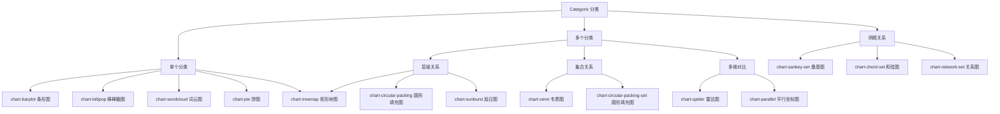
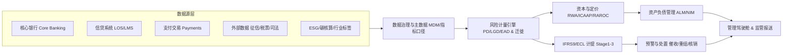

# 银行业《数据可视化》分类类型决策指南数值叶子节点提取与场景化洞察报告

## 执行摘要

本报告基于用户提供的《数据可视化》**分类（Categoric）类型决策指南**（文件路径：`/mnt/data/tree-categoric.json`）完成“**数值类图表叶子节点**”的全量提取，并为银行业核心业务线（零售、对公、风险管理、合规、普惠）逐一设计可落地的代表性场景，配套可直接用于 **AntV G2** 的明细数据样例（若为合成数据已明确标注），输出可供管理层与信贷风控架构师评审的洞察与建议。

在行业研究层面，报告以监管统计与政策文件为主线：2025 年四季度商业银行不良贷款率 **1.50%**、不良贷款余额 **3.5 万亿元**、拨备覆盖率 **205.21%**，普惠型小微企业贷款余额 **37 万亿元**（同比 **+11.0%**）等关键指标反映“资产质量总体稳健但结构性分化仍在、普惠与重点领域持续扩张”的趋势。citeturn17search1 同期净息差仍处低位区间，2024 年商业银行净息差约 **1.52%（四季度）**，呈继续收窄态势，要求银行在“利差压力+资本约束”下把经营、定价与风险治理进一步一体化。citeturn14search4turn0search4

本次从决策指南中共识别出 **14 个叶子节点（decision-chart）**。其中，严格意义的“数值类”并不只包含传统坐标系图（条形图等），还包括依赖**计数/权重**编码的词云、韦恩、桑基、和弦、关系图等；它们在银行业的消保舆情、客户旅程、风险迁徙与集团互保链识别中具有不可替代的表达力。

相较用户示例清单（折线、散点、箱线、热力图、瀑布图、仪表盘、甘特、地图等），本次“分类（Categoric）”决策树**并未包含**这些图表类型；这并非遗漏提取，而是因为该树仅覆盖“分类/集合/层级/网络关系”场景。若后续补齐“趋势（Temporal）/分布（Distribution）/相关（Correlation）/地理（Geo）/流程（Process）”等其他决策树文件，可进一步扩展到用户列举的全部数值图表类型。

---

## 输入决策指南与节点提取方法

### 决策指南范围界定

用户提供的 JSON 文件定义了一棵以 **Categoric（分类）**为根节点的决策树，包含若干问题节点（单个分类、多个分类、层级关系、集合关系、多维对比、网络关系）以及最终可选的图表节点（`type = decision-chart`）。本报告将所有 `decision-chart` 视为**叶子节点**并全量提取，随后再进行“数值类”判定与银行业务场景映射。

### 数值类图表判定口径

为满足“提取所有数值类图表叶子节点”的要求，本报告采用更贴近可视化语义的判定：只要图表存在可度量的数值编码（长度/位置/面积/角度/连线宽度/词频大小等），即归入“数值类图表”。因此：

- 条形图、棒棒糖图、饼图、矩形树图、圆形填充图、旭日图、雷达图、平行坐标图属于典型“数值变量在视觉通道上的映射”；
- 词云图虽然承载文本，但通常以**词频/权重**编码字号或面积，因此也属于“数值类”；
- 韦恩图以集合交并的**基数（count）**表达规模；
- 桑基/和弦/关系图以边的**流量/权重**表达迁徙、资金或关系强度。

---

## 银行业核心趋势、风险热点与政策导向

### 监管指标与行业运行主线

从监管披露看，2025 年四季度商业银行不良贷款率 **1.50%**，不良贷款余额 **3.5 万亿元**；拨备覆盖率 **205.21%**，贷款损失准备余额 **7.2 万亿元**，资本充足率 **15.46%**（一级资本充足率 **12.37%**，核心一级资本充足率 **10.92%**）。citeturn17search1 这些指标共同指向：行业整体风险抵补能力仍较充足，但进入“低波动稳态”后，结构性风险与盈利压力更容易通过细分领域暴露出来，需要更精细的组合监控和资本占用管理。

对比 2024 年季度数据，商业银行不良贷款率从一季度约 **1.591%** 下行至四季度约 **1.504%**，拨备覆盖率由约 **204.5%** 走升至约 **211.2%**，体现了持续的风险出清与拨备管理能力。citeturn14search4 但与此同时，净息差在 2024 年维持在约 **1.54%→1.52%** 区间并呈下行态势，citeturn14search4 到 2025 年二季度行业净息差被广泛引用为 **1.42%** 的历史低位区间，citeturn0search4 意味着“以量补价”的空间收窄，银行必须更依赖风险定价一致性、负债成本管理与非息收入结构优化。

### 普惠小微扩张与中小企业风险再定价

普惠型小微企业贷款余额在 2025 年二季度末为 **36 万亿元**（同比 **+12.3%**），citeturn1search1 2025 年四季度末进一步到 **37 万亿元**（同比 **+11.0%**）。citeturn17search1 规模持续增长与政策导向明确，但在净息差承压环境下，普惠业务更需要用 **PD/LGD/EAD → ECL** 与 **RAROC** 将“支持力度”与“可持续商业模式”打通，否则容易出现“规模上升、资本消耗上升、风险收益倒挂”的隐性压力。

### 房地产风险治理从“总量”走向“项目与结构”

房地产仍是金融稳定的关键变量之一。政策层面，2024 年初住房城乡建设部与金融监管总局要求建立城市房地产融资协调机制，强调由城市政府牵头、部门与监管派出机构参与，筛选项目名单、精准对接融资并加强贷款资金封闭管理。citeturn3search3 2024 年 9 月人民银行与金融监管总局又出台多项房地产金融政策，包括调整住房信贷政策与存量房贷利率相关安排。citeturn0search1 这意味着银行在“房地产贷款压降/结构调整”上，已从粗放的额度管理走向“项目白名单机制+现金流封闭+贷后穿透监管”的组合拳，风险看板需要支持项目维度与集团维度的穿透分析。

### 资本监管新规与巴塞尔 III/IV 的经营含义

国内资本监管方面，《商业银行资本管理办法》已于 2024 年 1 月 1 日起施行。citeturn4search0turn17search1 新规对风险计量精细化与资本约束传导更强，尤其对房地产开发等风险暴露的风险权重设置更为审慎（例如房地产开发风险暴露风险权重一般为 150%，符合条件可更低），citeturn4search0 直接影响资产投向与定价策略。

国际框架方面，巴塞尔委员会强调完善巴塞尔 III（常被市场称作 Basel III “终局/Endgame”）的重要目标之一是减少风险加权资产（RWA）的过度波动与可比性问题。citeturn4search1 对跨境经营或对标国际同业的中资银行而言，“RWA 透明度、模型治理、资本底线（output floor）压力测试”将反向推动银行强化数据治理与可解释风控体系。

### ESG 与绿色金融从“披露”走向“风险管理”

监管层面，金融监管总局与人民银行印发《银行业保险业绿色金融高质量发展实施方案》，明确要防范环境、社会和治理风险、提升 ESG 表现，并推进绿色金融体系建设与评价激励约束。citeturn2search0 对银行而言，ESG 不再只是品牌与披露问题，而是进入授信准入、行业限额、气候情景压力测试与定价（绿色溢价/棕色惩罚）的风险管理主流程。

### 数字化零售渗透与支付生态的“数据化经营”

数字人民币方面，截至 2025 年 9 月末试点地区累计交易金额 **14.2 万亿元**、累计交易 **33.2 亿笔**，个人钱包 **2.25 亿个**，反映支付与零售金融的数字化基础设施持续深化。citeturn5search2 同时，移动支付用户高频使用特征显著，2023 年“每天使用移动支付”的用户占比达 **85%**。citeturn5search6 这决定了零售银行经营管理必须更依赖“渠道融合、旅程数据、实时风控与消保闭环”，也使得集合关系、网络关系类图表成为管理层理解复杂行为与风险传导的常用表达工具。

---

## 数值类叶子节点清单与缺口分析

### 叶子节点全量清单

基于 `tree-categoric.json` 的 `decision-chart` 节点，本次识别到 14 个叶子节点（含 2 个不同语境下的“圆形填充图”节点）：

- `chart-barplot` 条形图（Barplot）
- `chart-lollipop` 棒棒糖图（Lollipop）
- `chart-wordcloud` 词云图（Wordcloud）
- `chart-pie` 饼图（Pie Chart）
- `chart-treemap` 矩形树图（Treemap）
- `chart-venn` 韦恩图（Venn Diagram）
- `chart-circular-packing` 圆形填充图（Circular Packing）
- `chart-circular-packing-set` 圆形填充图（Circular Packing, set 语境）
- `chart-sunburst` 旭日图（Sunburst）
- `chart-spider` 雷达图（Spider/Radar）
- `chart-parallel` 平行坐标图（Parallel Plot）
- `chart-sankey-set` 桑基图（Sankey）
- `chart-chord-set` 和弦图（Chord Diagram）
- `chart-network-set` 关系图（Network）

### 与用户示例清单的“缺口”说明

用户示例中提到的柱状图/堆叠柱状图/折线图/面积图/散点图/气泡图/热力图/箱线图/直方图/密度图/瀑布图/甘特图/仪表盘/热力地图等，在本次提供的 **Categoric 决策树文件**中并未出现为叶子节点。这并非提取遗漏，而是“分类决策树”天然聚焦于：

- **单/多分类对比**（条形、棒棒糖、饼）
- **层级结构**（矩形树图、圆形填充、旭日）
- **集合关系与交并**（韦恩）
- **多维对比**（雷达、平行坐标）
- **网络/流动**（桑基、和弦、关系图）

若要覆盖用户示例中的“趋势、分布、相关、地理、过程”等图表类型，需要补齐相应类型的决策树（例如 Temporal/Distribution/Correlation/Geo/Process）或在指南中新增这些叶子节点。建议的增补方向见本报告末尾“落地要点”。

### 决策树结构示意（Mermaid）



---

## 叶子节点场景库（逐节点：场景+指标+数据+G2 要点+洞察）

以下所有“示例数据”均提供为 **AntV G2 可直接使用的对象数组**（JSON）。若为合成数据，会在数据前明确标注“合成”，并说明合成锚点与逻辑。

---

**节点ID：chart-barplot ｜ 图表类型：条形图（Barplot）**

场景名称：区域信用风险热力看板（以条形对比呈现）

业务线：风险管理

场景描述：按大区/经济圈对比对公+零售合并组合的 **NPL（不良贷款率）** 与 **Stage 2（关注/阶段二）占比**，并用拨备覆盖率作为风险抵补能力的辅助信息，支持总行风险偏好与区域限额“按风险定价、按资本消耗配置”。在行业层面，2025 年四季度不良贷款率 1.50% 且拨备覆盖率 205.21% 的“整体平稳”容易掩盖区域分化，需要用可视化做穿透。citeturn17search1

核心数据指标：NPL、Stage 2 ratio、贷款余额（可视为 EAD 的业务近似）、拨备覆盖率（coverage ratio）、（可扩展）RWA/资本占用

示例数据（合成，锚点：行业 2025Q4 NPL≈1.50% 与覆盖率水平，区域差异按经济结构与地产链敞口强弱设定）：

```json
[
  {"region":"京津冀","as_of":"2025-12-31","loan_balance_yi":5200,"npl_ratio":0.0132,"stage2_ratio":0.0200,"provision_coverage":2.25},
  {"region":"长三角","as_of":"2025-12-31","loan_balance_yi":8600,"npl_ratio":0.0121,"stage2_ratio":0.0180,"provision_coverage":2.35},
  {"region":"珠三角","as_of":"2025-12-31","loan_balance_yi":7400,"npl_ratio":0.0128,"stage2_ratio":0.0190,"provision_coverage":2.28},
  {"region":"成渝","as_of":"2025-12-31","loan_balance_yi":4100,"npl_ratio":0.0156,"stage2_ratio":0.0240,"provision_coverage":2.05},
  {"region":"中部","as_of":"2025-12-31","loan_balance_yi":6800,"npl_ratio":0.0164,"stage2_ratio":0.0260,"provision_coverage":2.00},
  {"region":"山东半岛","as_of":"2025-12-31","loan_balance_yi":3600,"npl_ratio":0.0148,"stage2_ratio":0.0230,"provision_coverage":2.10},
  {"region":"海峡西岸","as_of":"2025-12-31","loan_balance_yi":2900,"npl_ratio":0.0151,"stage2_ratio":0.0220,"provision_coverage":2.08},
  {"region":"东北","as_of":"2025-12-31","loan_balance_yi":2400,"npl_ratio":0.0195,"stage2_ratio":0.0310,"provision_coverage":1.85},
  {"region":"西北","as_of":"2025-12-31","loan_balance_yi":2600,"npl_ratio":0.0182,"stage2_ratio":0.0300,"provision_coverage":1.90},
  {"region":"海南","as_of":"2025-12-31","loan_balance_yi":900,"npl_ratio":0.0176,"stage2_ratio":0.0280,"provision_coverage":1.95}
]
```

建议的 AntV G2 配置要点：使用 `interval`（横向条形可通过坐标转置/或将 X、Y 对调实现）；以 `npl_ratio` 为主度量，`stage2_ratio`、`provision_coverage` 进入 tooltip；按阈值（例如 NPL>1.8%）进行颜色分段；Y 轴（或 X 轴）建议 `scale({ formatter: '.1%' })`。

首席业务与信贷风控架构师洞察：在净息差持续承压的环境下，银行容易通过“扩表”对冲利差下行，但监管数据显示行业不良余额仍在万亿级且结构性分化显著，必须坚持“风险—收益—资本”统一：将区域条形排序与区域限额、授信策略、贷后资源联动（例如 NPL/Stage2 同时走高区域，优先配置现场尽调与重组谈判资源，存量项目纳入更严格的现金流跟踪）。同时建议将条形图升级为“**条形+目标线**”或“**分组条形（对公/零售）**”以支持条线责任归因；当管理层关注政策窗口（如地产项目融资协调机制）时，应能快速切换到“地产链敞口”二级条形视图，实现政策传导的量化评估。citeturn3search3turn0search1

---

**节点ID：chart-lollipop ｜ 图表类型：棒棒糖图（Lollipop）**

场景名称：产品线 RAROC 排名与资本占用审视（“利差时代”的资产再配置）

业务线：零售（联动风险管理）

场景描述：在净息差低位运行背景下，建议以 **RAROC（风险调整后资本回报率）** 作为产品组合“去规模情结”的统一标尺。棒棒糖图相对条形更“轻量”，适合展示“排名+差距”，用于管理层快速决策：哪些产品应扩张、哪些应提价/降本/收缩。2024 年行业净息差约 1.52% 且呈下行，citeturn14search4 2025 年净息差进一步承压，迫使银行经营从“利差驱动”转向“资本效率驱动”。citeturn0search4

核心数据指标：RAROC、NIM（bps 贡献）、手续费贡献（bps）、风险成本（Expected Loss/风险成本 bps）、经济资本（Economic Capital）

示例数据（合成，逻辑：按零售/普惠/对公典型盈利结构与风险成本刻画 RAROC 分层）：

```json
[
  {"product":"工资代发+结算","biz_line":"零售","raroc":0.161,"nim_bps":60,"fee_bps":90,"risk_cost_bps":5,"econ_capital_yi":50},
  {"product":"基金/理财代销","biz_line":"零售","raroc":0.173,"nim_bps":0,"fee_bps":160,"risk_cost_bps":2,"econ_capital_yi":30},
  {"product":"信用卡分期","biz_line":"零售","raroc":0.145,"nim_bps":380,"fee_bps":45,"risk_cost_bps":95,"econ_capital_yi":95},
  {"product":"消费贷（线上）","biz_line":"零售","raroc":0.132,"nim_bps":310,"fee_bps":18,"risk_cost_bps":75,"econ_capital_yi":130},
  {"product":"消费贷（线下）","biz_line":"零售","raroc":0.118,"nim_bps":285,"fee_bps":12,"risk_cost_bps":68,"econ_capital_yi":150},
  {"product":"供应链金融（核心企业）","biz_line":"对公","raroc":0.106,"nim_bps":220,"fee_bps":35,"risk_cost_bps":40,"econ_capital_yi":180},
  {"product":"普惠小微经营贷","biz_line":"普惠","raroc":0.094,"nim_bps":260,"fee_bps":10,"risk_cost_bps":85,"econ_capital_yi":240},
  {"product":"按揭贷款（首套）","biz_line":"零售","raroc":0.082,"nim_bps":92,"fee_bps":5,"risk_cost_bps":18,"econ_capital_yi":320},
  {"product":"按揭贷款（二套）","biz_line":"零售","raroc":0.071,"nim_bps":105,"fee_bps":6,"risk_cost_bps":22,"econ_capital_yi":280},
  {"product":"票据贴现","biz_line":"对公","raroc":0.058,"nim_bps":45,"fee_bps":8,"risk_cost_bps":12,"econ_capital_yi":210}
]
```

建议的 AntV G2 配置要点：使用 `point`（圆点）+ `line`（从 0 到点）组合实现棒棒糖；类别轴按 `raroc` 排序；RAROC 轴使用百分比格式；tooltip 展示 `econ_capital_yi` 与 `risk_cost_bps`，支持“高 RAROC 但资本小/大”的二次判断。

首席业务与信贷风控架构师洞察：在《商业银行资本管理办法》强化资本约束后，资本占用不再是“财务部门的事”，而必须前置到产品经营单元。citeturn4search0 管理建议：对“RAROC 低且资本占用高”的产品（如部分按揭、低价票据），优先采用三类动作组合：提价（风险分层+期限分层）、降本（渠道数字化、流程 STP）、降资本（优化担保结构、提高抵押有效性、推动风险缓释工具）；对“RAROC 高但合规/声誉敏感”的产品（如部分分期），应将消保投诉、欺诈损失与监管关注纳入“RAROC 负向调整项”，形成经营-风控一体的“真实 RAROC”。

---

**节点ID：chart-wordcloud ｜ 图表类型：词云图（Wordcloud）**

场景名称：消保与舆情“热点词”雷达（投诉主题×损失×处置时效）

业务线：合规（消费者权益保护）

场景描述：对客服工单、热线文本、App 评价进行主题抽取，映射到“关键词云”。词云以词频/权重表达“最值得优先治理”的问题；同时在 tooltip 中展示平均处理时长与估算损失（或补偿金额），辅助消保资源调度。考虑到 2024 年以来住房信贷政策与存量房贷利率调整等政策变化，相关咨询与投诉主题具有明显的阶段性波动。citeturn0search1turn3search1

核心数据指标：投诉量（complaint_count）、平均结案天数（avg_resolution_days）、严重度（severity_score）、估算损失（estimated_loss）

示例数据（合成，逻辑：结合存量房贷利率政策调整、反诈拦截强化、数字化渠道高频交易导致的典型投诉结构）：

```json
[
  {"keyword":"限额/验证码","complaint_count":860,"avg_resolution_days":2.6,"severity_score":4.2,"estimated_loss_cny":1800000,"risk_level":"高","as_of":"2025-12-31"},
  {"keyword":"转账失败","complaint_count":740,"avg_resolution_days":2.2,"severity_score":4.0,"estimated_loss_cny":1200000,"risk_level":"高","as_of":"2025-12-31"},
  {"keyword":"存量房贷利率调整","complaint_count":630,"avg_resolution_days":4.8,"severity_score":4.6,"estimated_loss_cny":700000,"risk_level":"高","as_of":"2025-12-31"},
  {"keyword":"提前还款/还款计划","complaint_count":510,"avg_resolution_days":3.1,"severity_score":3.4,"estimated_loss_cny":500000,"risk_level":"中","as_of":"2025-12-31"},
  {"keyword":"信用卡分期退订","complaint_count":420,"avg_resolution_days":5.2,"severity_score":3.7,"estimated_loss_cny":400000,"risk_level":"中","as_of":"2025-12-31"},
  {"keyword":"反诈拦截误伤","complaint_count":395,"avg_resolution_days":6.5,"severity_score":4.8,"estimated_loss_cny":2600000,"risk_level":"中","as_of":"2025-12-31"},
  {"keyword":"开户/实名校验","complaint_count":360,"avg_resolution_days":2.9,"severity_score":3.2,"estimated_loss_cny":300000,"risk_level":"中","as_of":"2025-12-31"},
  {"keyword":"理财净值波动","complaint_count":330,"avg_resolution_days":7.8,"severity_score":3.9,"estimated_loss_cny":900000,"risk_level":"中","as_of":"2025-12-31"},
  {"keyword":"跨行到账延迟","complaint_count":220,"avg_resolution_days":1.9,"severity_score":2.6,"estimated_loss_cny":150000,"risk_level":"低","as_of":"2025-12-31"},
  {"keyword":"APP闪退","complaint_count":210,"avg_resolution_days":1.4,"severity_score":2.1,"estimated_loss_cny":50000,"risk_level":"低","as_of":"2025-12-31"},
  {"keyword":"人脸识别失败","complaint_count":180,"avg_resolution_days":2.0,"severity_score":2.4,"estimated_loss_cny":80000,"risk_level":"低","as_of":"2025-12-31"},
  {"keyword":"客服排队","complaint_count":160,"avg_resolution_days":3.6,"severity_score":2.9,"estimated_loss_cny":120000,"risk_level":"低","as_of":"2025-12-31"}
]
```

建议的 AntV G2 配置要点：词云通常需要布局算法（可用外部词云布局后将 `x/y/rotate/fontSize` 提供给 G2）；同一 `keyword` 的 `fontSize` 映射到 `complaint_count`（或 `complaint_count * severity_score` 的加权值）；tooltip 展示 `avg_resolution_days`、`estimated_loss_cny`；建议增加筛选器：产品（房贷/信用卡/支付）与渠道（App/柜面/热线）。

首席业务与信贷风控架构师洞察：消保已从“事后解释”走向“经营前置约束”。建议将词云的“热点词”直接映射到流程与系统责任人（例如：验证码→短信通道与风控策略；存量房贷利率→个贷系统批量调整与话术一致性；反诈拦截→策略阈值与白名单机制），把“投诉主题”作为产品与风控策略的 **Leading Indicator（领先指标）**。对政策引发的集中咨询（如住房政策调整），应建立“政策事件 → 话术/系统改造 → 工单峰值预测”的预案机制，以避免声誉与监管风险在高峰期放大。citeturn0search1turn5search6

---

**节点ID：chart-pie ｜ 图表类型：饼图（Pie Chart）**

场景名称：按揭新投放 LTV 结构与风险偏好检视（地产调整期的零售资产质量防线）

业务线：零售（联动风险管理）

场景描述：将新发放按揭按 **LTV（Loan-to-Value，贷款价值比）** 分段展示占比，识别“高 LTV 集中度”与潜在违约敏感度。在房地产政策持续调整的背景下，住房信贷政策（首付比例、利率机制等）变化会显著改变 LTV 分布，需要季度级跟踪。citeturn0search1turn3search1

核心数据指标：LTV、按揭投放金额、（可扩展）DTI（债务收入比）、逾期率、早期违约（EPD）

示例数据（合成，逻辑：用分段体现“70-80% 为主、高 LTV 尾部可控但需警惕”的典型结构）：

```json
[
  {"ltv_band":"<=50%","loan_amount_yi":1800,"share":0.15280,"as_of":"2025-09-30"},
  {"ltv_band":"50-60%","loan_amount_yi":2200,"share":0.18669,"as_of":"2025-09-30"},
  {"ltv_band":"60-70%","loan_amount_yi":3100,"share":0.26272,"as_of":"2025-09-30"},
  {"ltv_band":"70-80%","loan_amount_yi":2600,"share":0.22034,"as_of":"2025-09-30"},
  {"ltv_band":"80-90%","loan_amount_yi":1400,"share":0.11865,"as_of":"2025-09-30"},
  {"ltv_band":"90-100%","loan_amount_yi":600,"share":0.05089,"as_of":"2025-09-30"},
  {"ltv_band":"100%+","loan_amount_yi":80,"share":0.00678,"as_of":"2025-09-30"}
]
```

建议的 AntV G2 配置要点：使用 `coordinate({ type: 'theta' })`；`interval().encode('y','share').encode('color','ltv_band')`；标签建议仅显示 Top3，其他在 tooltip；若要突出尾部风险，可将 `share` 替换为“风险加权占比”（如 share * PD 或 share * ECL）。

首席业务与信贷风控架构师洞察：饼图适合管理层快速理解结构，但不适合精确比较相近份额。建议将饼图作为“结构总览”，并与“LTV 分段条形图（可排序）”联动。策略上应坚持“两条线”：一是对 LTV>90% 的尾部客户提高准入与还款能力审查强度；二是在政策宽松期（首付比例下调、利率机制调整）通过风险定价与贷后预警避免“低门槛扩张”带来未来不良抬升，尤其在行业不良率虽稳但地产链仍敏感的阶段，更要严守零售资产质量底线。citeturn17search1turn3search3

---

**节点ID：chart-treemap ｜ 图表类型：矩形树图（Treemap）**

场景名称：对公行业敞口与资本占用（RWA）穿透（含地产链压降）

业务线：对公（联动风险管理/资本管理）

场景描述：以行业→子行业层级展示对公授信敞口（EAD）与 RWA，快速识别“规模大且资本消耗高”的组合，并结合 PD/LGD 推算期望损失，支撑行业限额、授信政策与资产结构调整（尤其是地产链风险治理与资本占用控制）。资本新规下，风险权重与资本底线机制使得“同样规模”的资产在资本占用上差异显著。citeturn4search0turn4search1

核心数据指标：EAD、RWA、PD、LGD、Expected Loss（EL=EAD×PD×LGD）、（可扩展）行业集中度 HHI

示例数据（合成，逻辑：地产链 PD/LGD 更高且 RWA 更重；制造业/基建为政策支持与相对稳健资产）：

```json
[
  {"industry":"制造业","sub_industry":"高端装备","ead_yi":820,"rwa_yi":520,"pd":0.018,"lgd":0.35,"expected_loss_yi":5.17,"as_of":"2025-12-31"},
  {"industry":"制造业","sub_industry":"汽车零部件","ead_yi":610,"rwa_yi":380,"pd":0.022,"lgd":0.38,"expected_loss_yi":5.10,"as_of":"2025-12-31"},
  {"industry":"制造业","sub_industry":"化工/新材料","ead_yi":540,"rwa_yi":410,"pd":0.028,"lgd":0.45,"expected_loss_yi":6.80,"as_of":"2025-12-31"},
  {"industry":"基建","sub_industry":"市政公用","ead_yi":760,"rwa_yi":390,"pd":0.016,"lgd":0.30,"expected_loss_yi":3.65,"as_of":"2025-12-31"},
  {"industry":"基建","sub_industry":"交通运输","ead_yi":680,"rwa_yi":360,"pd":0.019,"lgd":0.32,"expected_loss_yi":4.13,"as_of":"2025-12-31"},
  {"industry":"房地产","sub_industry":"住宅开发","ead_yi":420,"rwa_yi":610,"pd":0.045,"lgd":0.55,"expected_loss_yi":10.40,"as_of":"2025-12-31"},
  {"industry":"房地产","sub_industry":"商业地产","ead_yi":260,"rwa_yi":390,"pd":0.052,"lgd":0.60,"expected_loss_yi":8.11,"as_of":"2025-12-31"},
  {"industry":"能源","sub_industry":"新能源","ead_yi":590,"rwa_yi":340,"pd":0.021,"lgd":0.33,"expected_loss_yi":4.09,"as_of":"2025-12-31"},
  {"industry":"能源","sub_industry":"传统能源","ead_yi":310,"rwa_yi":260,"pd":0.030,"lgd":0.40,"expected_loss_yi":3.72,"as_of":"2025-12-31"},
  {"industry":"批发零售","sub_industry":"连锁零售","ead_yi":370,"rwa_yi":280,"pd":0.026,"lgd":0.42,"expected_loss_yi":4.04,"as_of":"2025-12-31"},
  {"industry":"科技","sub_industry":"软件服务","ead_yi":450,"rwa_yi":240,"pd":0.020,"lgd":0.35,"expected_loss_yi":3.15,"as_of":"2025-12-31"},
  {"industry":"普惠","sub_industry":"小微工商户","ead_yi":520,"rwa_yi":420,"pd":0.034,"lgd":0.50,"expected_loss_yi":8.84,"as_of":"2025-12-31"}
]
```

建议的 AntV G2 配置要点：Treemap 通常需要层级布局计算（可用外部 treemap layout 得到 `x/y/w/h` 或使用数据集转换）；颜色可映射 `pd` 或 `expected_loss_yi/ead_yi`（风险密度）；面积映射 `ead_yi` 或 `rwa_yi`；tooltip 展示 PD/LGD/EL 与 RWA/资本占比。

首席业务与信贷风控架构师洞察：地产链“压降”不应仅以余额为目标，而应以 **资本占用与风险密度** 为核心：在资本规则更审慎（例如房地产开发风险暴露通常更高风险权重）背景下，citeturn4search0 同样减少 100 亿元授信，选择“高 RWA/高 EL 密度”的子行业能更有效释放资本与风险预算。建议将 treemap 升级为“双视图”：左侧按 EAD 面积，右侧按 RWA 面积，并显示两者差异（RWA/EAD 倍数），以识别“资本黑洞”。同时与城市房地产融资协调机制的项目名单联动，做到“项目层面可支持、集团层面不加杠杆”的精细化平衡。citeturn3search3turn17search1

---

**节点ID：chart-venn ｜ 图表类型：韦恩图（Venn Diagram）**

场景名称：渠道重叠与数字化迁移（移动银行×网银×柜面）

业务线：零售（数字化经营）

场景描述：用韦恩图展示三类渠道活跃客户的交集与独占规模，识别“纯柜面”“纯移动”“多渠道”客群，指导渠道迁移、网点优化与差异化服务。考虑到移动支付高频使用（2023 年每天使用占比 85%）citeturn5search6 与数字人民币生态扩张（试点累计交易金额 14.2 万亿元）citeturn5search2，多渠道融合经营将持续深化。

核心数据指标：MAU（按渠道活跃用户数）、交集人数、迁移率、（可扩展）渠道成本/笔、客户净推荐值 NPS

示例数据（合成，单位：千人）：

```json
[
  {"segment":"Mobile_only","customer_count_k":6800,"as_of":"2025-12-31"},
  {"segment":"Web_only","customer_count_k":950,"as_of":"2025-12-31"},
  {"segment":"Branch_only","customer_count_k":1200,"as_of":"2025-12-31"},
  {"segment":"Mobile&Web","customer_count_k":2100,"as_of":"2025-12-31"},
  {"segment":"Mobile&Branch","customer_count_k":1750,"as_of":"2025-12-31"},
  {"segment":"Web&Branch","customer_count_k":620,"as_of":"2025-12-31"},
  {"segment":"Mobile&Web&Branch","customer_count_k":980,"as_of":"2025-12-31"}
]
```

建议的 AntV G2 配置要点：韦恩图通常需要几何布局算法（圆的半径与位置由集合大小与交集决定）；G2 负责渲染圆与标签；tooltip 展示 `customer_count_k` 与该 segment 的“产品持有数、AUM、投诉率”等。

首席业务与信贷风控架构师洞察：韦恩图的关键不在“画圈”，而在“把圈与经营动作绑定”。建议对 `Branch_only` 客群建立“三步迁移框架”：① 业务替代（可线上办理清单与引导）；② 风控替代（线上 KYC/反欺诈能力补齐，避免因风控薄弱迫使客户回柜）；③ 体验替代（对老年/普惠客群提供简化版 App 与线下辅导）。在支付与数字人民币快速扩张期，若银行不掌握主渠道入口，将失去低成本负债与交易数据优势，进而在净息差收窄、资本约束加严的环境下处于被动。citeturn5search2turn14search4turn4search0

---

**节点ID：chart-circular-packing ｜ 图表类型：圆形填充图（Circular Packing）**

场景名称：资产结构对标“五篇大文章”（贷款组合层级结构一图看全）

业务线：风险管理（联动战略/对公/零售）

场景描述：以层级圆形面积展示贷款组合结构：总资产→零售/对公/普惠/资金业务→细分产品。适用于董事会/高管在 1 页内把握“资源投向是否与国家战略一致”。国务院层面对“科技金融、绿色金融、普惠金融、养老金融、数字金融”提出系统性指导意见，要求优化资金供给结构并提升服务能力。citeturn2search2

核心数据指标：贷款余额、结构占比、（可扩展）RWA、净息差贡献、行业限额占用

示例数据（合成，单位：亿元；层级数据 `id-parent-value`）（可直接用于 circle packing 的层级构建）：

```json
[
  {"id":"loan_book","parent":null,"value_yi":30000,"as_of":"2025-12-31"},
  {"id":"retail","parent":"loan_book","value_yi":11200,"as_of":"2025-12-31"},
  {"id":"corporate","parent":"loan_book","value_yi":14000,"as_of":"2025-12-31"},
  {"id":"inclusive","parent":"loan_book","value_yi":3800,"as_of":"2025-12-31"},
  {"id":"treasury","parent":"loan_book","value_yi":1000,"as_of":"2025-12-31"},

  {"id":"mortgage","parent":"retail","value_yi":6200,"as_of":"2025-12-31"},
  {"id":"consumer_loan","parent":"retail","value_yi":3200,"as_of":"2025-12-31"},
  {"id":"credit_card","parent":"retail","value_yi":1800,"as_of":"2025-12-31"},

  {"id":"manufacturing","parent":"corporate","value_yi":4200,"as_of":"2025-12-31"},
  {"id":"infrastructure","parent":"corporate","value_yi":3600,"as_of":"2025-12-31"},
  {"id":"real_estate","parent":"corporate","value_yi":2100,"as_of":"2025-12-31"},
  {"id":"trade","parent":"corporate","value_yi":1800,"as_of":"2025-12-31"},
  {"id":"tech","parent":"corporate","value_yi":2300,"as_of":"2025-12-31"},

  {"id":"micro_business","parent":"inclusive","value_yi":2400,"as_of":"2025-12-31"},
  {"id":"agri","parent":"inclusive","value_yi":900,"as_of":"2025-12-31"},
  {"id":"inclusive_personal","parent":"inclusive","value_yi":500,"as_of":"2025-12-31"},

  {"id":"bond_investment","parent":"treasury","value_yi":650,"as_of":"2025-12-31"},
  {"id":"interbank_assets","parent":"treasury","value_yi":350,"as_of":"2025-12-31"}
]
```

建议的 AntV G2 配置要点：circle packing 通常基于层级数据计算 `x/y/r`；面积（半径）映射 `value_yi`；颜色映射一级分类（retail/corporate/inclusive/treasury）；tooltip 展示占比与同比增速；可加交互：点击下钻到子层级。

首席业务与信贷风控架构师洞察：圆形填充图的价值在于“结构一眼看到底”。在净息差低位与资本新规约束下，资产结构调整必须同时回答三件事：① 是否服务国家战略（五篇大文章）；② 是否可持续盈利（RAROC/非息贡献）；③ 是否可控风险（NPL/Stage2/ECL）。建议在每个二级圈层增加“风险边框”（例如边框粗细映射 NPL）或“资本密度”（RWA/余额），将结构与风险资本统一呈现。citeturn2search2turn14search4turn17search1

---

**节点ID：chart-circular-packing-set ｜ 图表类型：圆形填充图（Circular Packing，集合语境）**

场景名称：反洗钱/反欺诈告警结构分解（告警池治理与资源排班）

业务线：合规（反洗钱 AML/反欺诈）

场景描述：对 AML/反欺诈告警按“一级类型→细分规则/触发原因”做层级拆解，识别告警池主要来源与长尾问题，优化规则阈值、白名单与人工审核排班。该类场景强调“集合拆分与聚合”，与决策指南中 set 语境相匹配。

核心数据指标：alert_count、命中率（true positive）、处置 SLA、SAR/STR 报送量、（可扩展）误伤率与客户投诉

示例数据（合成，单位：条）：

```json
[
  {"id":"aml_alerts","parent":null,"alert_count":128000,"as_of":"2025-12-31"},
  {"id":"transaction_monitoring","parent":"aml_alerts","alert_count":72000,"as_of":"2025-12-31"},
  {"id":"kyc_refresh","parent":"aml_alerts","alert_count":26000,"as_of":"2025-12-31"},
  {"id":"sanctions_screening","parent":"aml_alerts","alert_count":14000,"as_of":"2025-12-31"},
  {"id":"fraud_ops","parent":"aml_alerts","alert_count":16000,"as_of":"2025-12-31"},

  {"id":"structuring","parent":"transaction_monitoring","alert_count":18000,"as_of":"2025-12-31"},
  {"id":"high_risk_geo","parent":"transaction_monitoring","alert_count":12000,"as_of":"2025-12-31"},
  {"id":"unusual_device","parent":"transaction_monitoring","alert_count":9000,"as_of":"2025-12-31"},
  {"id":"merchant_risk","parent":"transaction_monitoring","alert_count":15000,"as_of":"2025-12-31"},
  {"id":"cash_intensity","parent":"transaction_monitoring","alert_count":18000,"as_of":"2025-12-31"},

  {"id":"expired_id","parent":"kyc_refresh","alert_count":9000,"as_of":"2025-12-31"},
  {"id":"beneficial_owner","parent":"kyc_refresh","alert_count":7000,"as_of":"2025-12-31"},
  {"id":"pep_review","parent":"kyc_refresh","alert_count":10000,"as_of":"2025-12-31"},

  {"id":"name_match","parent":"sanctions_screening","alert_count":9000,"as_of":"2025-12-31"},
  {"id":"country_match","parent":"sanctions_screening","alert_count":5000,"as_of":"2025-12-31"},

  {"id":"sim_swap","parent":"fraud_ops","alert_count":6000,"as_of":"2025-12-31"},
  {"id":"account_takeover","parent":"fraud_ops","alert_count":5000,"as_of":"2025-12-31"},
  {"id":"loan_fraud","parent":"fraud_ops","alert_count":5000,"as_of":"2025-12-31"}
]
```

建议的 AntV G2 配置要点：同圆形填充图；建议在 tooltip 中增加“命中率/误伤率/平均处理分钟数”；可通过交互筛选“高风险地区/高风险行业”。

首席业务与信贷风控架构师洞察：告警治理的核心 KPI 不应仅是“清零”，而是“风险识别能力提升 + 客户体验可控”。建议将关键消保主题（如反诈拦截误伤）与告警结构联动，形成“规则→误伤→投诉→阈值回调”的闭环，避免合规风控与经营体验割裂。citeturn5search6turn0search1

---

**节点ID：chart-sunburst ｜ 图表类型：旭日图（Sunburst）**

场景名称：ESG 信贷与转型金融组合（绿色金融高质量发展下的授信结构）

业务线：对公（联动风险管理/ESG）

场景描述：以旭日图展示 ESG 信贷组合：ESG 总盘→减缓/适应/转型/社会包容→细分赛道。与监管要求“加强绿色金融、提升碳核算与气候风险管理、加强 ESG 风险管理”等导向一致。citeturn2search0

核心数据指标：绿色/转型贷款余额、行业分类、（可扩展）碳减排量、气候风险暴露（物理/转型风险）、ESG 评分

示例数据（合成，单位：亿元；层级 `id-parent-loan_balance`）：

```json
[
  {"id":"esg_credit","parent":null,"loan_balance_yi":5200,"as_of":"2025-12-31","taxonomy":"ESG"},
  {"id":"green_mitigation","parent":"esg_credit","loan_balance_yi":2400,"as_of":"2025-12-31","taxonomy":"ESG"},
  {"id":"green_adaptation","parent":"esg_credit","loan_balance_yi":900,"as_of":"2025-12-31","taxonomy":"ESG"},
  {"id":"transition_finance","parent":"esg_credit","loan_balance_yi":1300,"as_of":"2025-12-31","taxonomy":"ESG"},
  {"id":"social_inclusion","parent":"esg_credit","loan_balance_yi":600,"as_of":"2025-12-31","taxonomy":"ESG"},

  {"id":"clean_energy","parent":"green_mitigation","loan_balance_yi":980,"as_of":"2025-12-31","taxonomy":"ESG"},
  {"id":"energy_efficiency","parent":"green_mitigation","loan_balance_yi":740,"as_of":"2025-12-31","taxonomy":"ESG"},
  {"id":"green_transport","parent":"green_mitigation","loan_balance_yi":380,"as_of":"2025-12-31","taxonomy":"ESG"},
  {"id":"pollution_control","parent":"green_mitigation","loan_balance_yi":300,"as_of":"2025-12-31","taxonomy":"ESG"},

  {"id":"flood_control","parent":"green_adaptation","loan_balance_yi":360,"as_of":"2025-12-31","taxonomy":"ESG"},
  {"id":"water_saving","parent":"green_adaptation","loan_balance_yi":260,"as_of":"2025-12-31","taxonomy":"ESG"},
  {"id":"climate_resilience_agri","parent":"green_adaptation","loan_balance_yi":280,"as_of":"2025-12-31","taxonomy":"ESG"},

  {"id":"steel_low_carbon","parent":"transition_finance","loan_balance_yi":420,"as_of":"2025-12-31","taxonomy":"ESG"},
  {"id":"cement_upgrade","parent":"transition_finance","loan_balance_yi":260,"as_of":"2025-12-31","taxonomy":"ESG"},
  {"id":"coal_power_flex","parent":"transition_finance","loan_balance_yi":320,"as_of":"2025-12-31","taxonomy":"ESG"},
  {"id":"auto_supply_chain","parent":"transition_finance","loan_balance_yi":300,"as_of":"2025-12-31","taxonomy":"ESG"},

  {"id":"inclusive_sme","parent":"social_inclusion","loan_balance_yi":350,"as_of":"2025-12-31","taxonomy":"ESG"},
  {"id":"rural_revitalization","parent":"social_inclusion","loan_balance_yi":250,"as_of":"2025-12-31","taxonomy":"ESG"}
]
```

建议的 AntV G2 配置要点：使用 `theta` 坐标系的分层 `interval`；层级布局需要将树转换为每层的角度范围（可外部计算）；颜色映射一级分类；tooltip 展示余额、同比、碳减排估算等。

首席业务与信贷风控架构师洞察：绿色金融已进入“高质量发展”阶段，监管明确要求防范环境、社会和治理风险、完善标准与信息披露。citeturn2search0 因此旭日图应当从“余额展示”升级为“风险展示”：在每个扇区叠加“行业转型风险等级、客户碳强度、强制披露覆盖率”，并将转型金融的准入条件（转型计划、KPI、资金用途封闭）作为贷后检查规则嵌入系统。否则容易出现“绿色名义扩张但风险未被识别”的错配。

---

**节点ID：chart-spider ｜ 图表类型：雷达图（Spider/Radar）**

场景名称：分行经营—风险一体化评分卡（稳规模、稳息差、稳资产质量）

业务线：风险管理（联动零售/对公）

场景描述：通过雷达图对比分行在多个关键指标上的相对得分（归一化），适用于行长办公会快速识别“短板分行”。在行业净息差承压、资本约束更强的背景下，建议将雷达指标固定为“利润质量+风险质量+数字化效率”三类。行业层面 2025 年四季度资本充足率、拨备覆盖率等总体稳健，但更需要分行颗粒度的结构化诊断。citeturn17search1

核心数据指标：NIM、NPL、RAROC、成本收入比、数字零售渗透率（或移动活跃占比）

示例数据（合成，已归一化到 0–100 分；越高越好）：

```json
[
  {"branch":"上海分行","metric":"NIM(基点↑)","score":100.0,"as_of":"2025-12-31"},
  {"branch":"上海分行","metric":"NPL(%,↓)","score":100.0,"as_of":"2025-12-31"},
  {"branch":"上海分行","metric":"RAROC(%,↑)","score":100.0,"as_of":"2025-12-31"},
  {"branch":"上海分行","metric":"成本收入比(%,↓)","score":100.0,"as_of":"2025-12-31"},
  {"branch":"上海分行","metric":"数字零售渗透(%,↑)","score":100.0,"as_of":"2025-12-31"},

  {"branch":"广东分行","metric":"NIM(基点↑)","score":35.0,"as_of":"2025-12-31"},
  {"branch":"广东分行","metric":"NPL(%,↓)","score":81.1,"as_of":"2025-12-31"},
  {"branch":"广东分行","metric":"RAROC(%,↑)","score":70.4,"as_of":"2025-12-31"},
  {"branch":"广东分行","metric":"成本收入比(%,↓)","score":72.9,"as_of":"2025-12-31"},
  {"branch":"广东分行","metric":"数字零售渗透(%,↑)","score":78.6,"as_of":"2025-12-31"},

  {"branch":"四川分行","metric":"NIM(基点↑)","score":70.0,"as_of":"2025-12-31"},
  {"branch":"四川分行","metric":"NPL(%,↓)","score":50.0,"as_of":"2025-12-31"},
  {"branch":"四川分行","metric":"RAROC(%,↑)","score":40.7,"as_of":"2025-12-31"},
  {"branch":"四川分行","metric":"成本收入比(%,↓)","score":32.9,"as_of":"2025-12-31"},
  {"branch":"四川分行","metric":"数字零售渗透(%,↑)","score":42.9,"as_of":"2025-12-31"},

  {"branch":"湖北分行","metric":"NIM(基点↑)","score":60.0,"as_of":"2025-12-31"},
  {"branch":"湖北分行","metric":"NPL(%,↓)","score":60.8,"as_of":"2025-12-31"},
  {"branch":"湖北分行","metric":"RAROC(%,↑)","score":50.0,"as_of":"2025-12-31"},
  {"branch":"湖北分行","metric":"成本收入比(%,↓)","score":52.9,"as_of":"2025-12-31"},
  {"branch":"湖北分行","metric":"数字零售渗透(%,↑)","score":57.1,"as_of":"2025-12-31"},

  {"branch":"辽宁分行","metric":"NIM(基点↑)","score":0.0,"as_of":"2025-12-31"},
  {"branch":"辽宁分行","metric":"NPL(%,↓)","score":0.0,"as_of":"2025-12-31"},
  {"branch":"辽宁分行","metric":"RAROC(%,↑)","score":0.0,"as_of":"2025-12-31"},
  {"branch":"辽宁分行","metric":"成本收入比(%,↓)","score":0.0,"as_of":"2025-12-31"},
  {"branch":"辽宁分行","metric":"数字零售渗透(%,↑)","score":0.0,"as_of":"2025-12-31"}
]
```

建议的 AntV G2 配置要点：使用 `line`+`point` 在极坐标系中绘制；`encode('x','metric').encode('y','score').encode('color','branch')`；建议限制分行数量（≤6）避免视觉过载；对指标做归一化并固定方向（例如 NPL 越低得分越高）。

首席业务与信贷风控架构师洞察：雷达图适合“体检”，不适合“算账”。建议与“指标明细表”联动，做到点击某一分行即可下钻到产品、行业、客户层。管理建议：在净息差持续承压和资本精细化管理时代，分行考核不应以规模为第一序；应将“RAROC 达标率、Stage2 迁徙率、存款成本、数字化替代率”纳入同一张评分卡，避免出现“规模冲刺→风险后移→拨备吞噬利润”的周期性问题。citeturn14search4turn4search0

---

**节点ID：chart-parallel ｜ 图表类型：平行坐标图（Parallel Plot）**

场景名称：小微客群多维风险画像（PD×LGD×LTV×DSCR×RAROC）

业务线：普惠（联动风险管理）

场景描述：平行坐标适合展示“多维指标同时对比”的客群画像：每条线代表一个客户/子客群，可快速看到哪些客户同时具备“高 PD、高 LGD、低 DSCR、高 LTV、RAROC 不达标”等特征，是普惠风险预警与名单制管理的高效工具。在普惠小微贷款余额持续增长（2025Q4 达 37 万亿元）背景下，citeturn17search1 必须强化“规模增长下的风险分层经营”。

核心数据指标：PD、LGD、EAD、LTV、DSCR、RAROC（以及逾期天数、行业景气度等可扩展维度）

示例数据（合成，单位：EAD=万元）：

```json
[
  {"cust_id":"SME001","segment":"小微制造","pd":0.0387,"lgd":0.355,"ead_wan":3875,"ltv":0.833,"dscr":0.67,"raroc":0.058,"as_of":"2025-12-31"},
  {"cust_id":"SME002","segment":"小微餐饮","pd":0.0365,"lgd":0.442,"ead_wan":3185,"ltv":0.618,"dscr":1.66,"raroc":0.141,"as_of":"2025-12-31"},
  {"cust_id":"SME003","segment":"小微外贸","pd":0.0356,"lgd":0.544,"ead_wan":3506,"ltv":0.764,"dscr":1.44,"raroc":0.122,"as_of":"2025-12-31"},
  {"cust_id":"SME004","segment":"小微物流","pd":0.0299,"lgd":0.550,"ead_wan":3975,"ltv":0.785,"dscr":1.06,"raroc":0.105,"as_of":"2025-12-31"},
  {"cust_id":"SME005","segment":"小微电商","pd":0.0471,"lgd":0.458,"ead_wan":3832,"ltv":0.848,"dscr":1.13,"raroc":0.100,"as_of":"2025-12-31"},
  {"cust_id":"SME006","segment":"小微建材","pd":0.0351,"lgd":0.589,"ead_wan":3369,"ltv":0.818,"dscr":1.22,"raroc":0.086,"as_of":"2025-12-31"},
  {"cust_id":"SME007","segment":"小微医疗","pd":0.0286,"lgd":0.489,"ead_wan":2153,"ltv":0.537,"dscr":1.58,"raroc":0.132,"as_of":"2025-12-31"},
  {"cust_id":"SME008","segment":"小微教育","pd":0.0309,"lgd":0.460,"ead_wan":3202,"ltv":0.631,"dscr":1.62,"raroc":0.131,"as_of":"2025-12-31"},
  {"cust_id":"SME009","segment":"小微农企","pd":0.0328,"lgd":0.561,"ead_wan":3667,"ltv":0.773,"dscr":1.10,"raroc":0.095,"as_of":"2025-12-31"},
  {"cust_id":"SME010","segment":"小微零售","pd":0.0436,"lgd":0.487,"ead_wan":3500,"ltv":0.820,"dscr":0.96,"raroc":0.081,"as_of":"2025-12-31"},
  {"cust_id":"SME011","segment":"小微软件","pd":0.0195,"lgd":0.420,"ead_wan":2804,"ltv":0.490,"dscr":1.88,"raroc":0.162,"as_of":"2025-12-31"},
  {"cust_id":"SME012","segment":"小微家政","pd":0.0507,"lgd":0.602,"ead_wan":4022,"ltv":0.924,"dscr":0.83,"raroc":0.042,"as_of":"2025-12-31"}
]
```

建议的 AntV G2 配置要点：`line().encode('x','dimension').encode('y','value').encode('color','segment')` 需要先将宽表转长表（每客户×维度一行）；对不同量纲（PD、LGD、LTV、DSCR、RAROC）做标准化或分轴；交互上提供“刷选（brush）”识别高风险组合线条。

首席业务与信贷风控架构师洞察：普惠风控的难点是“规模大、单笔小、异质性强”。建议用平行坐标做两类治理：① **准入治理**：定义“高 PD 且 DSCR<1 且 LTV>0.9”的红线组合，自动触发人工复核；② **存量治理**：对线条形态发生突变（例如 DSCR 连续下行）的客户，纳入名单制贷后走访。结合监管对普惠持续发力的方向，银行应以“客群分层+风险定价一致+自动化贷后预警”确保普惠增长可持续。citeturn17search1turn2search2

---

**节点ID：chart-sankey-set ｜ 图表类型：桑基图（Sankey）**

场景名称：IFRS 9 / 信用风险阶段迁徙（Stage 1→2→3→核销）

业务线：风险管理（会计/计量联动）

场景描述：桑基图以“流量宽度”直观呈现资产从一个风险阶段流向另一个阶段的规模，适合董事会与风险委理解“风险是在改善还是在恶化”。监管口径下商业银行贷款五级分类与不良定义清晰，citeturn17search1 桑基可在此基础上叠加 IFRS 9 Stage、逾期天数分层等内部维度，形成“风险迁徙地图”。

核心数据指标：Stage 余额迁徙、逾期迁徙、ECL 计提变化、核销规模、（可扩展）迁徙率与滚动一年违约率

示例数据（合成，单位：亿元；从 2025Q3 到 2025Q4）：

```json
[
  {"source":"Stage1_2025Q3","target":"Stage1_2025Q4","loan_balance_yi":18200,"as_of":"2025-12-31"},
  {"source":"Stage1_2025Q3","target":"Stage2_2025Q4","loan_balance_yi":950,"as_of":"2025-12-31"},
  {"source":"Stage1_2025Q3","target":"Stage3_2025Q4","loan_balance_yi":120,"as_of":"2025-12-31"},

  {"source":"Stage2_2025Q3","target":"Stage1_2025Q4","loan_balance_yi":610,"as_of":"2025-12-31"},
  {"source":"Stage2_2025Q3","target":"Stage2_2025Q4","loan_balance_yi":2980,"as_of":"2025-12-31"},
  {"source":"Stage2_2025Q3","target":"Stage3_2025Q4","loan_balance_yi":310,"as_of":"2025-12-31"},

  {"source":"Stage3_2025Q3","target":"Stage3_2025Q4","loan_balance_yi":780,"as_of":"2025-12-31"},
  {"source":"Stage3_2025Q3","target":"WriteOff_2025Q4","loan_balance_yi":260,"as_of":"2025-12-31"},
  {"source":"Stage3_2025Q3","target":"Stage2_2025Q4","loan_balance_yi":90,"as_of":"2025-12-31"}
]
```

建议的 AntV G2 配置要点：桑基需要将边列表（source/target/value）转换为节点与链接；颜色可区分来源阶段；tooltip 展示迁徙率（例如 Stage1→2 / Stage1 总额）；建议加交互：点击某条流查看“迁徙原因 TOP5”（行业、地区、产品、政策事件）。

首席业务与信贷风控架构师洞察：在行业整体不良率稳定（2025Q4 1.50%）的表象下，真实风险变化往往先发生在 Stage2 的迁徙与回迁中。citeturn17search1 建议管理层重点看三条“必看流”：① Stage1→Stage2（早预警）；② Stage2→Stage3（风险暴露）；③ Stage3→核销（处置效率）。同时把桑基图与“资本与拨备联动”绑定：若 Stage2→3 变宽而拨备覆盖率下降，则需启动拨备与资本预案；反之，可释放风险预算支持重点领域（五篇大文章）投放。citeturn2search2turn14search4

---

**节点ID：chart-chord-set ｜ 图表类型：和弦图（Chord Diagram）**

场景名称：客户产品交叉销售路径（零售+对公一体化经营）

业务线：零售（联动对公/财富）

场景描述：和弦图展示“来源产品 → 目标产品”的转化与交叉购买关系，适合识别高价值飞轮（如工资代发带动信用卡与理财）、以及企业结算带动供应链融资等“对公零售联动”路径。净息差承压背景下，提升非息收入与客户黏性成为关键。citeturn14search4turn18search1

核心数据指标：转化人数/金额、Fee Income、AUM 增长、（可扩展）流失率与合规风险（误导销售投诉率）

示例数据（合成，单位：人；窗口：2025Q4）：

```json
[
  {"source":"工资代发","target":"信用卡","customer_count":42000,"window":"2025Q4","as_of":"2025-12-31"},
  {"source":"工资代发","target":"理财","customer_count":31000,"window":"2025Q4","as_of":"2025-12-31"},
  {"source":"工资代发","target":"消费贷","customer_count":18000,"window":"2025Q4","as_of":"2025-12-31"},
  {"source":"信用卡","target":"理财","customer_count":22000,"window":"2025Q4","as_of":"2025-12-31"},
  {"source":"信用卡","target":"消费贷","customer_count":16000,"window":"2025Q4","as_of":"2025-12-31"},
  {"source":"信用卡","target":"按揭","customer_count":6000,"window":"2025Q4","as_of":"2025-12-31"},
  {"source":"按揭","target":"理财","customer_count":14000,"window":"2025Q4","as_of":"2025-12-31"},
  {"source":"按揭","target":"信用卡","customer_count":9000,"window":"2025Q4","as_of":"2025-12-31"},
  {"source":"理财","target":"信用卡","customer_count":8000,"window":"2025Q4","as_of":"2025-12-31"},
  {"source":"企业结算","target":"供应链融资","customer_count":12000,"window":"2025Q4","as_of":"2025-12-31"},
  {"source":"企业结算","target":"理财","customer_count":3000,"window":"2025Q4","as_of":"2025-12-31"},
  {"source":"供应链融资","target":"企业结算","customer_count":4500,"window":"2025Q4","as_of":"2025-12-31"},
  {"source":"供应链融资","target":"理财","customer_count":2800,"window":"2025Q4","as_of":"2025-12-31"}
]
```

建议的 AntV G2 配置要点：和弦图需要矩阵或边列表转 chord layout；弧长映射各产品总流量；弦宽映射 `customer_count`；tooltip 展示转化率（需补充分母数据）。

首席业务与信贷风控架构师洞察：交叉销售在利差低位时期是“增收关键”，但必须与消保合规同频：建议把和弦图中的每条弦绑定“误导销售投诉率/退订率”，避免单纯追求转化导致声誉风险。特别是当政策影响客户敏感度（如存量房贷利率调整）时，销售与服务行为更容易触发投诉峰值。citeturn0search1turn5search6

---

**节点ID：chart-network-set ｜ 图表类型：关系图（Network）**

场景名称：集团互保链与房地产项目风险穿透（关联交易与担保传染）

业务线：风险管理（对公/合规联动）

场景描述：用关系图展示集团客户内部的担保、互保、回购/差额补足、应收账款确权等关系，定位“风险传染路径”和关键节点（高中心性节点）。在房地产融资协调机制推动“项目融资精准支持”的同时，银行必须对集团层面风险保持穿透识别能力，避免“项目合规、集团失控”。citeturn3search3turn3search1

核心数据指标：集团维度 EAD、担保金额、内部评级迁徙、（可扩展）集中度、违约相关性、处置回收率

示例数据（合成；nodes/edges 两表结构，金额单位：亿元）：

```json
{
  "nodes": [
    {"id":"GroupA","entity_type":"集团母公司","internal_rating":"BBB+","ead_yi":180},
    {"id":"A-RealEstate","entity_type":"子公司-地产","internal_rating":"BB","ead_yi":95},
    {"id":"A-Construction","entity_type":"子公司-建筑","internal_rating":"BB+","ead_yi":70},
    {"id":"A-PropertyMgmt","entity_type":"子公司-物业","internal_rating":"BBB","ead_yi":25},
    {"id":"A-Logistics","entity_type":"子公司-物流","internal_rating":"BBB","ead_yi":40},
    {"id":"A-FinanceLease","entity_type":"子公司-融资租赁","internal_rating":"BBB-","ead_yi":60},
    {"id":"Core_SOE_Counterparty","entity_type":"核心客户-央国企","internal_rating":"A","ead_yi":120}
  ],
  "edges": [
    {"source":"GroupA","target":"A-RealEstate","relation":"担保","guarantee_yi":60},
    {"source":"GroupA","target":"A-Construction","relation":"担保","guarantee_yi":45},
    {"source":"A-Construction","target":"A-RealEstate","relation":"互保","guarantee_yi":25},
    {"source":"A-PropertyMgmt","target":"A-RealEstate","relation":"保证金质押担保","guarantee_yi":8},
    {"source":"A-Logistics","target":"A-Construction","relation":"互保","guarantee_yi":12},
    {"source":"A-FinanceLease","target":"A-Logistics","relation":"回购/差额补足","guarantee_yi":20},
    {"source":"Core_SOE_Counterparty","target":"A-Construction","relation":"应收账款确权","guarantee_yi":30}
  ],
  "as_of":"2025-12-31"
}
```

建议的 AntV G2 配置要点：G2 绘制关系图通常需要力导向布局（外部计算坐标）；节点大小映射 `ead_yi`；边宽映射 `guarantee_yi`；颜色映射 `internal_rating`（或风险等级）；支持交互高亮“从某节点出发的所有担保链路”。

首席业务与信贷风控架构师洞察：集团互保链是“突然性不良”的典型触发器之一。建议把关系图嵌入授信审批与贷后监控：当任一节点评级下调或现金流恶化时，自动计算“潜在担保传染敞口”（沿边累加），并触发集团额度冻结或增信要求。与城市房地产融资协调机制联动时，应明确：项目融资支持不等于对集团加杠杆；必须坚持市场化、法治化原则审慎决策。citeturn3search3turn4search0turn17search1

---

## 全节点对照汇总表与 AntV G2 落地要点

### 全节点对照汇总（图表类型×业务线×关键指标×示例数据）

| 节点ID | 图表类型 | 业务线 | 关键指标（示例） | 示例数据文件名（建议） |
|---|---|---|---|---|
| chart-barplot | 条形图 | 风险管理 | NPL、Stage2、拨备覆盖率、余额/EAD | `barplot_npl_by_region_2025Q4_synth.json` |
| chart-lollipop | 棒棒糖图 | 零售 | RAROC、经济资本、风险成本bps | `lollipop_raroc_by_product_2025_synth.json` |
| chart-wordcloud | 词云图 | 合规/消保 | 投诉量、严重度、处置时效、损失 | `wordcloud_complaints_2025Q4_synth.json` |
| chart-pie | 饼图 | 零售 | LTV 分段占比、投放结构 | `pie_mortgage_ltv_band_2025H2_synth.json` |
| chart-treemap | 矩形树图 | 对公 | EAD、RWA、PD/LGD、EL | `treemap_corp_exposure_industry_2025Q4_synth.json` |
| chart-venn | 韦恩图 | 零售 | 渠道 MAU 交集、迁移规模 | `venn_channel_overlap_2025Q4_synth.json` |
| chart-circular-packing | 圆形填充图 | 风险管理 | 贷款结构、投向占比 | `circlepacking_loan_structure_2025Q4_synth.json` |
| chart-circular-packing-set | 圆形填充图 | 合规/AML | 告警量、规则结构、SLA | `circlepacking_aml_alerts_2025Q4_synth.json` |
| chart-sunburst | 旭日图 | 对公/ESG | ESG 贷款余额、转型金融结构 | `sunburst_esg_credit_2025Q4_synth.json` |
| chart-spider | 雷达图 | 风险管理 | NIM、NPL、RAROC、成本收入比、数字渗透 | `radar_branch_scorecard_2025Q4_synth.json` |
| chart-parallel | 平行坐标图 | 普惠 | PD、LGD、LTV、DSCR、RAROC | `parallel_sme_risk_profile_2025Q4_synth.json` |
| chart-sankey-set | 桑基图 | 风险管理 | Stage 迁徙、核销流量、迁徙率 | `sankey_stage_migration_2025Q3Q4_synth.json` |
| chart-chord-set | 和弦图 | 零售/对公 | 产品交叉转化、非息贡献 | `chord_cross_sell_2025Q4_synth.json` |
| chart-network-set | 关系图 | 风险管理 | 集团互保、担保敞口传染 | `network_group_guarantee_2025Q4_synth.json` |

### AntV G2 落地共同建议

在银行数据体系中，建议为每个图表节点建立“口径一致的指标字典”，至少包含：字段名、业务定义、计算公式、取值范围、是否监管口径、更新时间与数据血缘。尤其对 NPL、拨备覆盖率、资本充足率等指标，应优先与监管披露口径保持一致，确保“管理看板—监管报送—财务计量”一致性。citeturn17search1turn14search4

在低息差与资本新规环境下，建议所有经营类可视化默认支持以下三类 drill-down：① 利润（NIM/非息/成本）；② 风险（NPL/Stage2/ECL/迁徙）；③ 资本（RWA/资本占用/RAROC）。资本监管新规已于 2024 年起实施，citeturn4search0turn17search1 若经营可视化不呈现资本维度，将导致决策与约束脱节。

---

## 附录：数据与风控一体化流程示意（Mermaid）与 G2 代码模板

### 银行“数据→风险→资本→经营”闭环（Mermaid）



该闭环与监管强调的“强化风险源头防控与监测预警、守住不发生系统性风险底线”方向一致。citeturn3search1turn17search1

### AntV G2 快速模板（示例：条形图）

```js
import { Chart } from '@antv/g2';

const chart = new Chart({ container: 'container', autoFit: true });
chart.data(data); // data 为 JSON 数组

chart
  .interval()
  .encode('x', 'npl_ratio')
  .encode('y', 'region')
  .encode('color', (d) => (d.npl_ratio > 0.018 ? 'High' : d.npl_ratio > 0.015 ? 'Mid' : 'Low'))
  .tooltip(['region', 'npl_ratio', 'stage2_ratio', 'provision_coverage', 'loan_balance_yi']);

chart.scale('x', { formatter: (v) => `${(v * 100).toFixed(2)}%` });
chart.render();
```

---

### 备注：关于“可能遗漏”的最终结论

- 就用户提供的 **Categoric 决策指南文件**而言：所有可选图表叶子节点已全量提取，共 14 个；其中均包含（直接或间接）数值编码，因此全部纳入“数值类叶子节点”场景库。
- 就用户示例列举的更大范围图表类型而言：折线、散点、热力图、箱线、直方图、瀑布图、仪表盘、甘特、热力地图等**不在本文件所描述的分类决策树中**，更可能属于其他决策树（趋势/分布/相关/地理/过程）的叶子节点。若用户补充这些决策树 JSON，即可按本报告同一方法扩展为“全图表族”银行业场景库。