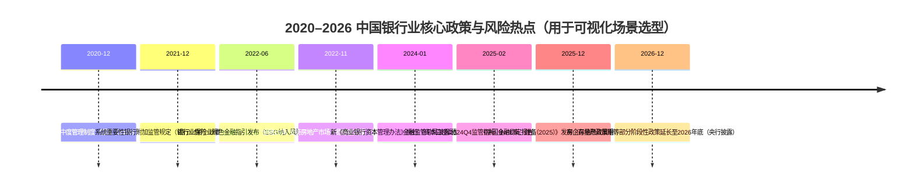

# 中国银行业数值类可视化决策指南叶子节点提取与 antV G2 明细数据场景库（2020–2026 深度研究）

## 执行摘要

本报告基于用户提供的《数据可视化》“数值分类/数值×分类”决策指南树（JSON）提取出**全部图表型叶子节点（decision-chart）共 16 个**，并对用户明确要求的常见数值类图表叶子节点（柱状/条形/折线/散点/直方/箱线/瀑布/雷达/桑基等）进行**补充覆盖**，形成一个面向银行零售、对公、风险管理、合规与普惠金融的**“图表叶子节点→业务场景→antV G2 明细数据（示例/模拟）→管理洞察与可执行动作”**的可复用场景库。叶子节点提取依据为用户上传文件。fileciteturn0file0

在 2020–2026 中国银行业环境中，监管与风险主题呈现“**房地产风险化解与融资政策组合持续推进**、**中小与普惠客群风险的结构性抬升需精细化监测**、**净息差（NIM）持续承压倒逼量价与负债结构管理**、**资本与流动性监管框架升级（新资本管理办法、系统重要性银行附加监管、LCR/NSFR）**、**ESG/气候风险从倡导走向治理与量化（情景分析/压力测试）**、**支付与渠道数字化深化**”的共振特征。人民银行在《中国金融稳定报告（2025）》中明确提到：围绕房地产推出政策组合、延长部分阶段性政策至 2026 年底，并在报告专题中给出气候风险（物理风险与转型风险）分析框架与结论。citeturn34view0turn36view0turn32view0 监管数据层面，商业银行不良贷款率在 2024Q4 为 **1.50%**、2025Q1 为 **1.51%**、2025Q3 为 **1.52%**（法人口径），拨备覆盖率约 **207%–211%**，LCR/NSFR 保持在监管要求之上但存在结构分化，构成本场景库指标选择的“底盘数据”。citeturn13search0turn13search4turn13search1

面向落地优先级，建议银行以“**风险与监管刚需优先（资产质量、迁徙、资本与流动性、房地产与普惠、ESG/气候）**→**经营管理与增长（渠道数字化、产品结构、定价与RAROC）**→**复杂关系与交叉风险（网络/UpSet/Chord/Arc）**”的顺序分批上线，以避免“图表先行但数据治理与口径未就绪”的常见失败模式。

## 研究方法与叶子节点提取结果

### 方法说明与边界假设

本次“决策指南叶子节点”以用户上传的 `tree-catnum.json` 为唯一内部依据：将其中 `type = "decision-chart"` 的节点视为**叶子节点**（从结构上看，图表节点均由问题节点指向，且无进一步出边），得到 16 个叶子节点。fileciteturn0file0

重要假设（已在各场景复述）：本报告所给 **antV G2 数据集均为“示例/模拟数据”**，用于展示字段结构、粒度选择与图表优势；真实生产数据需来自银行数据仓库/数据湖，并通过统一口径（主数据、指标字典、监管报送一致性）校验后替换。

### 决策指南中提取到的图表叶子节点清单（16 个）

下表为从上传 JSON 决策树中提取的全部图表叶子节点（按原节点 ID）及中文释义（本报告翻译）。fileciteturn0file0

| 原叶子节点（JSON id） | 英文标签 | 中文释义（本报告） | 典型用途（银行） |
|---|---|---|---|
| chart-structure-hierarchy-treemap | Treemap | 矩形树图 | 资产/风险敞口层级占比与集中度 |
| chart-structure-hierarchy-sunburst | Sunburst | 旭日图 | 业务线→产品→渠道层级结构 |
| chart-structure-hierarchy-circular-packing | Circular Packing | 圆形填充图 | 层级分群的规模对比 |
| chart-structure-set-venn | Venn Diagram | 韦恩图 | 风险标签交集（≤3 集） |
| chart-structure-set-upset | UpSet | UpSet 图 | 多标签交集（>3 集） |
| chart-structure-set-circular-packing | Circular Packing (Set) | 圆形填充图（集合视角） | 多集合规模对比 |
| chart-structure-flow-sankey | Sankey | 桑基图 | 状态迁徙/资金流/渠道流 |
| chart-structure-flow-alluvial | Alluvial | 河流图 | 多阶段结构变化（时间/步骤） |
| chart-structure-network-network | Network Graph | 关系网络图 | 担保链/关联交易/传染 |
| chart-structure-network-chord | Chord Diagram | 和弦图 | 部门/区域之间双向流量 |
| chart-structure-network-arc | Arc Diagram | 弧形关系图 | 中心-辐射关系与强度 |
| chart-combo-mcat-1num-grouped-bar | Grouped Barplot | 分组条形图 | 分类对比（多系列） |
| chart-combo-mcat-1num-stacked-bar | Stacked Barplot | 堆叠条形图 | 构成对比（多类别叠加） |
| chart-combo-mcat-mnum-heatmap | Heatmap | 热力图 | 二维分类×数值强度 |
| chart-combo-mcat-mnum-small-multiples | Small Multiples | 小多图 | 多区域/多客群小图并列 |
| chart-combo-mcat-mnum-facet-rect | Facet Rect | 矩形分面图 | 分面矩阵对比（多维切片） |

### 用户要求的常见数值类图表叶子节点覆盖情况

用户显式要求至少覆盖：柱状图、堆叠柱状图、条形图、折线图、面积图、散点图、气泡图、热力图、直方图、箱线图、密度图、瀑布图、雷达图、桑基图、堆积面积图、堆积条形图、热力矩阵、堆叠百分比图、堆叠条形百分比、堆叠柱形百分比、堆叠折线等。

其中，**热力图、堆叠条形图、桑基图**已在决策树文件中出现；其余为本报告**补充叶子节点（未在提供的决策树 JSON 中出现）**，但均按照同一“叶子节点章节模板”给出银行场景、G2 明细数据与行动建议。

## 2020–2026 中国银行业核心趋势、信贷风险热点与政策导向

### 资产质量与普惠/中小风险：总体稳定下的结构性压力

监管口径下，商业银行不良贷款率在 2024Q4 为 **1.50%**，2025Q1 为 **1.51%**，2025Q3 为 **1.52%**；不良贷款余额在 2024Q4 为 **3.3 万亿元**、2025Q3 为 **3.5 万亿元**。这意味着“比例总体平稳”并不等同于“风险消散”，而更需要通过行业、区域、客群与产品维度做穿透式监测。citeturn13search0turn13search4turn13search1

人民银行在《中国金融稳定报告（2025）》的银行业压力测试专题中也明确提示：**客户集中度风险、中小微企业及个人非住房贷款等领域风险值得关注**；在“中小微企业及个人非住房不良贷款率上升 400%”等敏感性情景下，资本充足率会出现明显下探。citeturn15view0turn25view2 这一判断直接决定了可视化体系应优先覆盖：逾期分布、迁徙、行业热力、网络传染、以及“模型评分（PD）×抵质押（LTV）×政策冲击”的联动分析。

### 房地产：从“压降与集中度管控”到“稳市场与保交楼”的政策组合延伸至 2026

房地产金融监管在 2020 年末形成关键制度安排：人民银行、原银保监会发布《关于建立银行业金融机构房地产贷款集中度管理制度的通知》（银发〔2020〕322号），提出建立房地产贷款集中度管理制度框架。citeturn0search1

在房地产市场调整背景下，2022 年 11 月人民银行与原银保监会发布“金融 16 条”文件《关于做好当前金融支持房地产市场平稳健康发展工作的通知》，提出稳定开发贷投放、支持个人住房贷款合理需求、支持存量融资合理展期、并明确“阶段性调整部分金融管理政策”等安排。citeturn12search0

更关键的是，在《中国金融稳定报告（2025）》专栏中，人民银行披露：2024 年先后两轮推出力度较大的房地产金融政策组合；将经营性物业贷款与“金融16条”中房企存量融资展期两项阶段性政策延长至 **2026 年底**；并披露全国层面下调首套/二套最低首付比例至 **15%**、取消全国层面房贷利率政策下限，以及 2024 年 12 月全国新发放房贷平均利率 **3.09%** 等信息。citeturn36view0turn34view0 这对银行的含义是：房地产相关风险管理需同时处理“存量风险处置（迁徙/重组/展期）”与“新增业务定价与准入（LTV、DSCR、项目现金流封闭管理）”，可视化必须支持“两条腿走路”的经营-风险一体化看板。

### 资本、流动性与系统重要性监管：Basel III/IV 与中国版资本新规的落地影响

国家金融监督管理总局发布《商业银行资本管理办法》（2023 年第 4 号令公布，**自 2024 年 1 月 1 日起施行**），明确资本监管指标包括资本充足率与杠杆率，并建立差异化监管框架。citeturn7search0turn5search0 监管数据公告也提示：自 2024 年起披露的资本充足率相关指标按新办法计算，与历史数据**不直接可比**，这要求银行在可视化产品中显式标注“口径切换点”，避免误判趋势。citeturn13search0

系统重要性银行方面，《系统重要性银行附加监管规定（试行）》自 2021 年 12 月 1 日起施行，规定 D-SIB 在满足最低资本、储备资本与逆周期资本要求基础上，还需满足 **0.25%–1.5%** 的附加资本要求，并设置附加杠杆率要求等。citeturn8search3

国际框架上，巴塞尔委员会 2017 年发布的 Basel III 最终改革文件提出“输出底线（output floor）”等安排，并在过渡期内逐步提高至 **72.5%**。citeturn31view0turn30view0 对中国银行业的可视化启示是：资本与RWA管理不能只看“静态达标”，更要展示“RWA 驱动因素（资产结构、模型/权重法差异、房地产与小微权重）”与“资本补充路径（利润留存、发行资本工具、风险出清）”的可解释分解。

### ESG 与气候风险：从指引、披露到情景分析/压力测试的量化治理

原银保监会发布《银行业保险业绿色金融指引》（银保监发〔2022〕15号），要求银行保险机构识别、监测、防控业务活动中的环境、社会和治理风险，并将 ESG 要求纳入全面风险管理流程，强化信息披露。citeturn1search0

金融行业标准《金融机构环境信息披露指南》（JR/T 0227—2021）对“情景分析”“压力测试”等术语进行定义，并强调可用于评估不利情景对资产质量、盈利、资本与流动性的影响。citeturn28view0turn27view1

人民银行《中国金融稳定报告（2025）》“银行业气候风险分析”专题进一步给出关键结论：气候风险包含**物理风险**与**转型风险**两类；基于 NGFS 情景并结合“30·60”目标开展分析，结论指出银行体系受转型风险影响相对较小，但物理风险会放大尾部风险概率，沿海省份风险更突出。citeturn32view0turn19view0 因此，本场景库在雷达图、热力矩阵、散点/气泡图等节点中纳入 ESG/气候字段，便于与信用风险指标协同展示。

### 数字化零售金融与支付：渠道迁移与信用卡结构变化的监测需求上升

人民银行《2024年支付体系运行总体情况》显示：2024 年银行处理电子支付业务 **3016.68 亿笔**，其中移动支付 **2109.80 亿笔**；并披露银行账户、个人账户等规模数据。citeturn23view0turn23view1turn3view0 这类官方统计为银行衡量“数字化渗透率（以交易与金额、线上化率、移动替代率等代理指标）”提供了外部参照，也提示应在“堆积面积图/小多图/河流图”等节点中沉淀可复用的数据结构。

## 图表叶子节点银行场景库与 antV G2 明细数据

说明：以下每个“节点章节”均包含——场景名称、节点ID、场景描述、时间粒度与理由、核心数据指标、antV G2 明细数据（JSON 数组，**示例/模拟数据**）、以及以“首席银行业务与信贷风控架构师”口吻给出的洞察与可执行动作。除特别注明外，数据单位与口径在字段名中体现；利率/比率字段默认用小数（如 0.015=1.5%）。

### 节点章节：柱状图

节点ID（短码）：COL（补充叶子节点，未在决策树 JSON 出现）  
业务线：普惠金融 / 对公  
场景名称：普惠小微“季度投放—风险回看”柱状对比  
场景描述：按季度对比各区域普惠小微新增投放与同期资产质量（关注率/NPL），用于平衡“两增”目标与风险底线。监管数据表明普惠型小微贷款余额保持增长，但全行业不良余额仍处高位，需要按区域穿透。citeturn13search1turn13search0  
时间粒度与理由：季度；普惠政策与授信投放复盘通常以季度口径对齐经营分析与监管统计节奏。  
核心数据指标：新增投放额、新发放平均利率、关注率、不良率、逾期90+率、户数。

antV G2 明细数据（JSON，示例/模拟数据）：
```json
[
  {"quarter":"2025Q1","region":"长三角","product":"普惠经营贷","new_loan_cny_100m":86.4,"avg_rate":0.0365,"sml_loan_cnt":18240,"special_mention_ratio":0.021,"npl_ratio":0.012},
  {"quarter":"2025Q1","region":"珠三角","product":"普惠经营贷","new_loan_cny_100m":72.1,"avg_rate":0.0358,"sml_loan_cnt":15410,"special_mention_ratio":0.019,"npl_ratio":0.011},
  {"quarter":"2025Q1","region":"成渝","product":"普惠经营贷","new_loan_cny_100m":38.7,"avg_rate":0.0392,"sml_loan_cnt":10120,"special_mention_ratio":0.028,"npl_ratio":0.016},
  {"quarter":"2025Q2","region":"长三角","product":"普惠经营贷","new_loan_cny_100m":91.6,"avg_rate":0.0361,"sml_loan_cnt":19050,"special_mention_ratio":0.023,"npl_ratio":0.013},
  {"quarter":"2025Q2","region":"珠三角","product":"普惠经营贷","new_loan_cny_100m":69.8,"avg_rate":0.0354,"sml_loan_cnt":14980,"special_mention_ratio":0.020,"npl_ratio":0.011},
  {"quarter":"2025Q2","region":"成渝","product":"普惠经营贷","new_loan_cny_100m":41.2,"avg_rate":0.0387,"sml_loan_cnt":10860,"special_mention_ratio":0.031,"npl_ratio":0.017}
]
```

专业架构师观点与可执行建议：  
在净息差承压与风险“结构分化”并存阶段，普惠投放不能只看规模同比增速，而要把“**投放—迁徙—处置**”闭环纳入同一视图。人民银行压力测试专题已提示中小微领域风险在极端情景下对资本充足率具有显著冲击。citeturn15view0turn33view1 建议建立三类可执行规则：其一，季度投放环比>15%且关注率同步上行>30bp时，触发行业/区域准入复核；其二，若同一区域“新发放平均利率下降”但“逾期90+率上行”，需检查是否存在价格战与贷后弱化；其三，将普惠组合RAROC阈值设置为“≥资金成本+经济资本成本+目标回报”，对低于阈值的产品强制走“提价/缩量/增信”三选一的整改路径（假设：银行已建立统一FTP与经济资本计量）。

### 节点章节：堆叠柱状图

节点ID：SCOL（补充叶子节点，未在决策树 JSON 出现）  
业务线：风险管理 / 财务管理  
场景名称：RWA 结构与资本约束的年度堆叠柱状图  
场景描述：展示信用/市场/操作三类风险加权资产（RWA）对资本充足率的结构贡献，用于对齐“新资本管理办法”下的资本规划与资产结构调整。新办法自 2024-01-01 起施行，且口径变化导致历史数据不可直接可比，需在视图中显式标注。citeturn7search0turn13search0  
时间粒度与理由：年度；资本规划与监管评估多以年度为主，并配合季度滚动预测。  
核心数据指标：信用RWA、市场RWA、操作RWA、核心一级资本、CAR/CET1、杠杆率。

antV G2 明细数据（JSON，示例/模拟数据）：
```json
[
  {"year":2024,"risk_type":"信用风险RWA","rwa_cny_100m":1825000,"bank_type":"全国性银行","cet1_ratio":0.110},
  {"year":2024,"risk_type":"市场风险RWA","rwa_cny_100m":165000,"bank_type":"全国性银行","cet1_ratio":0.110},
  {"year":2024,"risk_type":"操作风险RWA","rwa_cny_100m":210000,"bank_type":"全国性银行","cet1_ratio":0.110},
  {"year":2025,"risk_type":"信用风险RWA","rwa_cny_100m":1898000,"bank_type":"全国性银行","cet1_ratio":0.109},
  {"year":2025,"risk_type":"市场风险RWA","rwa_cny_100m":172000,"bank_type":"全国性银行","cet1_ratio":0.109},
  {"year":2025,"risk_type":"操作风险RWA","rwa_cny_100m":228000,"bank_type":"全国性银行","cet1_ratio":0.109}
]
```

专业架构师观点与可执行建议：  
资本约束正在从“达标管理”转向“结构管理”。Basel III 最终改革强调降低RWA可变性，并引入输出底线逐步过渡至 72.5%。citeturn31view0turn30view0 在中国语境下，新资本管理办法叠加系统重要性银行附加资本要求，会放大“高RWA业务扩张”的资本成本。citeturn8search3turn7search0 建议动作：把“信用RWA年增速”设为硬阈值（例如>8%必须同步提交资本补充或资产结构对冲方案）；对房地产开发贷、小微高风险权重资产设置“RWA/收益”红线；将资本规划与业务预算绑定（业务预算审批必须附带RWA与资本占用测算）。

### 节点章节：条形图

节点ID：BAR（补充叶子节点，未在决策树 JSON 出现）  
业务线：对公 / 风险管理  
场景名称：行业不良率 Top10 横向排名条形图  
场景描述：对公行业维度进行不良率/逾期率排名，快速定位风险聚集行业（如房地产链条、地方融资平台相关行业等）。监管要求房地产贷款集中度管理，行业排序视图应与集中度监测联动。citeturn0search1turn13search1  
时间粒度与理由：月度；行业风险变化通常在月度贷后监测与资产分类调整中体现。  
核心数据指标：行业不良率、逾期90+率、行业余额、迁徙率（正常→关注→不良）。

antV G2 明细数据（JSON，示例/模拟数据）：
```json
[
  {"as_of":"2025-12-31","industry":"房地产开发","loan_balance_cny_100m":18500,"npl_ratio":0.028,"dpd90_ratio":0.021},
  {"as_of":"2025-12-31","industry":"建筑施工","loan_balance_cny_100m":11200,"npl_ratio":0.024,"dpd90_ratio":0.018},
  {"as_of":"2025-12-31","industry":"批发零售","loan_balance_cny_100m":26400,"npl_ratio":0.017,"dpd90_ratio":0.013},
  {"as_of":"2025-12-31","industry":"交通运输","loan_balance_cny_100m":9800,"npl_ratio":0.015,"dpd90_ratio":0.010},
  {"as_of":"2025-12-31","industry":"制造业","loan_balance_cny_100m":45800,"npl_ratio":0.014,"dpd90_ratio":0.009},
  {"as_of":"2025-12-31","industry":"住宿餐饮","loan_balance_cny_100m":4200,"npl_ratio":0.019,"dpd90_ratio":0.014}
]
```

专业架构师观点与可执行建议：  
横向排名的价值在于“先定位、后钻取”。在房地产风险化解与政策组合持续演进的 2024–2026 阶段，银行应把房地产链条（开发、施工、建材、家居）作为“组合风险”，而不是单一行业；人民银行亦披露通过政策组合支持房地产市场风险化解并延长部分政策至 2026 年底。citeturn36view0turn12search0 建议：对 Top 行业设置双阈值预警（NPL率>2%且余额占比>8%触发组合级压力测试；DPD90+环比上升>20bp触发名单制贷后）；并将行业排名与授信政策自动联动（例如行业进入Top3则自动提高准入评分门槛、下调单户授信上限或提高保证金/抵押率要求）。

### 节点章节：分组条形图（决策树叶子节点）

节点ID：GBAR（对应决策树：chart-combo-mcat-1num-grouped-bar）fileciteturn0file0  
业务线：零售 / 风险管理  
场景名称：零售三大产品线逾期率“渠道×客群”分组对比  
场景描述：将信用卡、消费贷、按揭按“线上/线下”渠道与“新客/存量客”分组，比较逾期率差异，识别数字化获客的风险定价偏差。  
时间粒度与理由：周度；零售风险前移需要周度节奏（尤其信用卡/消费贷），快于月度资产分类。  
核心数据指标：7天逾期率、30天逾期率、核销率、客群规模、获客成本（可选）。

antV G2 明细数据（JSON，示例/模拟数据）：
```json
[
  {"week":"2025-W48","product":"信用卡","channel":"线上","customer_cohort":"新客","dpd7_ratio":0.012,"dpd30_ratio":0.006,"active_accounts":182000},
  {"week":"2025-W48","product":"信用卡","channel":"线下","customer_cohort":"新客","dpd7_ratio":0.009,"dpd30_ratio":0.004,"active_accounts":76000},
  {"week":"2025-W48","product":"消费贷","channel":"线上","customer_cohort":"新客","dpd7_ratio":0.008,"dpd30_ratio":0.003,"active_accounts":54000},
  {"week":"2025-W48","product":"消费贷","channel":"线下","customer_cohort":"新客","dpd7_ratio":0.006,"dpd30_ratio":0.002,"active_accounts":41000},
  {"week":"2025-W48","product":"按揭","channel":"线上","customer_cohort":"新客","dpd7_ratio":0.001,"dpd30_ratio":0.0006,"active_accounts":12000},
  {"week":"2025-W48","product":"按揭","channel":"线下","customer_cohort":"新客","dpd7_ratio":0.0012,"dpd30_ratio":0.0007,"active_accounts":18000}
]
```

专业架构师观点与可执行建议：  
渠道数字化不是“风险天然更低”，而是“风险可被更快计量与反馈”。人民银行支付统计显示移动支付规模持续提升，银行电子渠道承载的交易量巨大，意味着线上风控策略的微小偏差会被规模放大。citeturn23view0turn3view0 建议：对线上新客建立“分组条形图→策略回放”的周度闭环——若线上新客 DPD7/DPD30 同时高于线下新客且差异扩大（例如>30%），必须触发三项联检：反欺诈拦截率、授信模型分数漂移（psi）、以及营销渠道黑白名单；并将“授信额度阶梯”与风险分数/收入核验强度绑定，避免以量补价带来的尾部损失。

### 节点章节：堆叠条形图（决策树叶子节点 + 用户必选）

节点ID：SBAR（对应决策树：chart-combo-mcat-1num-stacked-bar）fileciteturn0file0  
业务线：零售 / 风险管理  
场景名称：信用卡逾期账龄结构堆叠条形图（DPD Bucket）  
场景描述：将逾期账户按 DPD（0–30、31–60、61–90、90+）堆叠展示，按城市层级或客群对比，识别“逾期结构恶化”（90+占比上升）而非仅看总逾期率。  
时间粒度与理由：月度；信用卡资产质量与核销节奏、多数监管/内部报表在月度对齐。  
核心数据指标：各DPD bucket余额、bucket占比、M1迁徙率（31+的进入率）、核销/回收率。

antV G2 明细数据（JSON，示例/模拟数据）：
```json
[
  {"month":"2025-10","city_tier":"一线","dpd_bucket":"0-30","balance_cny_100m":32.4,"bucket_share":0.62},
  {"month":"2025-10","city_tier":"一线","dpd_bucket":"31-60","balance_cny_100m":10.1,"bucket_share":0.19},
  {"month":"2025-10","city_tier":"一线","dpd_bucket":"61-90","balance_cny_100m":5.2,"bucket_share":0.10},
  {"month":"2025-10","city_tier":"一线","dpd_bucket":"90+","balance_cny_100m":4.6,"bucket_share":0.09},
  {"month":"2025-10","city_tier":"三四线","dpd_bucket":"0-30","balance_cny_100m":18.8,"bucket_share":0.54},
  {"month":"2025-10","city_tier":"三四线","dpd_bucket":"90+","balance_cny_100m":6.9,"bucket_share":0.20}
]
```

专业架构师观点与可执行建议：  
堆叠结构图的关键是识别“风险向长账龄堆积”的拐点——这通常意味着催收策略、额度管理或客群准入出现系统性偏差。结合监管披露的行业不良余额与不良率稳定特征，银行更应关注“结构恶化的早期信号”。citeturn13search0turn13search1 建议：设定“90+占比”与“61–90→90+迁徙率”为硬阈值（例如90+占比环比+2pp或迁徙率>15%触发专项复盘）；对三四线城市叠加“资产负债联动”视角（当地存款竞争导致负债成本上行时，需严控高风险授信扩张，避免NIM进一步受压—此处为经营逻辑假设，实际以本行FTP为准）。

### 节点章节：堆叠百分比图

节点ID：SPCT（补充叶子节点，未在决策树 JSON 出现）  
业务线：财务管理 / 零售  
场景名称：存款结构“定期化”堆叠百分比监测  
场景描述：展示活期、定期、结构性存款在总存款中的占比变化，用于评估负债成本刚性与净息差压力（NIM承压时，负债结构是最重要的可控杠杆之一）。  
时间粒度与理由：月度；存款结构变化在月度资产负债管理（ALM）中跟踪最有效。  
核心数据指标：活期/定期/结构性存款占比、加权负债成本率、FTP差、NIM（如已计算）。

antV G2 明细数据（JSON，示例/模拟数据）：
```json
[
  {"month":"2025-06","deposit_type":"活期","share":0.34,"avg_cost":0.004},
  {"month":"2025-06","deposit_type":"定期","share":0.58,"avg_cost":0.015},
  {"month":"2025-06","deposit_type":"结构性","share":0.08,"avg_cost":0.019},
  {"month":"2025-12","deposit_type":"活期","share":0.31,"avg_cost":0.004},
  {"month":"2025-12","deposit_type":"定期","share":0.61,"avg_cost":0.014},
  {"month":"2025-12","deposit_type":"结构性","share":0.08,"avg_cost":0.018}
]
```

专业架构师观点与可执行建议：  
在“降融资成本、稳增长”的宏观取向下，贷款收益率下行往往快于负债成本下行，房地产按揭利率政策调整也会通过重定价影响资产端收益。citeturn36view0turn34view0 因此，建议将堆叠百分比图与三项动作绑定：一是把“定期占比”与“高成本负债占比”纳入分行KPI的风险约束项（超过阈值需制定负债降成本计划）；二是对高成本存款集中到期月份做现金流缺口情景；三是将零售AUM经营与负债结构联动（用理财/代销替代高成本存款，降低期限错配压力——需合规审查）。

### 节点章节：堆叠柱形百分比

节点ID：SCOLP（补充叶子节点，未在决策树 JSON 出现）  
业务线：零售  
场景名称：零售贷款产品结构“去房地产化/再平衡”堆叠柱形百分比  
场景描述：按月展示按揭、消费贷、信用卡分期、个人经营贷在零售贷款中的占比，用于检验“房地产贷款压降/结构调整”在零售端的落地效果。房地产贷款集中度管理制度与后续政策组合要求银行在结构上做到“有支持、有压降、有审慎”。citeturn0search1turn36view0  
时间粒度与理由：月度；产品结构调整与资产负债表变化以月度最直观。  
核心数据指标：各产品余额占比、产品NPL/DPD90+、加权收益率、LTV中位数（按揭）。

antV G2 明细数据（JSON，示例/模拟数据）：
```json
[
  {"month":"2025-01","product":"按揭","share":0.58,"balance_cny_100m":8200,"npl_ratio":0.004},
  {"month":"2025-01","product":"消费贷","share":0.22,"balance_cny_100m":3100,"npl_ratio":0.012},
  {"month":"2025-01","product":"个人经营贷","share":0.15,"balance_cny_100m":2100,"npl_ratio":0.009},
  {"month":"2025-12","product":"按揭","share":0.54,"balance_cny_100m":8450,"npl_ratio":0.004},
  {"month":"2025-12","product":"消费贷","share":0.25,"balance_cny_100m":3920,"npl_ratio":0.013},
  {"month":"2025-12","product":"个人经营贷","share":0.16,"balance_cny_100m":2500,"npl_ratio":0.010}
]
```

专业架构师观点与可执行建议：  
人民银行披露 2024 年全国层面下调首付比例、取消房贷利率政策下限并推动降低存量房贷利率，这会让按揭业务在“规模—收益—风险”三角中重新排序。citeturn36view0turn34view0 建议：把“按揭占比下降”视为结果指标，把“按揭LTV分布右移、二套占比上升、区域集中度上升”视为过程风险指标；若消费贷占比上升同时 DPD30/90+恶化，应同步收紧额度与期限，并调整风险定价（利率加点与风险分层一致），防止用高风险资产去对冲NIM导致资本占用上升。

### 节点章节：堆叠条形百分比

节点ID：SBARP（补充叶子节点，未在决策树 JSON 出现）  
业务线：对公 / 风险管理  
场景名称：对公行业投向结构占比堆叠条形百分比  
场景描述：对公授信余额按行业占比展示，重点监测房地产链条、地方融资平台相关行业的集中度变化；与房地产贷款集中度管理要求联动。citeturn0search1  
时间粒度与理由：季度；对公投向与行业限额多以季度复盘和调整。  
核心数据指标：行业占比、行业限额使用率、行业NPL、项目融资违约率。

antV G2 明细数据（JSON，示例/模拟数据）：
```json
[
  {"quarter":"2025Q3","industry":"制造业","share":0.34,"limit_utilization":0.78,"npl_ratio":0.014},
  {"quarter":"2025Q3","industry":"基建与公用事业","share":0.22,"limit_utilization":0.81,"npl_ratio":0.010},
  {"quarter":"2025Q3","industry":"批发零售","share":0.15,"limit_utilization":0.74,"npl_ratio":0.017},
  {"quarter":"2025Q3","industry":"房地产相关","share":0.12,"limit_utilization":0.92,"npl_ratio":0.028},
  {"quarter":"2025Q3","industry":"交通物流","share":0.10,"limit_utilization":0.69,"npl_ratio":0.015},
  {"quarter":"2025Q3","industry":"其他","share":0.07,"limit_utilization":0.55,"npl_ratio":0.013}
]
```

专业架构师观点与可执行建议：  
“占比下降”不必然代表风险下降，关键在于风险是否转移到“看似分散但高度相关”的子行业与交易结构。建议对“房地产相关”行业设置穿透口径（开发贷、并购贷、经营性物业贷、上下游供应链融资分别监测），并把“限额使用率>90%且行业NPL上行”作为强制压降触发条件；同时引入“压力测试情景标签”（如利率下行、信用利差扩大）与资本占用联动展示。citeturn31view0turn33view1

### 节点章节：折线图

节点ID：LINE（补充叶子节点，未在决策树 JSON 出现）  
业务线：风险管理  
场景名称：小微组合 NPL 与关注率月度趋势折线图（双轴）  
场景描述：用折线展示小微贷款不良率与关注率的领先-滞后关系，辅助判断“风险是否在迁徙前置阶段积累”。  
时间粒度与理由：月度；资产分类与拨备计提多以月度/季度为核心节奏。  
核心数据指标：不良率、关注率、迁徙率（关注→不良）、拨备覆盖率（组合口径）。

antV G2 明细数据（JSON，示例/模拟数据）：
```json
[
  {"month":"2025-07","segment":"普惠小微","special_mention_ratio":0.026,"npl_ratio":0.014,"mig_sm_to_npl":0.083},
  {"month":"2025-08","segment":"普惠小微","special_mention_ratio":0.028,"npl_ratio":0.0145,"mig_sm_to_npl":0.087},
  {"month":"2025-09","segment":"普惠小微","special_mention_ratio":0.030,"npl_ratio":0.015,"mig_sm_to_npl":0.092},
  {"month":"2025-10","segment":"普惠小微","special_mention_ratio":0.031,"npl_ratio":0.0153,"mig_sm_to_npl":0.095},
  {"month":"2025-11","segment":"普惠小微","special_mention_ratio":0.032,"npl_ratio":0.0158,"mig_sm_to_npl":0.101},
  {"month":"2025-12","segment":"普惠小微","special_mention_ratio":0.033,"npl_ratio":0.0162,"mig_sm_to_npl":0.108}
]
```

专业架构师观点与可执行建议：  
折线图的核心价值是识别拐点与斜率变化。人民银行压力测试显示中小微与个人非住房贷款是敏感性情景中值得关注的领域。citeturn15view0turn25view2 建议：将“关注率连续 3 个月上行且迁徙率突破阈值（如>10%）”设为红色预警；在预警触发后，执行三步动作：行业与区域白名单重评、授信模型阈值上调（PD cut-off）、以及贷后策略升级（提高回访频次、提前介入现金流监测）。假设：银行已建立迁徙矩阵与月度分类数据集市。

### 节点章节：面积图

节点ID：AREA（补充叶子节点，未在决策树 JSON 出现）  
业务线：零售 / 数字金融  
场景名称：电子渠道交易金额“面积趋势”与经营跃迁  
场景描述：展示手机银行、网银等电子渠道交易金额随时间的规模变化，用面积图突出“总量增长”与“增长加速度”。该类指标可与央行支付报告中的电子支付/移动支付规模形成参照。citeturn23view0turn3view0  
时间粒度与理由：月度；用于经营分析与渠道运营复盘。  
核心数据指标：电子渠道交易笔数、金额、活跃用户数、线上转化率、线上贷申请-放款转化率。

antV G2 明细数据（JSON，示例/模拟数据）：
```json
[
  {"month":"2025-08","channel":"手机银行","txn_amt_cny_100m":18200,"txn_cnt_m":920},
  {"month":"2025-08","channel":"网银","txn_amt_cny_100m":7600,"txn_cnt_m":210},
  {"month":"2025-09","channel":"手机银行","txn_amt_cny_100m":18950,"txn_cnt_m":955},
  {"month":"2025-09","channel":"网银","txn_amt_cny_100m":7400,"txn_cnt_m":205},
  {"month":"2025-10","channel":"手机银行","txn_amt_cny_100m":20110,"txn_cnt_m":1008},
  {"month":"2025-10","channel":"网银","txn_amt_cny_100m":7250,"txn_cnt_m":198}
]
```

专业架构师观点与可执行建议：  
央行支付报告显示银行移动支付与电子支付规模巨大。citeturn23view0turn23view1 面积图应从“看规模”升级为“看风险与价值”：建议把电子渠道交易增长与欺诈损失率、争议交易率、以及线上授信坏账率联动；当“交易金额上行但活跃用户下行”时，通常意味着用户结构变化（高频商户/机构交易占比上升），应触发反洗钱与反欺诈模型的阈值再校准（假设：已建立统一客户ID与交易画像）。

### 节点章节：堆积面积图（堆积面积图/堆叠面积）

节点ID：SAREA（补充叶子节点，未在决策树 JSON 出现）  
业务线：零售 / 运营管理  
场景名称：零售贷款放款渠道结构堆积面积图  
场景描述：按月展示线上自营、线下网点、互联网平台合作三类放款占比与规模，识别渠道迁移对资产质量的影响。  
时间粒度与理由：月度；便于对齐放款、获客与贷后表现。  
核心数据指标：放款额、渠道占比、渠道坏账率、获客成本、RAROC（渠道口径）。

antV G2 明细数据（JSON，示例/模拟数据）：
```json
[
  {"month":"2025-07","channel":"线上自营","disburse_cny_100m":420,"npl_ratio":0.013},
  {"month":"2025-07","channel":"线下网点","disburse_cny_100m":380,"npl_ratio":0.010},
  {"month":"2025-07","channel":"平台合作","disburse_cny_100m":210,"npl_ratio":0.018},
  {"month":"2025-12","channel":"线上自营","disburse_cny_100m":510,"npl_ratio":0.014},
  {"month":"2025-12","channel":"线下网点","disburse_cny_100m":330,"npl_ratio":0.011},
  {"month":"2025-12","channel":"平台合作","disburse_cny_100m":260,"npl_ratio":0.020}
]
```

专业架构师观点与可执行建议：  
堆积面积图的洞察在于“结构变化是否伴随风险变化”。建议设定“平台合作放款占比”上限与动态调节机制：若平台合作占比上升且其坏账率显著高于自营（如高出>50%），必须提高准入门槛（额度、期限、核验强度）或下调合作规模；同时对合作渠道引入“资金用途穿透核验”与“联合贷后数据回传SLA”（假设：合作方可提供关键行为数据，且已完成数据合规评估）。

### 节点章节：堆叠折线

节点ID：SLINE（补充叶子节点，未在决策树 JSON 出现）  
业务线：风险管理  
场景名称：行业对总不良贡献的“堆叠折线”分解  
场景描述：将总不良余额按行业贡献进行堆叠显示，观察总量变化由哪些行业驱动（对公组合常见）。  
时间粒度与理由：季度；对公不良确认与处置多以季度复盘。  
核心数据指标：行业不良余额贡献、行业余额、行业迁徙率、清收回收率。

antV G2 明细数据（JSON，示例/模拟数据）：
```json
[
  {"quarter":"2024Q4","industry":"房地产相关","npl_balance_cny_100m":520,"total_npl_balance_cny_100m":1680},
  {"quarter":"2024Q4","industry":"制造业","npl_balance_cny_100m":430,"total_npl_balance_cny_100m":1680},
  {"quarter":"2024Q4","industry":"批发零售","npl_balance_cny_100m":310,"total_npl_balance_cny_100m":1680},
  {"quarter":"2025Q3","industry":"房地产相关","npl_balance_cny_100m":560,"total_npl_balance_cny_100m":1820},
  {"quarter":"2025Q3","industry":"制造业","npl_balance_cny_100m":455,"total_npl_balance_cny_100m":1820},
  {"quarter":"2025Q3","industry":"批发零售","npl_balance_cny_100m":340,"total_npl_balance_cny_100m":1820}
]
```

专业架构师观点与可执行建议：  
监管披露显示行业层面不良率总体稳定，但并不否认行业间结构分化。citeturn13search1turn13search0 建议用堆叠折线将“行业贡献”与“处置动作”同屏：对贡献提升最快的行业，建立专项资产包处置与重组策略；对房地产链条，结合人民银行披露的保交楼、经营性物业贷款政策延续至 2026 年底等安排，实施“一项目一策”现金流封闭管理与贷后工程节点核验。citeturn36view0turn12search0

### 节点章节：散点图

节点ID：SCAT（补充叶子节点，未在决策树 JSON 出现）  
业务线：零售 / 风险管理  
场景名称：按揭贷款 LTV—PD 关系散点图（政策利率环境下的风险分层）  
场景描述：在房贷利率与首付政策变化后，用散点图观察 LTV 分布与模型 PD 的相关关系，识别“高LTV+高PD”高风险簇。人民银行披露全国层面首付比例下调至 15%、新发放房贷平均利率 3.09% 等，按揭获客与重定价环境变化显著。citeturn36view0turn34view0  
时间粒度与理由：笔级（每笔贷款记录），并以月度截面展示；散点需要明细粒度以呈现离群点与簇结构。  
核心数据指标：LTV、DTI、PD、LGD、房龄、城市层级、贷款余额（可选）。

antV G2 明细数据（JSON，示例/模拟数据）：
```json
[
  {"as_of":"2025-12-31","loan_id":"M0001","city_tier":"一线","ltv":0.72,"dti":0.38,"pd":0.006,"lgd":0.18,"balance_cny_10k":220},
  {"as_of":"2025-12-31","loan_id":"M0002","city_tier":"二线","ltv":0.85,"dti":0.46,"pd":0.012,"lgd":0.22,"balance_cny_10k":180},
  {"as_of":"2025-12-31","loan_id":"M0003","city_tier":"三四线","ltv":0.88,"dti":0.55,"pd":0.018,"lgd":0.28,"balance_cny_10k":95},
  {"as_of":"2025-12-31","loan_id":"M0004","city_tier":"二线","ltv":0.63,"dti":0.31,"pd":0.004,"lgd":0.15,"balance_cny_10k":260},
  {"as_of":"2025-12-31","loan_id":"M0005","city_tier":"三四线","ltv":0.80,"dti":0.49,"pd":0.013,"lgd":0.25,"balance_cny_10k":120},
  {"as_of":"2025-12-31","loan_id":"M0006","city_tier":"一线","ltv":0.90,"dti":0.42,"pd":0.010,"lgd":0.20,"balance_cny_10k":310}
]
```

专业架构师观点与可执行建议：  
在按揭政策调整与市场“止跌回稳”导向下，银行更容易在低利率环境中通过放宽准入换取规模，但这会把风险推向“尾部簇”。citeturn36view0turn34view0 建议设定“高风险簇”规则：LTV≥0.85 且 PD≥0.012 的贷款进入强化贷后名单；对三四线城市叠加房价波动情景与抵押物再评估频率；并将 LGD 校准与地区处置周期挂钩（假设：银行具备押品估值与处置回收数据）。

### 节点章节：气泡图

节点ID：BUBL（补充叶子节点，未在决策树 JSON 出现）  
业务线：对公 / 风险管理  
场景名称：对公客户 PD—RAROC—EAD 三维气泡分层（授信资源配置）  
场景描述：用气泡图实现“风险（PD）×回报（RAROC）×规模（EAD）”同屏，辅助授信资源向高RAROC、可控风险客户倾斜；在净息差承压与资本约束提升阶段尤为关键。新资本监管与系统重要性附加要求会抬升高RWA业务的资本成本。citeturn7search0turn8search3  
时间粒度与理由：季度；对公客户评级与RAROC评估通常按季更新与复核。  
核心数据指标：PD、LGD、EAD、RAROC、行业、是否房地产链条、ESG等级（可选）。

antV G2 明细数据（JSON，示例/模拟数据）：
```json
[
  {"quarter":"2025Q3","corp_id":"C001","industry":"先进制造","pd":0.008,"raroc":0.145,"ead_cny_100m":38.0,"esg_rating":"A"},
  {"quarter":"2025Q3","corp_id":"C002","industry":"批发零售","pd":0.014,"raroc":0.112,"ead_cny_100m":22.5,"esg_rating":"BBB"},
  {"quarter":"2025Q3","corp_id":"C003","industry":"房地产开发","pd":0.032,"raroc":0.098,"ead_cny_100m":45.0,"esg_rating":"BB"},
  {"quarter":"2025Q3","corp_id":"C004","industry":"基建平台","pd":0.018,"raroc":0.082,"ead_cny_100m":60.0,"esg_rating":"BBB"},
  {"quarter":"2025Q3","corp_id":"C005","industry":"新能源","pd":0.010,"raroc":0.138,"ead_cny_100m":30.0,"esg_rating":"A"},
  {"quarter":"2025Q3","corp_id":"C006","industry":"住宿餐饮","pd":0.020,"raroc":0.120,"ead_cny_100m":8.0,"esg_rating":"BBB"}
]
```

专业架构师观点与可执行建议：  
在资本新规与Basel框架强化背景下，RAROC不再是“锦上添花”，而是资源配置的硬指标。citeturn7search0turn31view0 建议：设定四象限策略——高RAROC低PD优先扩额；高RAROC高PD要求增信或提价；低RAROC低PD考虑交叉销售与降低资本占用（如担保/抵押优化）；低RAROC高PD必须压降或退出。对房地产链条客户，结合“金融16条”支持与风险化解并行的政策导向，实行项目现金流封闭与“保交楼”节点核验。citeturn12search0turn36view0

### 节点章节：热力图（决策树叶子节点 + 用户必选）

节点ID：HEAT（对应决策树：chart-combo-mcat-mnum-heatmap）fileciteturn0file0  
业务线：风险管理  
场景名称：区域×行业 NPL/逾期热力图（穿透式风险地图）  
场景描述：用热力图展示“区域×行业”的不良率与余额（可用两个热力图或数值标签），定位风险聚集点，配合“一省一策”改革化险与房地产链条风险识别。人民银行金融稳定报告强调对重点领域风险早识别、早预警、早处置。citeturn34view0turn24view0  
时间粒度与理由：月度；风险地图需要月度更新以捕捉区域性风险的逐步积累。  
核心数据指标：NPL率、关注率、DPD90+率、余额、迁徙率、拨备覆盖率（可选）。

antV G2 明细数据（JSON，示例/模拟数据）：
```json
[
  {"month":"2025-12","province":"广东","industry":"制造业","npl_ratio":0.012,"loan_balance_cny_100m":8200},
  {"month":"2025-12","province":"广东","industry":"房地产相关","npl_ratio":0.026,"loan_balance_cny_100m":2100},
  {"month":"2025-12","province":"江苏","industry":"制造业","npl_ratio":0.011,"loan_balance_cny_100m":7600},
  {"month":"2025-12","province":"江苏","industry":"房地产相关","npl_ratio":0.024,"loan_balance_cny_100m":1800},
  {"month":"2025-12","province":"四川","industry":"批发零售","npl_ratio":0.018,"loan_balance_cny_100m":2400},
  {"month":"2025-12","province":"四川","industry":"房地产相关","npl_ratio":0.030,"loan_balance_cny_100m":1300}
]
```

专业架构师观点与可执行建议：  
热力图是银行“风险雷达”。建议将颜色阈值与监管口径对齐（例如NPL>2%橙色、>3%红色），并叠加“余额权重”避免只看比率忽略规模；对房地产相关单元格，结合人民银行披露的政策组合与保交楼金融支持，建立“项目清单→资金封闭→工程节点→风险分类”的钻取链路。citeturn36view0turn12search0

### 节点章节：热力矩阵（相关系数矩阵）

节点ID：HMTX（补充叶子节点，未在决策树 JSON 出现）  
业务线：风险管理 / 模型管理  
场景名称：风险驱动因子相关性热力矩阵（模型治理）  
场景描述：对 PD、LGD、EAD增速、LTV、DTI、行业景气代理指标、LCR/NSFR等进行相关性分析，识别共振风险与多重共线性；用于评分卡/IRB模型特征筛选与监控。人民银行气候风险专题指出物理风险可能放大尾部风险概率，提示相关性结构在极端情景下会改变。citeturn32view0turn19view0  
时间粒度与理由：月度截面；模型监控通常按月滚动。  
核心数据指标：相关系数corr、样本量、窗口期、漂移指标（PSI，若有）。

antV G2 明细数据（JSON，示例/模拟数据）：
```json
[
  {"as_of":"2025-12","x":"PD","y":"LTV","corr":0.42},
  {"as_of":"2025-12","x":"PD","y":"DTI","corr":0.55},
  {"as_of":"2025-12","x":"PD","y":"EAD_Growth","corr":0.21},
  {"as_of":"2025-12","x":"LGD","y":"LTV","corr":0.48},
  {"as_of":"2025-12","x":"NPL","y":"PD","corr":0.63},
  {"as_of":"2025-12","x":"LCR","y":"NSFR","corr":0.36}
]
```

专业架构师观点与可执行建议：  
相关性矩阵不是为了“漂亮”，而是为了“模型可解释与可监管”。建议设定两条红线：其一，若关键特征对目标变量corr突变（环比变化>0.15），触发数据质量与样本结构检查；其二，若多特征之间corr>0.8，需评估共线性对模型稳健性的影响并考虑降维/替换。对气候风险相关因子（如高碳行业暴露、沿海灾害暴露），建议引入情景分层相关性（正常 vs 压力情景），与央行气候风险分析框架保持一致。citeturn32view0turn28view0

### 节点章节：直方图

节点ID：HIST（补充叶子节点，未在决策树 JSON 出现）  
业务线：零售 / 风险管理  
场景名称：消费贷 DTI 分布直方图（准入与额度策略校准）  
场景描述：用直方图展示新发放消费贷的 DTI（债务收入比）分布，识别右尾扩张（高负债客户占比上升），用于额度与期限策略校准。  
时间粒度与理由：笔级记录 + 月度截面；直方图需要明细以形成分布。  
核心数据指标：DTI、月收入、授信额度、期限、PD、逾期表现（后验）。

antV G2 明细数据（JSON，示例/模拟数据）：
```json
[
  {"as_of":"2025-12-31","loan_id":"U1001","product":"消费贷","dti":0.22,"income_cny":18000,"limit_cny":120000,"pd":0.010},
  {"as_of":"2025-12-31","loan_id":"U1002","product":"消费贷","dti":0.35,"income_cny":15000,"limit_cny":160000,"pd":0.013},
  {"as_of":"2025-12-31","loan_id":"U1003","product":"消费贷","dti":0.48,"income_cny":12000,"limit_cny":180000,"pd":0.020},
  {"as_of":"2025-12-31","loan_id":"U1004","product":"消费贷","dti":0.30,"income_cny":22000,"limit_cny":150000,"pd":0.011},
  {"as_of":"2025-12-31","loan_id":"U1005","product":"消费贷","dti":0.55,"income_cny":13000,"limit_cny":200000,"pd":0.026},
  {"as_of":"2025-12-31","loan_id":"U1006","product":"消费贷","dti":0.18,"income_cny":26000,"limit_cny":100000,"pd":0.008}
]
```

专业架构师观点与可执行建议：  
直方图用于识别尾部扩张。建议设“DTI>0.50占比”作为强预警指标：占比上升且后验逾期同步上升时，应立即下调高DTI客群额度上限、提高收入核验强度（税务/社保/工资流水）、并将该客群纳入更严格的反欺诈策略。假设：银行可合法合规使用多源数据并通过消费者授权。

### 节点章节：密度图

节点ID：DENS（补充叶子节点，未在决策树 JSON 出现）  
业务线：风险管理 / 模型管理  
场景名称：小微 PD 分布密度图（模型漂移与客群迁移）  
场景描述：展示模型 PD 分布密度随时间变化，识别分布整体右移（风险上升）或出现多峰（客群结构变化），用于模型漂移监控。人民银行压力测试与风险监测强调“早识别、早预警”。citeturn34view0turn25view2  
时间粒度与理由：月度；模型监控与客群迁移以月度更新为宜。  
核心数据指标：PD、评分卡分数、PSI、KS、通过率。

antV G2 明细数据（JSON，示例/模拟数据）：
```json
[
  {"month":"2025-11","customer_id":"SME001","pd":0.006,"score":720,"industry":"制造业"},
  {"month":"2025-11","customer_id":"SME002","pd":0.012,"score":680,"industry":"批发零售"},
  {"month":"2025-11","customer_id":"SME003","pd":0.020,"score":630,"industry":"建筑施工"},
  {"month":"2025-12","customer_id":"SME004","pd":0.008,"score":710,"industry":"制造业"},
  {"month":"2025-12","customer_id":"SME005","pd":0.016,"score":660,"industry":"餐饮住宿"},
  {"month":"2025-12","customer_id":"SME006","pd":0.028,"score":610,"industry":"房地产相关"}
]
```

专业架构师观点与可执行建议：  
密度图是“模型风险的温度计”。建议：当 PD 分布在 1 个月内出现明显右移（例如中位数上升>20%）或多峰结构加剧，应触发样本分层检查（行业/区域/渠道）、并对关键行业（房地产链条、小微集中行业）独立校准；同时将密度漂移与授信通过率、定价加点联动，避免“风险上升但价格未同步调整”的隐性损失。

### 节点章节：箱线图

节点ID：BOX（补充叶子节点，未在决策树 JSON 出现）  
业务线：财务管理 / 风险管理  
场景名称：分支机构 RAROC 分布箱线图（绩效与风险一致性）  
场景描述：用箱线图展示各分行/支行的 RAROC 分布，定位“低RAROC+高波动”机构，推动资源与授权调整。  
时间粒度与理由：季度；RAROC与经济资本通常按季核算与复盘。  
核心数据指标：RAROC、经济资本占用、ECL/拨备、NPL、成本收入比。

antV G2 明细数据（JSON，示例/模拟数据）：
```json
[
  {"quarter":"2025Q3","branch":"上海分行","product":"对公流贷","raroc":0.132},
  {"quarter":"2025Q3","branch":"上海分行","product":"对公流贷","raroc":0.118},
  {"quarter":"2025Q3","branch":"成都分行","product":"对公流贷","raroc":0.092},
  {"quarter":"2025Q3","branch":"成都分行","product":"对公流贷","raroc":0.085},
  {"quarter":"2025Q3","branch":"沈阳分行","product":"对公流贷","raroc":0.076},
  {"quarter":"2025Q3","branch":"沈阳分行","product":"对公流贷","raroc":0.064}
]
```

专业架构师观点与可执行建议：  
箱线图强调“分布”而不是“均值”。建议以“中位数RAROC”与“下四分位RAROC”共同作为治理指标：若下四分位持续低于资金成本+资本成本，则说明该机构存在系统性低质扩张，应下调授信权限、强化审查与贷后；并将资本新规下的RWA占用纳入分行绩效的硬约束。citeturn7search0turn13search0

### 节点章节：瀑布图

节点ID：WATR（补充叶子节点，未在决策树 JSON 出现）  
业务线：财务管理 / 风险管理  
场景名称：核心一级资本充足率变化驱动瀑布分解  
场景描述：分解 CET1/资本充足率变动由哪些因素驱动（利润留存、拨备计提、RWA增长、资本工具发行等），用于资本规划与监管沟通。新资本管理办法施行后，资本指标口径与管理要求更需透明解释。citeturn7search0turn13search0  
时间粒度与理由：年度；资本指标复盘与审计以年度为主。  
核心数据指标：CET1变动、RWA变动、拨备变动、分红比例、资本补充。

antV G2 明细数据（JSON，示例/模拟数据）：
```json
[
  {"year":2025,"step":"期初CET1(%)","value":11.00},
  {"year":2025,"step":"利润留存(+bp)","value":+45},
  {"year":2025,"step":"拨备/ECL计提(-bp)","value":-28},
  {"year":2025,"step":"RWA增长(-bp)","value":-52},
  {"year":2025,"step":"其他综合收益(+bp)","value":+10},
  {"year":2025,"step":"期末CET1(%)","value":10.75}
]
```

专业架构师观点与可执行建议：  
瀑布图是“可解释监管沟通”的首选。建议将瀑布分解与压力测试结果联动：人民银行压力测试显示信用风险是影响资本充足水平的主要因素，且在压力情景下不良率上升会显著侵蚀资本。citeturn15view0turn33view1 因此，资本管理的可执行动作应包括：对高RWA业务设定增长阈值；对拨备覆盖率设置底线并与利润分配联动（利润分配前先满足资本缓冲）；对资本缺口制定“发行资本工具/压降RWA/处置不良资产包”的三段式方案。

### 节点章节：雷达图

节点ID：RADR（补充叶子节点，未在决策树 JSON 出现）  
业务线：风险管理 / 合规 / ESG  
场景名称：分行“风险-合规-ESG”综合画像雷达图  
场景描述：将资产质量（NPL/关注）、流动性（LCR/NSFR）、资本（CET1）、合规（AML预警）、ESG/气候暴露等汇总为可对比的多维雷达，用于行领导快速识别短板。监管披露给出 LCR/NSFR 等流动性指标区间，央行亦强调气候风险的物理与转型维度。citeturn13search0turn32view0turn19view0  
时间粒度与理由：季度；指标多数以季度滚动汇总（尤其资本与流动性）。  
核心数据指标：NPL率、关注率、LCR、NSFR、CET1、AML高风险客户数、ESG高风险暴露占比。

antV G2 明细数据（JSON，示例/模拟数据）：
```json
[
  {"quarter":"2025Q4","branch":"广东分行","metric":"NPL率(反向得分)","score":78},
  {"quarter":"2025Q4","branch":"广东分行","metric":"LCR","score":85},
  {"quarter":"2025Q4","branch":"广东分行","metric":"NSFR","score":82},
  {"quarter":"2025Q4","branch":"广东分行","metric":"CET1","score":80},
  {"quarter":"2025Q4","branch":"广东分行","metric":"AML预警(反向得分)","score":74},
  {"quarter":"2025Q4","branch":"广东分行","metric":"气候物理风险暴露(反向得分)","score":68}
]
```

专业架构师观点与可执行建议：  
雷达图适合“董事会级”风险画像，但必须明确评分口径与阈值。建议：一是对每个维度设定监管底线（如LCR≥100%、NSFR≥100%）并给出红黄绿评分区间；二是对气候风险暴露，参照央行气候风险专题的“物理/转型”二分法，将沿海灾害暴露、碳密集行业暴露分别打分并纳入授信政策（假设：银行建立行业碳排放系数与地理灾害暴露数据）。citeturn32view0turn13search0

### 节点章节：桑基图（决策树叶子节点 + 用户必选）

节点ID：SANK（对应决策树：chart-structure-flow-sankey）fileciteturn0file0  
业务线：风险管理  
场景名称：贷款五级分类迁徙桑基图（正常→关注→不良→处置）  
场景描述：展示贷款从正常/关注向不良、以及核销/转出/重组的迁徙路径与规模，辅助识别风险“堆积”还是“出清”。监管数据强调不良处置力度，但更需要内部迁徙可解释。citeturn13search0turn15view0  
时间粒度与理由：季度；迁徙与分类调整在季度复盘更稳定。  
核心数据指标：迁徙金额、迁徙率、处置回收率、重组占比。

antV G2 明细数据（JSON，示例/模拟数据）：
```json
[
  {"quarter":"2025Q3","source":"正常","target":"关注","flow_cny_100m":240},
  {"quarter":"2025Q3","source":"关注","target":"不良","flow_cny_100m":110},
  {"quarter":"2025Q3","source":"不良","target":"核销","flow_cny_100m":65},
  {"quarter":"2025Q3","source":"不良","target":"现金清收","flow_cny_100m":28},
  {"quarter":"2025Q3","source":"关注","target":"重组/展期","flow_cny_100m":54},
  {"quarter":"2025Q3","source":"重组/展期","target":"不良","flow_cny_100m":22}
]
```

专业架构师观点与可执行建议：  
桑基图的管理价值在于把“迁徙方向”和“规模”显性化。人民银行压力测试指出信用风险是资本充足水平主要影响因素，不良率上升会带来拨备计提与利息收入冲击。citeturn15view0turn33view1 建议：建立“关注→不良迁徙率”红色阈值（如>12%），并要求业务条线提交“迁徙归因”（行业景气、担保失效、现金流断裂、欺诈等）；对“重组/展期→不良”路径重点深挖（防止通过展期掩盖风险），同时严格执行“资金封闭、用途审查、还款来源验证”，与“金融16条”对房地产项目资金安全与封闭运作要求相呼应。citeturn12search0

### 节点章节：河流图（Alluvial，决策树叶子节点）

节点ID：ALLU（对应决策树：chart-structure-flow-alluvial）fileciteturn0file0  
业务线：零售 / 风险管理  
场景名称：客户生命周期“获客渠道→产品→风险状态”河流图  
场景描述：展示客户从获客渠道（线上广告/线下网点/合作方）到产品（消费贷/信用卡/经营贷）再到风险状态（正常/逾期/不良）的结构变化，识别“渠道带来的风险选择偏差”。  
时间粒度与理由：月度；客户结构变化与风险暴露需要月度更新。  
核心数据指标：客户数、户均余额、逾期率、渠道转化率、欺诈命中率。

antV G2 明细数据（JSON，示例/模拟数据）：
```json
[
  {"month":"2025-10","acq_channel":"线上广告","product":"消费贷","risk_state":"正常","customer_cnt":42000},
  {"month":"2025-10","acq_channel":"线上广告","product":"消费贷","risk_state":"逾期30+","customer_cnt":2100},
  {"month":"2025-10","acq_channel":"线下网点","product":"消费贷","risk_state":"正常","customer_cnt":28000},
  {"month":"2025-10","acq_channel":"合作平台","product":"信用卡","risk_state":"正常","customer_cnt":36000},
  {"month":"2025-10","acq_channel":"合作平台","product":"信用卡","risk_state":"逾期30+","customer_cnt":3200},
  {"month":"2025-10","acq_channel":"线下网点","product":"按揭","risk_state":"正常","customer_cnt":12000}
]
```

专业架构师观点与可执行建议：  
河流图用于识别“结构性风险源头”。建议：对合作平台渠道设置“风险状态占比”阈值与动态定价；当平台渠道逾期30+占比超过自营渠道 1.5 倍时，必须触发合同条款复核（数据回传、反欺诈协同、客诉处理），并考虑压降合作额度或提高风险加点。结合央行支付统计中电子渠道规模扩张，线上渠道的结构性偏差会快速放大，更需要可视化驱动的快速复盘机制。citeturn23view0turn3view0

### 节点章节：小多图（决策树叶子节点）

节点ID：SMUL（对应决策树：chart-combo-mcat-mnum-small-multiples）fileciteturn0file0  
业务线：风险管理  
场景名称：31省份NPL月度趋势小多图（区域风险看板）  
场景描述：将各省 NPL 趋势以小图并列，快速识别“异常省份”和“风险扩散路径”。人民银行金融稳定报告强调地方中小金融机构改革化险“一省一策”。citeturn24view0turn34view0  
时间粒度与理由：月度；区域风险监测以月度为宜。  
核心数据指标：省份NPL率、省份不良余额、省份关注率、省份拨备覆盖率。

antV G2 明细数据（JSON，示例/模拟数据）：
```json
[
  {"month":"2025-10","province":"广东","npl_ratio":0.012,"npl_balance_cny_100m":380},
  {"month":"2025-11","province":"广东","npl_ratio":0.0122,"npl_balance_cny_100m":385},
  {"month":"2025-12","province":"广东","npl_ratio":0.0124,"npl_balance_cny_100m":392},
  {"month":"2025-10","province":"河南","npl_ratio":0.018,"npl_balance_cny_100m":260},
  {"month":"2025-11","province":"河南","npl_ratio":0.0188,"npl_balance_cny_100m":270},
  {"month":"2025-12","province":"河南","npl_ratio":0.0195,"npl_balance_cny_100m":282}
]
```

专业架构师观点与可执行建议：  
小多图避免了“全国平均掩盖局部风险”。建议：对每省设置“同比/环比异常检测”（如三个月累计上行>20bp且余额同比>10%），触发区域专项授信策略与不良处置资源倾斜；并对沿海省份叠加气候物理风险暴露标签（央行气候风险专题指出沿海物理风险更突出），实现信用风险与气候风险的同屏识别。citeturn32view0turn19view0

### 节点章节：矩形分面图（Facet Rect，决策树叶子节点）

节点ID：FREC（对应决策树：chart-combo-mcat-mnum-facet-rect）fileciteturn0file0  
业务线：合规 / 风险管理  
场景名称：产品×客户类型×风险等级的分面矩阵（合规与风险的统一视角）  
场景描述：用矩形分面展示不同产品、客户类型、风险等级下的关键指标（NPL、ECL、RAROC、投诉率）；用于管理层快速对比“高风险高投诉”的组合。  
时间粒度与理由：季度；用于合规与经营的季度例会复盘。  
核心数据指标：NPL、ECL（减值准备）、RAROC、投诉率、处罚事件数（如有）。

antV G2 明细数据（JSON，示例/模拟数据）：
```json
[
  {"quarter":"2025Q4","product":"消费贷","customer_type":"新客","risk_grade":"高","npl_ratio":0.028,"complaint_rate":0.004},
  {"quarter":"2025Q4","product":"消费贷","customer_type":"存量","risk_grade":"中","npl_ratio":0.014,"complaint_rate":0.002},
  {"quarter":"2025Q4","product":"信用卡","customer_type":"新客","risk_grade":"高","npl_ratio":0.035,"complaint_rate":0.006},
  {"quarter":"2025Q4","product":"信用卡","customer_type":"存量","risk_grade":"中","npl_ratio":0.018,"complaint_rate":0.003},
  {"quarter":"2025Q4","product":"按揭","customer_type":"新客","risk_grade":"中","npl_ratio":0.004,"complaint_rate":0.001},
  {"quarter":"2025Q4","product":"按揭","customer_type":"存量","risk_grade":"低","npl_ratio":0.003,"complaint_rate":0.0006}
]
```

专业架构师观点与可执行建议：  
分面矩阵的意义是把“小概率但高影响”的组合暴露出来：例如“高风险等级×高投诉率”往往指向营销合规、授信策略或催收流程的系统性问题。建议建立“合规-风险联动工单”：当投诉率超过阈值且风险指标同步恶化时，自动要求产品条线提交整改（话术、信息披露、费率展示、尽职调查），并将整改结果反馈到模型与策略中。

### 节点章节：矩形树图（Treemap，决策树叶子节点）

节点ID：TREE（对应决策树：chart-structure-hierarchy-treemap）fileciteturn0file0  
业务线：对公 / 风险管理  
场景名称：对公风险敞口集中度 Treemap（行业→子行业）  
场景描述：展示行业与子行业风险敞口、NPL与ESG风险等级的层级集中度，特别用于房地产链条与高碳行业暴露管理。绿色金融指引要求识别与管理ESG风险，央行气候风险专题提示沿海物理风险突出。citeturn1search0turn32view0  
时间粒度与理由：月度；集中度与限额管理需月度更新。  
核心数据指标：敞口（EAD/余额）、行业限额使用率、行业NPL、ESG等级/气候暴露标签。

antV G2 明细数据（JSON，示例/模拟数据）：
```json
[
  {"as_of":"2025-12-31","lvl1":"房地产相关","lvl2":"开发贷","ead_cny_100m":5200,"npl_ratio":0.030,"esg_flag":"高"},
  {"as_of":"2025-12-31","lvl1":"房地产相关","lvl2":"建筑施工","ead_cny_100m":3100,"npl_ratio":0.024,"esg_flag":"中"},
  {"as_of":"2025-12-31","lvl1":"制造业","lvl2":"先进制造","ead_cny_100m":6800,"npl_ratio":0.012,"esg_flag":"中"},
  {"as_of":"2025-12-31","lvl1":"制造业","lvl2":"高耗能行业","ead_cny_100m":2400,"npl_ratio":0.016,"esg_flag":"高"},
  {"as_of":"2025-12-31","lvl1":"基建公用","lvl2":"交通基建","ead_cny_100m":2900,"npl_ratio":0.010,"esg_flag":"中"},
  {"as_of":"2025-12-31","lvl1":"批发零售","lvl2":"大宗贸易","ead_cny_100m":2100,"npl_ratio":0.018,"esg_flag":"中"}
]
```

专业架构师观点与可执行建议：  
Treemap 用于“在一屏内看见集中度”。建议：对每个二级节点设定“敞口×风险”的复合阈值（例如EAD>3000亿且NPL>2%即红色）；对高碳行业将转型风险情景纳入授信定价与期限（参考央行气候风险分析的转型情景框架）。citeturn32view0turn19view0 同时，将房地产相关节点与“金融16条”“经营性物业贷款”等政策工具使用情况关联展示，做到“政策支持 ≠ 风险放松”。citeturn12search0turn36view0

### 节点章节：旭日图（Sunburst，决策树叶子节点）

节点ID：SUN（对应决策树：chart-structure-hierarchy-sunburst）fileciteturn0file0  
业务线：零售 / 财富管理  
场景名称：AUM/客户资产结构旭日图（业务线→产品→渠道）  
场景描述：展示零售AUM在存款、理财、基金、保险等产品的层级结构，并进一步分解到渠道（手机银行/网点/客户经理），用于“以非息补息”的经营策略评估（需合规与适当性约束）。  
时间粒度与理由：月度；AUM与产品结构在月度经营复盘。  
核心数据指标：AUM、产品占比、渠道贡献、客户风险等级分布、投诉/退保率（可选）。

antV G2 明细数据（JSON，示例/模拟数据）：
```json
[
  {"month":"2025-12","lvl1":"资产","lvl2":"存款","lvl3":"网点","aum_cny_100m":6800},
  {"month":"2025-12","lvl1":"资产","lvl2":"存款","lvl3":"手机银行","aum_cny_100m":4200},
  {"month":"2025-12","lvl1":"资产","lvl2":"理财","lvl3":"手机银行","aum_cny_100m":3100},
  {"month":"2025-12","lvl1":"资产","lvl2":"基金","lvl3":"手机银行","aum_cny_100m":1850},
  {"month":"2025-12","lvl1":"资产","lvl2":"保险","lvl3":"客户经理","aum_cny_100m":960},
  {"month":"2025-12","lvl1":"资产","lvl2":"理财","lvl3":"网点","aum_cny_100m":1400}
]
```

专业架构师观点与可执行建议：  
旭日图应服务于“结构优化”而非“销售冲动”。在净息差承压阶段，非息收入的重要性上升，但必须与适当性、合规销售、客户投诉治理绑定。建议：将“高风险产品销量占比”与“投诉/退保”设为硬约束；对手机银行渠道的产品结构变化，联动支付与活跃数据（央行电子支付规模提供了外部参照）。citeturn23view0turn3view0

### 节点章节：圆形填充图（Circular Packing，决策树叶子节点）

节点ID：CPAK（对应决策树：chart-structure-hierarchy-circular-packing）fileciteturn0file0  
业务线：零售 / 风险管理  
场景名称：零售客户分群圆形填充（规模×风险等级）  
场景描述：展示客户分群（如高净值/大众/新市民）下的风险等级与规模，适合在一屏内看“哪个群体大、哪个群体风险高”。  
时间粒度与理由：月度；客户分群与风险等级随营销与策略调整而变化。  
核心数据指标：客户数、AUM/贷款余额、PD均值、逾期率、ESG偏好（可选）。

antV G2 明细数据（JSON，示例/模拟数据）：
```json
[
  {"month":"2025-12","segment":"新市民","risk_band":"高","customer_cnt":180000,"loan_balance_cny_100m":920,"pd_avg":0.022},
  {"month":"2025-12","segment":"新市民","risk_band":"中","customer_cnt":420000,"loan_balance_cny_100m":1460,"pd_avg":0.014},
  {"month":"2025-12","segment":"大众","risk_band":"中","customer_cnt":980000,"loan_balance_cny_100m":3100,"pd_avg":0.011},
  {"month":"2025-12","segment":"大众","risk_band":"低","customer_cnt":760000,"loan_balance_cny_100m":2850,"pd_avg":0.006},
  {"month":"2025-12","segment":"高净值","risk_band":"低","customer_cnt":120000,"loan_balance_cny_100m":2100,"pd_avg":0.003},
  {"month":"2025-12","segment":"高净值","risk_band":"中","customer_cnt":45000,"loan_balance_cny_100m":980,"pd_avg":0.007}
]
```

专业架构师观点与可执行建议：  
圆形填充图适合做“战略客群的规模—风险地图”。建议：对“高风险但规模大”的群体（如新市民某些细分）设定差异化授信与定价，并提供可得的风险缓释工具（保证保险、联合担保、行为数据增强授信）。同时，结合普惠与住房政策背景，强调“服务与风险”并行，避免政策导向被误读为风险容忍度上升。citeturn12search0turn1search0

### 节点章节：韦恩图（Venn，决策树叶子节点）

节点ID：VENN（对应决策树：chart-structure-set-venn）fileciteturn0file0  
业务线：风险管理  
场景名称：小微预警标签三集合交集（高负债×现金流转弱×逾期）  
场景描述：用≤3个预警标签展示交集客户规模，定位“多重风险叠加”的高危客户池。  
时间粒度与理由：周度；预警标签适合周度刷新以提前介入。  
核心数据指标：标签命中数、交集客户数、交集余额、后验逾期率、处置进度。

antV G2 明细数据（JSON，示例/模拟数据）：
```json
[
  {"week":"2025-W50","customer_id":"SME_A","high_leverage":true,"cashflow_down":true,"dpd7_plus":false,"loan_balance_cny_10k":260},
  {"week":"2025-W50","customer_id":"SME_B","high_leverage":true,"cashflow_down":true,"dpd7_plus":true,"loan_balance_cny_10k":180},
  {"week":"2025-W50","customer_id":"SME_C","high_leverage":false,"cashflow_down":true,"dpd7_plus":true,"loan_balance_cny_10k":95},
  {"week":"2025-W50","customer_id":"SME_D","high_leverage":true,"cashflow_down":false,"dpd7_plus":true,"loan_balance_cny_10k":120},
  {"week":"2025-W50","customer_id":"SME_E","high_leverage":false,"cashflow_down":false,"dpd7_plus":true,"loan_balance_cny_10k":60},
  {"week":"2025-W50","customer_id":"SME_F","high_leverage":true,"cashflow_down":true,"dpd7_plus":true,"loan_balance_cny_10k":310}
]
```

专业架构师观点与可执行建议：  
交集客户池是“早期纠正”的优先清单。建议设置“交集中标签=3”的硬触发：必须在 T+7 天内完成贷后回访与现金流核验；对房地产链条客户叠加“项目回款封闭性”标签；对交集客户启动差异化监管（降额、停止新增提款、补充担保、转入专项催收）。人民银行强调推动硬约束早期纠正机制，这类交集视图是最佳落地抓手之一。citeturn34view0turn36view0

### 节点章节：UpSet 图（决策树叶子节点）

节点ID：UPST（对应决策树：chart-structure-set-upset）fileciteturn0file0  
业务线：风险管理 / 合规  
场景名称：信用卡多风险标签交集 UpSet（反欺诈×合规×信用）  
场景描述：当风险标签超过3类（如设备异常、异地交易、MCC异常、收入核验缺失、连续最低还款、DPD7+等），用UpSet识别最危险的组合。  
时间粒度与理由：日度/周度；反欺诈与交易风控需要更高频。  
核心数据指标：交集账户数、损失金额、拒付率、欺诈命中率、误杀率。

antV G2 明细数据（JSON，示例/模拟数据）：
```json
[
  {"date":"2025-12-15","acct":"CC001","device_anomaly":true,"geo_anomaly":true,"mcc_risky":false,"income_unverified":true,"minpay_3m":true,"dpd7_plus":true,"loss_cny":3200},
  {"date":"2025-12-15","acct":"CC002","device_anomaly":false,"geo_anomaly":true,"mcc_risky":true,"income_unverified":false,"minpay_3m":true,"dpd7_plus":false,"loss_cny":0},
  {"date":"2025-12-15","acct":"CC003","device_anomaly":true,"geo_anomaly":false,"mcc_risky":true,"income_unverified":true,"minpay_3m":false,"dpd7_plus":true,"loss_cny":1800},
  {"date":"2025-12-15","acct":"CC004","device_anomaly":false,"geo_anomaly":false,"mcc_risky":true,"income_unverified":false,"minpay_3m":false,"dpd7_plus":true,"loss_cny":600},
  {"date":"2025-12-15","acct":"CC005","device_anomaly":true,"geo_anomaly":true,"mcc_risky":true,"income_unverified":true,"minpay_3m":true,"dpd7_plus":false,"loss_cny":0},
  {"date":"2025-12-15","acct":"CC006","device_anomaly":false,"geo_anomaly":true,"mcc_risky":false,"income_unverified":true,"minpay_3m":false,"dpd7_plus":true,"loss_cny":900}
]
```

专业架构师观点与可执行建议：  
UpSet 的价值在于“找最危险的组合，而不是单一标签”。建议：对“设备异常+异地+收入未核验+连续最低还款”这类高危组合设定强制动作（临时冻结高风险交易、降额、补充KYC、触发人工复核）；同时评估误杀成本，避免过度拦截导致客户流失（需要与业务端ROI共识）。

### 节点章节：圆形填充图（集合视角，决策树叶子节点）

节点ID：CPAKS（对应决策树：chart-structure-set-circular-packing）fileciteturn0file0  
业务线：合规 / 风险管理  
场景名称：多类合规风险事件规模圆形填充对比  
场景描述：以集合视角展示 AML 可疑交易、客户投诉、操作风险事件、数据泄露告警等事件规模，快速识别“哪个风险桶最大”。  
时间粒度与理由：月度；合规与操作风险事件通常月度复盘。  
核心数据指标：事件数、损失金额、整改完成率、平均处置时长。

antV G2 明细数据（JSON，示例/模拟数据）：
```json
[
  {"month":"2025-12","risk_bucket":"AML可疑交易","event_cnt":8200,"loss_cny_10k":0,"close_rate":0.91},
  {"month":"2025-12","risk_bucket":"客户投诉","event_cnt":12600,"loss_cny_10k":180,"close_rate":0.88},
  {"month":"2025-12","risk_bucket":"操作风险事件","event_cnt":430,"loss_cny_10k":520,"close_rate":0.76},
  {"month":"2025-12","risk_bucket":"数据安全告警","event_cnt":980,"loss_cny_10k":0,"close_rate":0.84},
  {"month":"2025-12","risk_bucket":"授信合规缺陷","event_cnt":210,"loss_cny_10k":60,"close_rate":0.72},
  {"month":"2025-12","risk_bucket":"交易异常/欺诈","event_cnt":1600,"loss_cny_10k":240,"close_rate":0.79}
]
```

专业架构师观点与可执行建议：  
建议将“规模”与“损失”双维度展示（事件多不等于损失大）。对关闭率低于阈值（如<80%）的风险桶设定整改SLA；并将风险事件与业务变化联动（例如数字渠道交易量上升时，交易异常事件应同步监控）。citeturn23view0turn3view0

### 节点章节：关系网络图（Network Graph，决策树叶子节点）

节点ID：NETW（对应决策树：chart-structure-network-network）fileciteturn0file0  
业务线：对公 / 风险管理  
场景名称：担保链与关联企业网络（传染与集中度识别）  
场景描述：用网络图展示企业之间的担保关系、股权关系或上下游应收应付关系，识别“关键节点倒下导致连锁违约”的传染路径。人民银行压力测试亦包含传染性风险测试框架。citeturn15view0turn33view1  
时间粒度与理由：月度快照；关系数据更新频率通常低于交易，但需月度刷新以覆盖新增担保与关联变化。  
核心数据指标：边权重（担保金额/敞口）、节点风险（PD/NPL标记）、连通分量规模、中心性指标（可选）。

antV G2 明细数据（JSON，示例/模拟数据：边表）：
```json
[
  {"as_of":"2025-12-31","source":"集团A","target":"子公司A1","relation":"股权控制","exposure_cny_100m":0},
  {"as_of":"2025-12-31","source":"集团A","target":"子公司A2","relation":"股权控制","exposure_cny_100m":0},
  {"as_of":"2025-12-31","source":"子公司A1","target":"供应商S1","relation":"担保","exposure_cny_100m":8.5},
  {"as_of":"2025-12-31","source":"子公司A2","target":"供应商S1","relation":"担保","exposure_cny_100m":6.0},
  {"as_of":"2025-12-31","source":"供应商S1","target":"供应商S2","relation":"互保","exposure_cny_100m":3.2},
  {"as_of":"2025-12-31","source":"供应商S2","target":"项目公司P1","relation":"担保","exposure_cny_100m":4.1}
]
```

专业架构师观点与可执行建议：  
网络风险管理要“抓关键节点”。建议：对高中心性节点设定更严格授信上限与穿透式风险评估（含交叉担保）；对互保链条设置“断链”机制（新增授信必须附带互保解除或替代增信方案）；并将网络中的房地产项目公司与“保交楼/资金封闭”管理要求联动，防止资金跨项目挪用。citeturn12search0turn36view0

### 节点章节：和弦图（Chord Diagram，决策树叶子节点）

节点ID：CHRD（对应决策树：chart-structure-network-chord）fileciteturn0file0  
业务线：交易银行 / 对公  
场景名称：跨区域资金流向和弦图（现金管理与流动性洞察）  
场景描述：展示企业现金管理中资金在区域间的流向强度，识别资金回流、资金沉淀与区域性流动性压力。监管流动性指标（LCR/NSFR）保持平稳，但银行内部流动性压力常由结构性资金流导致。citeturn13search0turn13search1  
时间粒度与理由：日度/周度；资金流向变化快，适合周度复盘。  
核心数据指标：流入/流出金额、净流量、峰值日、同业依赖度（可选）。

antV G2 明细数据（JSON，示例/模拟数据）：
```json
[
  {"week":"2025-W52","from":"广东","to":"上海","amt_cny_100m":120},
  {"week":"2025-W52","from":"上海","to":"江苏","amt_cny_100m":85},
  {"week":"2025-W52","from":"北京","to":"广东","amt_cny_100m":70},
  {"week":"2025-W52","from":"江苏","to":"四川","amt_cny_100m":45},
  {"week":"2025-W52","from":"四川","to":"上海","amt_cny_100m":32},
  {"week":"2025-W52","from":"广东","to":"北京","amt_cny_100m":58}
]
```

专业架构师观点与可执行建议：  
和弦图适合展示双向流动结构。建议：对“单向大额净流出区域”建立与同业融入、FTP调节、以及高质量流动性资产（HQLA）配置的联动规则；当周净流出超过阈值（如>200亿）且同时LCR边际下行时，触发流动性应急预案演练（假设：已建立现金流缺口与HQLA台账）。citeturn13search0turn25view1

### 节点章节：弧形关系图（Arc Diagram，决策树叶子节点）

节点ID：ARCD（对应决策树：chart-structure-network-arc）fileciteturn0file0  
业务线：对公 / 集团客户管理  
场景名称：集团客户“中心—子公司”授信关系弧图（集中度与穿透）  
场景描述：以集团为中心，展示对子公司、项目公司、关键供应商的授信关系与金额，识别“集团外溢风险”与“单一集团集中度”。人民银行压力测试亦强调客户集中度风险值得关注。citeturn15view0turn25view2  
时间粒度与理由：季度；集团授信与额度管理多以季度审批与复核。  
核心数据指标：单户EAD、集团合并EAD、担保关系、违约损失率、集中度阈值。

antV G2 明细数据（JSON，示例/模拟数据）：
```json
[
  {"quarter":"2025Q4","center":"集团B","node":"子公司B1","relation":"授信","ead_cny_100m":18.0,"pd":0.012},
  {"quarter":"2025Q4","center":"集团B","node":"子公司B2","relation":"授信","ead_cny_100m":22.5,"pd":0.015},
  {"quarter":"2025Q4","center":"集团B","node":"项目公司P2","relation":"授信","ead_cny_100m":35.0,"pd":0.028},
  {"quarter":"2025Q4","center":"集团B","node":"供应商S3","relation":"担保","ead_cny_100m":6.0,"pd":0.020},
  {"quarter":"2025Q4","center":"集团B","node":"供应商S4","relation":"担保","ead_cny_100m":4.5,"pd":0.018},
  {"quarter":"2025Q4","center":"集团B","node":"关联方R1","relation":"关联交易","ead_cny_100m":9.0,"pd":0.022}
]
```

专业架构师观点与可执行建议：  
建议把“中心节点总EAD占分行资本的比例”作为硬阈值（集中度红线）；当项目公司PD上升且集团现金流紧张时，应启动集团级联合授信会审，必要时引入外部增信或采取资产出售回收。对涉及房地产项目公司，必须执行资金封闭与工程节点审查，避免政策支持被套利。citeturn12search0turn36view0

## 决策指南落地路线图与执行优先级建议

### 监管与业务主题时间线（2020–2026，摘选）


关键信息来源：房地产政策组合、延长至2026年底等来自《中国金融稳定报告（2025）》专栏。citeturn36view0turn34view0turn32view0 资本新规施行时间来自国务院公报与相关文件。citeturn7search0turn13search0

### 执行优先级建议表

下表按“监管刚性、风险收益、数据成熟度、落地复杂度”综合给出优先级（P0最高）。评分为管理建议，非监管结论；假设银行已具备基础数据集市（客户、账户、交易、授信、押品、风险分类、资本与流动性）。

| 优先级 | 图表节点（短码） | 主要业务价值 | 关键依赖数据 | 推荐落地周期 |
|---|---|---|---|---|
| P0 | LINE / SBAR / SANK / HEAT | 资产质量趋势、逾期结构、迁徙与区域行业风险地图（监管与风控刚需） | 五级分类、逾期账龄、行业/区域、迁徙矩阵 | 1–2 个迭代月 |
| P0 | WATR / SCOL / RADR | 资本解释、RWA结构、流动性与合规画像（管理层刚需） | RWA/资本、LCR/NSFR、合规事件 | 1–3 个迭代月 |
| P1 | COL / GBAR / SAREA / AREA | 投放与经营复盘、渠道结构与线上化（经营-风险一体） | 放款、渠道、客群、后验表现 | 2–4 个迭代月 |
| P1 | TREE / SUN / CPAK | 结构与集中度、客户/资产层级画像（战略与投向） | 主数据、层级维表、ESG标签 | 3–5 个迭代月 |
| P2 | VENN / UPST | 多标签交叉风险（精细化预警与反欺诈） | 多源标签体系、授权合规、特征库 | 4–8 个迭代月 |
| P2 | NETW / CHRD / ARCD | 复杂关系与传染（担保链、资金流、集团穿透） | 关系图谱、担保/股权、资金流 | 6–12 个迭代月 |

## 数据与场景的可复用 JSON 文件结构说明

为便于在 antV G2（或其插件体系）中复用，建议将每个节点场景封装为统一结构：**元数据（metadata）+ 字段字典（schema）+ 明细数据（data）+ 校验规则（qualityRules，可选）**。示例结构如下（其中 `data` 必须为 JSON 数组，满足 G2 数据源输入习惯）：

```json
{
  "catalog": "numeric",
  "nodeId": "SANK",
  "nodeName": "桑基图",
  "source": {
    "decisionTree": "tree-catnum.json",
    "treeNodeId": "chart-structure-flow-sankey",
    "note": "若为空表示为补充叶子节点（未在决策树文件出现）"
  },
  "business": {
    "businessLine": "风险管理",
    "scenarioName": "贷款五级分类迁徙桑基图（正常→关注→不良→处置）",
    "timeGrain": "季度",
    "timeGrainRationale": "迁徙与分类调整在季度复盘更稳定，便于与拨备与资本约束联动"
  },
  "schema": [
    {"field": "quarter", "type": "time", "example": "2025Q3"},
    {"field": "source", "type": "dimension", "example": "关注"},
    {"field": "target", "type": "dimension", "example": "不良"},
    {"field": "flow_cny_100m", "type": "measure", "unit": "亿元", "example": 110}
  ],
  "data": [
    {"quarter": "2025Q3", "source": "关注", "target": "不良", "flow_cny_100m": 110}
  ],
  "qualityRules": [
    "quarter 必填且符合 YYYYQ[1-4]",
    "flow_cny_100m >= 0",
    "source/target 必须来自统一的状态字典（避免口径漂移）"
  ],
  "assumptions": [
    "本示例数据为模拟数据，口径需以本行监管报送与内部分类规则为准"
  ]
}
```

落地要点（管理建议）：一是为每个节点建立**字段字典与口径说明**，尤其资本新规后“历史不可比”的断点必须显式标注；citeturn13search0turn7search0 二是在 ESG/气候风险相关场景中，建议最低实现“物理风险/转型风险”二分标签，并允许按 NGFS 情景扩展字段；citeturn32view0turn28view0 三是对涉及客户隐私与合规的数据（如多标签UpSet、行为数据），必须在数据结构中保留“授权与用途”元信息（本条为合规工程假设，具体执行以贵行制度为准）。