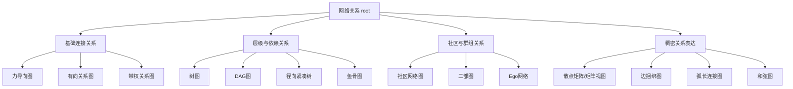
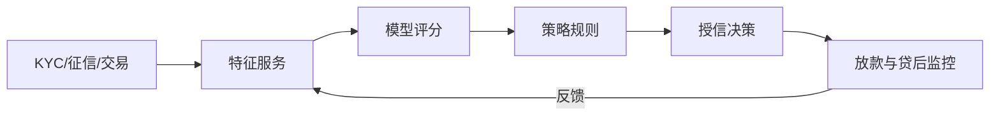

# 决策指南应用场景报告：网络关系型可视化在银行业务与信贷风控的落地（2020–2026）

## 执行摘要

本报告基于你提供的《数据可视化》“网络关系”类型决策指南 JSON（已包含网络关系图结构）提取**全部网络关系图叶子节点（共14个图表类型）**，并结合**2020–2026年银行业趋势、信贷风险热点与监管政策导向**，为每个叶子节点设计**可落地的银行业务/风控场景**、给出**关键指标定义**、生成**兼容 AntV G6/G2 的明细数据样本（以明细边/事件为主）**，并以“首席银行业务与信贷风控架构师”口吻输出**高管级洞察与对策**。网络关系类可视化在这一阶段的价值，集中体现在：一是更好支撑“穿透式监管/全流程监管”的风控证据链要求（监管体系改革与金融稳定法立法持续推进），二是在房地产、地方融资平台、中小金融机构风险化解与不良处置等重点领域，提供“关系穿透 + 传染路径 + 社区团伙”视角的早识别、早预警与早处置能力，三是同时满足数据安全、个人信息保护、反洗钱与反电诈等合规红线下的“可用不可见”数据治理要求。citeturn6search0turn8search0turn1search0turn1search1turn2search1

报告还给出“趋势 × 业务领域”影响矩阵，便于将网络关系图谱能力与零售、对公、普惠、风险、合规、资负管理（ALM）等条线的年度路线图对齐；并在文末汇总全篇专业缩写与定义，确保术语口径一致。

## JSON叶子节点提取结果

### 数据来源与缺失字段标注

你提供的 JSON 中，“网络关系”决策图包含 `nodes` 与 `edges`，根节点为 `root`（label-cn 为“网络关系”），其下分为“基础连接关系 / 层级与依赖关系 / 社区与群组关系 / 稠密关系表达”四类问题节点，每个问题节点下连接到具体图表（`type: decision-chart`）并形成叶子节点。fileciteturn0file0

字段完备性检查：叶子节点均具备 `id` 与 `data.label-cn`（中文名），因此无需占位符；不过仅有少数图表节点提供 `storyPath`，其余图表未提供该字段，按你的规则标注为“未指定”。fileciteturn0file0

### 叶子节点清单

| 节点ID | 名称 | 父路径（根/问题/图表） |
|---|---|---|
| chart-net-force | 力导向图 | 网络关系 / 基础连接关系 / 力导向图 |
| chart-net-directed | 有向关系图 | 网络关系 / 基础连接关系 / 有向关系图 |
| chart-net-weighted | 带权关系图 | 网络关系 / 基础连接关系 / 带权关系图 |
| chart-net-tree | 树图 | 网络关系 / 层级与依赖关系 / 树图 |
| chart-net-dag | DAG图 | 网络关系 / 层级与依赖关系 / DAG图 |
| chart-net-radial-compact-tree | 径向紧凑树 | 网络关系 / 层级与依赖关系 / 径向紧凑树 |
| chart-net-fishbone | 鱼骨图 | 网络关系 / 层级与依赖关系 / 鱼骨图 |
| chart-net-community | 社区网络图 | 网络关系 / 社区与群组关系 / 社区网络图 |
| chart-net-bipartite | 二部图 | 网络关系 / 社区与群组关系 / 二部图 |
| chart-net-ego | Ego网络 | 网络关系 / 社区与群组关系 / Ego网络 |
| chart-net-adj-matrix | 散点矩阵（矩阵视图） | 网络关系 / 稠密关系表达 / 散点矩阵 |
| chart-net-edge-bundling | 边捆绑图 | 网络关系 / 稠密关系表达 / 边捆绑图 |
| chart-net-arc | 弧长连接图 | 网络关系 / 稠密关系表达 / 弧长连接图 |
| chart-net-chord | 和弦图 | 网络关系 / 稠密关系表达 / 和弦图 |

以上节点与连线关系均来自你提供的 JSON。fileciteturn0file0

为便于业务方理解决策树结构，下面用 mermaid 复刻一次“网络关系”决策图主干（以叶子图表为落点）：



## 2020–2026银行业趋势、信贷风险热点与政策导向

### 监管与政策主线

这一阶段的监管主线可以概括为“**强监管、穿透式监管、全覆盖监管、把风险防控前移**”。国家层面推动金融监管体制改革，在原银保监会基础上组建**国家金融监督管理总局**，并形成“一行一局一会”监管格局以提升监管覆盖与协同效率。citeturn5search0turn4search0 立法层面，**金融稳定法草案二审稿**继续完善金融风险防范处置与监测预警、早期纠正等制度安排，释放出对“事前—事中—事后”闭环治理的强烈信号。citeturn6search0

### 信贷风险与资产质量热点

从监管公开数据看，银行业在“总体稳健”框架下呈现“**稳中有压、结构分化**”。以2025年四季度为例，监管披露商业银行不良贷款率为**1.50%**，拨备覆盖率**205.21%**，资本充足率**15.46%**（新资本办法口径），同时强调历史口径与新口径不可直接比。citeturn10search0turn1search3 在重点领域，监管工作会议连续强调：中小金融机构改革化险、城市房地产融资协调机制、地方政府融资平台债务风险化解、不良资产处置、打击黑灰产等。citeturn6search1turn8search0

在政策工具上，房地产相关风险管理进一步制度化：央行与原银保监会建立银行业金融机构**房地产贷款集中度管理制度**，目标在于防范房地产贷款过度集中带来的系统性风险。citeturn0search2 对互联网信贷，2020年出台的**商业银行互联网贷款管理暂行办法**强化机构责任、整改与审慎经营要求，压实“平台合作不等于风险外包”的底线。citeturn0search1 资产质量管理方面，监管发布**商业银行金融资产风险分类办法**，强调真实反映金融资产质量与信用风险评估的准确性。citeturn2search0

### 数字化、数据治理与合规要求升级

数字化转型并非“可选项”，而是监管与经营共同驱动的必选项。央行发布的**金融科技发展规划（2022—2025年）**从顶层设计明确了金融数字化转型、数据要素、审慎监管与治理体系等任务方向。citeturn0search0 同期，信息科技风险也被纳入更强监管框架：原银保监会印发**银行保险机构信息科技外包风险监管办法**，并明确其适用范围与合规依据（关联网络安全法、数据安全法、个人信息保护法等）。citeturn4search3turn5search2

数据合规红线显著抬升：**个人信息保护法**对个人信息处理者、自动化决策等概念作出法律定义；**数据安全法**对数据、数据处理与数据安全等作出界定并确立治理体系方向。citeturn1search0turn1search1 这直接影响网络关系图谱（尤其是账户-设备-地理位置-行为轨迹类图谱）在“可视化与建模”时必须引入的数据最小化、脱敏化、用途限定与可审计机制。

### 反洗钱、反电诈与“黑灰产”治理

反洗钱监管持续强化。央行发布的**金融机构反洗钱和反恐怖融资监督管理办法**明确适用机构范围与监督管理框架，为银行将图谱分析引入可疑交易监测（STR）、客户尽调（CDD/KYC）提供制度依据。citeturn2search1 反电诈方面，**反电信网络诈骗法**自2022年12月1日起施行，为银行在账户风险分级、资金链路追踪、涉诈资金止付/拦截等环节的联防联控提供法律环境。citeturn3search4 监管会议也多次点名要坚决打击金融领域“黑灰产”。citeturn8search0

### 绿色金融与气候风险进入“从倡导到方法论”阶段

原银保监会印发**银行业保险业绿色金融指引**，要求银行保险机构发展绿色金融、服务“双碳”并强化相关管理。citeturn1search2 国际层面，巴塞尔委员会发布气候相关金融风险管理与监督原则，为银行将气候风险纳入治理、资本与风险管理流程（如ICAAP/ILAAP）提供原则框架。citeturn3search2 对网络关系类可视化而言，绿色金融/气候风险的难点在于“供应链传导、产业链上下游暴露、担保与交易关系”——天然适合用网络关系图谱做穿透与聚类。

### 统计口径与经营管理的新“共同语言”

2025年，多部门联合印发**金融“五篇大文章”总体统计制度（试行）**，推动科技金融、绿色金融、普惠金融、养老金融、数字金融的统计口径与指标体系建设，意味着银行经营评价将更依赖一致口径的数据治理与可追溯数据链。citeturn6search3 这也解释了为什么“数据谱系（lineage）”“决策可解释/可审计”能力在2024–2026显著升温：没有可追溯的数据关系与依赖图，统一统计与监管报送很难稳健落地。

## 影响矩阵：趋势 × 业务领域

下表用“高/中/低”标注主要趋势对不同条线的影响强度（高=直接影响经营/合规与关键KPI；中=需要改造流程或系统支撑；低=间接影响或局部影响）。趋势判断基于上述监管文件、监管会议要点与监管指标披露。citeturn8search0turn6search3turn10search0turn1search0turn2search1

| 趋势/热点（2020–2026） | 零售 | 对公 | 普惠/小微 | 风险管理 | 合规/反洗钱/消保 | 资负管理ALM/资金 |
|---|---|---|---|---|---|---|
| 强监管与穿透式监管、金融稳定法立法推进 | 中 | 中 | 中 | 高 | 高 | 中 |
| 房地产风险与集中度管理、融资协调机制常态化 | 中 | 高 | 低 | 高 | 中 | 中 |
| 地方融资平台（城投/LGFV）债务风险化解、接续置换重组 | 低 | 高 | 低 | 高 | 中 | 中 |
| 中小金融机构改革化险、不良处置与“守住不爆雷底线” | 中 | 中 | 中 | 高 | 中 | 中 |
| 互联网贷款监管、平台合作审慎化 | 高 | 中 | 高 | 高 | 中 | 低 |
| 资本新规与风险分类新规（口径变化、可比性管理） | 中 | 中 | 中 | 高 | 中 | 高 |
| 数据安全/个人信息保护（数据最小化、用途限定、自动化决策治理） | 高 | 中 | 中 | 高 | 高 | 低 |
| 反洗钱、反电诈、打击黑灰产（链路追踪、团伙识别） | 高 | 中 | 中 | 高 | 高 | 低 |
| 绿色金融与气候风险纳入风险管理框架 | 中 | 高 | 中 | 高 | 中 | 中 |
| “五篇大文章”统计制度与经营评价再对齐 | 中 | 中 | 高 | 中 | 中 | 中 |

## 叶子节点应用场景库

> 数据结构说明：  
> AntV **G6** 推荐使用标准 JSON 图数据结构 `{ nodes: [], edges: [], combos: [] }`，节点需唯一 `id`，边需 `source/target`，业务字段建议放入 `data`。citeturn12view1  
> AntV **G2** 的 chord 标记示例使用 `links`，并在 encode 中指定 `source/target` 字段映射（文档示例中为 `begin/end`）。citeturn12view0  
> 本报告所有样例数据为**合成示例**，用于展示“网络关系图”呈现优势（路径、社区、稠密关系降噪、穿透层级等），真实生产应对接数据安全与个人信息保护要求（脱敏、最小化、用途限定、可审计）。citeturn1search0turn1search1  

### 章节：力导向图（Force-directed Graph）

**场景名称：跨渠道账户-设备-商户关系穿透（反洗钱 + 反电诈联合图谱）**  
**节点ID：chart-net-force**（`storyPath`: `/graph/network`；其余未使用字段：未指定）fileciteturn0file0  

**业务线：合规/反洗钱（AML）+ 零售风险（Fraud）**  

**场景描述**  
2020–2026年在反洗钱监管趋严与反电诈立法落地背景下，银行需要把“账户、客户、设备、商户、钱包（含数币钱包）”的碎片信息连接成可解释的关系网络，以支撑可疑交易监测、涉诈资金链路识别与快速止付/拦截。央行反洗钱监管办法与反电诈法律环境，为“图谱化监测 + 证据链留存”提供了现实刚需。citeturn2search1turn3search4 同时，数字人民币试点扩大使“钱包—账户—场景”关系更复杂，也更需要用网络结构表达。citeturn0search3  

**核心数据指标（示例）**

| 指标 | 定义 | 单位 | 风控提示/阈值示例（可配置） |
|---|---|---|---|
| 关系边类型 relType | 转账/收款/同设备登录/同身份证件/同地址等 | 类别 | relType 决定风控规则与解释链 |
| 交易金额 amount | 单笔交易金额 | CNY | 单笔/日累计超阈值触发 STR/Fraud 规则 |
| 时间戳 ts | 事件发生时间 | ISO-8601 | 时间窗口（如T+1/T+7/T+30）影响边权与告警 |
| 节点风险分 riskScore | 综合风险评分（设备+行为+名单+模型） | 0–100 | ≥80：高风险人工复核；≥90：联动止付（示例） |
| 节点度数 degree | 节点连接数（入度+出度） | 个 | 度数异常高：疑似“跑分/中转”枢纽 |
| 路径长度 hop | 从可疑源到落点的跳数 | 跳 | hop≥3 且金额衰减异常：典型分层洗钱 |

**明细数据样本（AntV G6 兼容，边=明细事件）**  
（G6 图数据结构：nodes/edges；业务字段放入 data。citeturn12view1）

```json
{
  "nodes": [
    { "id": "C001", "data": { "label": "客户C001", "nodeType": "customer", "riskScore": 82 } },
    { "id": "A001", "data": { "label": "账户A001", "nodeType": "account", "owner": "C001", "riskScore": 78 } },
    { "id": "D099", "data": { "label": "设备D099", "nodeType": "device", "deviceFp": "fp_7f3a", "riskScore": 90 } },
    { "id": "M771", "data": { "label": "商户M771(虚拟商品)", "nodeType": "merchant", "mcc": "5816", "riskScore": 70 } },
    { "id": "W200", "data": { "label": "数币钱包W200", "nodeType": "wallet_ecny", "riskScore": 65 } },
    { "id": "A888", "data": { "label": "账户A888(疑似中转)", "nodeType": "account", "riskScore": 88 } }
  ],
  "edges": [
    { "id": "e1", "source": "C001", "target": "A001", "data": { "relType": "owns", "ts": "2024-10-01T00:00:00+08:00" } },
    { "id": "e2", "source": "A001", "target": "D099", "data": { "relType": "loginFrom", "ts": "2026-02-05T09:10:12+08:00", "channel": "mobile" } },
    { "id": "e3", "source": "A001", "target": "M771", "data": { "relType": "merchantPay", "ts": "2026-02-05T09:12:21+08:00", "amount": 12800, "currency": "CNY" } },
    { "id": "e4", "source": "A001", "target": "A888", "data": { "relType": "transfer", "ts": "2026-02-05T09:14:02+08:00", "amount": 12000, "currency": "CNY" } },
    { "id": "e5", "source": "A888", "target": "W200", "data": { "relType": "topUp", "ts": "2026-02-05T09:16:40+08:00", "amount": 11950, "currency": "CNY" } }
  ]
}
```

**架构师观点（高管口径）**  
该场景的关键不在“画出网络”，而在于把网络变成可执行的“联防联控链路”。建议以**事件流（交易/登录/设备指纹）**为最小颗粒度构建边，配合T+0实时规则与T+1批量图计算，形成“双速风控”。在合规侧，必须对图谱字段实施**用途限定与最小化**，并对自动化决策触发的处置（如止付/降额）提供可解释原因码与审批留痕，满足个人信息保护与自动化决策治理要求。citeturn1search0turn2search1  
阈值建议：当同一设备指纹在48小时内绑定≥N个账户且发生高频小额入账—大额集中转出，可作为黑灰产“跑分”强特征；当路径 hop≥3 且金额衰减规律符合“分层-整合”模式，应提升 STR 命中权重并联动名单筛查。

### 章节：有向关系图（Directed Graph）

**场景名称：涉诈资金链路追踪与“断链”处置编排**  
**节点ID：chart-net-directed**（`storyPath`: 未指定）fileciteturn0file0  

**业务线：零售风险 + 合规（反电诈/反洗钱）**

**场景描述**  
有向关系图强调“从哪里来、到哪里去”。反电诈法实施后，银行在涉诈资金处置上需要更清晰地回答：资金从受害人账户流出后，经由哪些中转账户、在多短时间内、以何种手法分层转移。该类图直接服务“止付—冻结—解冻—返还”的处置链条与跨机构协同。citeturn3search4turn8search0  

**核心数据指标（示例）**

| 指标 | 定义 | 单位 | 风控提示/阈值示例 |
|---|---|---|---|
| direction | 边方向（source→target） | — | 决定链路追踪方向与回溯方向 |
| elapsedSec | 相邻两跳时间间隔 | 秒 | 极短间隔（如<60秒）常见于自动化洗钱脚本（示例） |
| splitRatio | 拆分比例（多出边分流） | % | 高拆分+高频：分层洗钱信号 |
| retentionRate | 留存比例（入账后留存） | % | 低留存（快速转出）=中转账户特征 |
| hitReasonCodes | 命中原因码集合 | codes | 便于将图结果转为可执行处置策略 |

**明细数据样本（AntV G6 兼容，有向边=转账事件）**

```json
{
  "nodes": [
    { "id": "V001", "data": { "label": "受害人账户V001", "nodeType": "account", "riskRole": "victim" } },
    { "id": "M001", "data": { "label": "中转账户M001", "nodeType": "account", "riskRole": "mule" } },
    { "id": "M002", "data": { "label": "中转账户M002", "nodeType": "account", "riskRole": "mule" } },
    { "id": "CASH", "data": { "label": "出金落点(疑似套现)", "nodeType": "cashout", "riskRole": "cashout" } }
  ],
  "edges": [
    { "id": "t1", "source": "V001", "target": "M001", "data": { "relType": "transfer", "ts": "2026-02-18T10:01:12+08:00", "amount": 50000, "channel": "mobile", "elapsedSec": 0 } },
    { "id": "t2", "source": "M001", "target": "M002", "data": { "relType": "transfer", "ts": "2026-02-18T10:01:55+08:00", "amount": 49800, "channel": "api", "elapsedSec": 43 } },
    { "id": "t3", "source": "M002", "target": "CASH", "data": { "relType": "cashout", "ts": "2026-02-18T10:03:02+08:00", "amount": 49600, "method": "thirdPartyPay", "elapsedSec": 67 } }
  ]
}
```

**架构师观点（高管口径）**  
“断链”效率由两件事决定：**实时链路构建能力**与**处置编排权限**。建议对有向交易边增加“风险处置状态”（如 `freezeStatus: pending/frozen/released`）并形成面向一线的“链路工单”。监管持续强调打击黑灰产与防非打非，银行应把链路追踪的结果直接对接到黑名单/灰名单、限额、止付与人工复核流程，实现“图→策略→动作”的闭环。citeturn8search0  
关键阈值示例：当 `elapsedSec` 连续多跳小于某阈值且 `retentionRate` 接近0，优先判定为中转；当同一收款账户在T+1内接收来自≥N个来源账户入账并迅速分流，应触发团伙扩展（以该账户为种子扩展ego网络与社区检测）。

### 章节：带权关系图（Weighted Graph）

**场景名称：对公客户关联交易强度与集中度风险图谱**  
**节点ID：chart-net-weighted**（`storyPath`: 未指定）fileciteturn0file0  

**业务线：对公业务 + 授信风险管理（关联交易/集中度）**

**场景描述**  
在地方融资平台风险化解、房地产产业链风险与企业集团化经营背景下，银行对公授信需要“看得见关联”，不仅看股权关系，更看交易与资金往来强度。带权关系图用**边权重（金额/频次/期限敞口）**直观表达“关系强弱”，服务授信审查、关联方授信集中度、交易真实性核验与风险传染评估。监管会议明确要求依法合规支持融资平台债务风险化解、严控增量风险，带权图可作为授信穿透与风险定量化的重要中间件。citeturn8search0turn6search1  

**核心数据指标（示例）**

| 指标 | 定义 | 单位 | 风控提示/阈值示例 |
|---|---|---|---|
| edgeWeightAmt30d | 近30日交易总额 | CNY | 大额强关联：需穿透核验与合同/发票一致性 |
| edgeWeightCnt30d | 近30日交易笔数 | 笔 | 高频小额：可能隐匿关联或资金空转 |
| exposureEAD | 风险暴露（含表内外） | CNY | 与资本占用、RAROC联动 |
| PD/LGD | 违约概率/违约损失率 | % | PD上升或LGD恶化时边权应折损（风险加权） |
| RAROC | 风险调整资本回报率 | % | RAROC低于资本成本：调价/压降/退出（示例） |

**明细数据样本（“明细交易事件” + “可视化边权汇总”共存，G6兼容）**  
（生产上通常用明细事件聚合出边权；此处两者一并给出，便于落地。）

```json
{
  "nodes": [
    { "id": "E_CORE", "data": { "label": "核心企业A", "nodeType": "corp", "rating": "AA-", "industry": "制造业" } },
    { "id": "E_SUP1", "data": { "label": "供应商1", "nodeType": "corp", "rating": "A", "industry": "零部件" } },
    { "id": "E_SUP2", "data": { "label": "供应商2", "nodeType": "corp", "rating": "BBB+", "industry": "物流" } }
  ],
  "edgeEvents": [
    { "txId": "x1", "from": "E_CORE", "to": "E_SUP1", "ts": "2026-01-08T14:02:01+08:00", "amount": 1800000, "ccy": "CNY", "biz": "应付账款" },
    { "txId": "x2", "from": "E_CORE", "to": "E_SUP1", "ts": "2026-01-16T10:21:33+08:00", "amount": 950000, "ccy": "CNY", "biz": "应付账款" },
    { "txId": "x3", "from": "E_CORE", "to": "E_SUP2", "ts": "2026-01-20T09:11:05+08:00", "amount": 320000, "ccy": "CNY", "biz": "物流服务" },
    { "txId": "x4", "from": "E_SUP2", "to": "E_SUP1", "ts": "2026-01-22T15:45:10+08:00", "amount": 120000, "ccy": "CNY", "biz": "代采/转包" }
  ],
  "edges": [
    { "id": "w1", "source": "E_CORE", "target": "E_SUP1", "data": { "relType": "tradePay", "edgeWeightAmt30d": 2750000, "edgeWeightCnt30d": 2 } },
    { "id": "w2", "source": "E_CORE", "target": "E_SUP2", "data": { "relType": "tradePay", "edgeWeightAmt30d": 320000, "edgeWeightCnt30d": 1 } },
    { "id": "w3", "source": "E_SUP2", "target": "E_SUP1", "data": { "relType": "tradePay", "edgeWeightAmt30d": 120000, "edgeWeightCnt30d": 1 } }
  ]
}
```

**架构师观点（高管口径）**  
带权图应当成为“对公授信的一张底图”：把**交易强度**与**授信敞口（EAD）/风险参数（PD、LGD）**叠加，形成“经营关联 + 风险关联”的双权重网络。对融资平台与房地产产业链客户，建议引入“**风险折损权重**”（例如将边权乘以 `RiskFactor = f(PD, LGD, 期限, 担保质量)`），避免出现“交易很热闹但风险已劣化”的误判。监管连续强调化债与不良处置，银行需要用这类图谱把“增量严控、存量优化”做成可视化的组合管理动作。citeturn8search0turn10search0  
阈值建议：当某客户的加权度数（weighted degree）快速上升但其现金流覆盖（DSCR）下降，应触发授信重评估；RAROC 低于资本成本（示例：10%）时，优先通过调价、缩短期限、增信或退出压降来纠偏。

### 章节：树图（Tree Diagram）

**场景名称：集团授信穿透与额度分配树（母子公司—项目—条线）**  
**节点ID：chart-net-tree**（`storyPath`: 未指定）fileciteturn0file0  

**业务线：对公授信 + 集团客户风险管理**

**场景描述**  
树图适用于严格父子层级。对公授信中最典型的层级是“集团—子公司—项目公司—融资品种/担保品”。在房地产贷款集中度管理制度强化与重点领域风险治理背景下，银行需要把集团授信穿透到底层项目与担保品，识别“母强子弱/壳公司融资/担保穿透不足”等结构性风险。citeturn0search2turn8search0  

**核心数据指标（示例）**

| 指标 | 定义 | 单位 | 风控提示/阈值示例 |
|---|---|---|---|
| groupLimit | 集团总授信额度 | CNY | 总额与集中度限额联动 |
| entityLimit | 单主体额度 | CNY | 设定子公司限额防止“分拆绕限” |
| projectEAD | 项目风险暴露 | CNY | 项目穿透是压力测试输入 |
| guaranteeType | 担保类型（抵押/质押/保证） | 类别 | 担保质量决定LGD与资本占用 |
| LTV | 抵押贷款成数=贷款余额/抵押物评估值 | % | LTV抬升提示抵押品质量或价格下行风险 |

**明细数据样本（G6：树层级以 parentId 表达，亦可转换为 children）**  
（G6 支持树形结构与 graph data 互转；此处给出可直接用 graph 表达的 parent-child 边。）citeturn12view1  

```json
{
  "nodes": [
    { "id": "G001", "data": { "label": "集团G001", "level": "group", "groupLimit": 12000000000 } },
    { "id": "S101", "data": { "label": "子公司S101(地产开发)", "level": "subsidiary", "rating": "BBB", "entityLimit": 3500000000 } },
    { "id": "P900", "data": { "label": "项目公司P900(城中村改造)", "level": "project", "projectEAD": 1800000000, "collateralType": "土地/在建工程" } },
    { "id": "COL01", "data": { "label": "抵押物COL01", "level": "collateral", "valuation": 2600000000, "valuationDate": "2025-12-31" } }
  ],
  "edges": [
    { "id": "g-s", "source": "G001", "target": "S101", "data": { "relType": "ownsControl", "ownershipPct": 100 } },
    { "id": "s-p", "source": "S101", "target": "P900", "data": { "relType": "owns", "ownershipPct": 80 } },
    { "id": "p-col", "source": "P900", "target": "COL01", "data": { "relType": "pledge", "loanBalance": 1700000000, "LTV": 65.38 } }
  ]
}
```

**架构师观点（高管口径）**  
集团授信管理的核心是“**穿透与一致口径**”。树图必须与风险分类、资本计量口径一致：风险分类新规强调真实反映资产质量，资本新规口径变化也要求数据链可追溯。citeturn2search0turn1search3  
建议把“项目层”作为最小管理单元之一：当房地产相关政策与融资协调机制推进时（例如“白名单项目”审批、增量融资协调），银行内部也应建立“项目—资金用途—回款闭环”的树形证据链。citeturn6search1turn8search0  
阈值建议：对抵押类项目贷款，LTV 需结合抵押物类型与市场波动进行动态折算（示例：对价格敏感资产引入折扣率），并设置“估值时效”阈值（评估日期超过N天必须重估）。

### 章节：DAG图（DAG Diagram）

**场景名称：授信审批与风控策略依赖DAG（可审计决策链）**  
**节点ID：chart-net-dag**（`storyPath`: 未指定）fileciteturn0file0  

**业务线：风险管理（信贷审批）+ 合规（模型治理/可解释）+ 科技架构**

**场景描述**  
DAG（有向无环图）最适合表达“依赖但不循环”的链条，如：数据源→特征→模型→策略→决策→放款→贷后监控。2020–2026年数据安全与个人信息保护要求提升，使银行必须对“哪些数据被用于哪些决策”给出可追溯证据；同时金融科技发展规划强调审慎监管与治理体系，DAG可作为“数据与决策谱系（lineage）”的可视化中枢。citeturn0search0turn1search0turn1search1  

**核心数据指标（示例）**

| 指标 | 定义 | 单位 | 风控提示/阈值示例 |
|---|---|---|---|
| dataLineageCoverage | 决策链路可追溯覆盖率 | % | 低覆盖=合规风险与审计风险 |
| modelVersion | 模型版本号 | — | 版本漂移需触发回溯评估 |
| overrideRate | 人工覆核/策略豁免比例 | % | 太高：策略失效；太低：可能误伤消保 |
| decisionLatency | 决策耗时端到端 | ms | 影响线上转化与反欺诈时效 |
| PSI/KS | 稳定性/区分度指标 | — | PSI高=分布漂移；KS下降=模型衰减 |

**明细数据样本（G6：流程DAG）**

```json
{
  "nodes": [
    { "id": "SRC_KYC", "data": { "label": "KYC/实名核验", "kind": "dataSource" } },
    { "id": "SRC_BUREAU", "data": { "label": "征信/外部数据", "kind": "dataSource" } },
    { "id": "FEAT_FS", "data": { "label": "特征服务(Feature Service)", "kind": "service" } },
    { "id": "MODEL_PD", "data": { "label": "PD模型v3.4", "kind": "model", "KS": 0.42 } },
    { "id": "RULE_DTI", "data": { "label": "DTI规则", "kind": "policy", "threshold": 0.55 } },
    { "id": "DECISION", "data": { "label": "授信决策", "kind": "decision" } }
  ],
  "edges": [
    { "source": "SRC_KYC", "target": "FEAT_FS", "data": { "relType": "feeds" } },
    { "source": "SRC_BUREAU", "target": "FEAT_FS", "data": { "relType": "feeds" } },
    { "source": "FEAT_FS", "target": "MODEL_PD", "data": { "relType": "featuresToModel" } },
    { "source": "MODEL_PD", "target": "DECISION", "data": { "relType": "scoreToDecision", "field": "pdScore" } },
    { "source": "RULE_DTI", "target": "DECISION", "data": { "relType": "ruleGate", "field": "DTI" } }
  ],
  "decisionEvents": [
    { "appId": "APP20260201_0007", "ts": "2026-02-01T11:20:02+08:00", "pdScore": 0.038, "DTI": 0.49, "decision": "APPROVE", "latencyMs": 312 },
    { "appId": "APP20260201_0011", "ts": "2026-02-01T11:22:15+08:00", "pdScore": 0.072, "DTI": 0.61, "decision": "DECLINE", "latencyMs": 355 }
  ]
}
```

**架构师观点（高管口径）**  
DAG不是“技术流程图”，而是合规与经营的共同语言。个人信息保护法对自动化决策与个人信息处理提出约束，银行必须证明数据使用“有依据、可解释、可复核”。citeturn1search0turn1search1 建议把 DAG 作为风控平台的“一等公民”，对每条边增加：数据授权依据、数据最小化说明、模型版本与灰度策略、策略豁免审批号，从而让审计、消保与监管检查可以“一键回放”。监管会议提到“加快推进金监工程设计和建设”，银行侧应同步建设“决策工程”，让监管与经营统计口径可追溯。citeturn8search0turn6search3  
阈值建议：DTI 等硬规则阈值必须和产品定价/额度策略一起联动，避免“风控过严导致客诉、过松导致风险后置”。建议设置 overrideRate 的上下限区间（示例：2%–8%）并以周为周期复盘。



> 注：流程反馈回到特征服务并不等于DAG出现环；在“单次决策执行链”内仍保持无环，反馈属于下一周期迭代。

### 章节：径向紧凑树（Radial Compact Tree）

**场景名称：UBO/实控人穿透与名单筛查（对公KYC与制裁合规）**  
**节点ID：chart-net-radial-compact-tree**（`storyPath`: 未指定）fileciteturn0file0  

**业务线：合规（KYC/制裁/反洗钱）+ 对公业务**

**场景描述**  
径向紧凑树适合展示“血缘/控制链”且节点多、层级深的结构，例如对公客户的股权穿透、实控人识别与关联企业扩展。在反洗钱监管框架下，银行需要更稳健地完成客户尽调与风险等级评估；同时数据合规要求也使“只展示必要关系、可解释展示”变得更重要。citeturn2search1turn1search0turn1search1  

**核心数据指标（示例）**

| 指标 | 定义 | 单位 | 风控提示/阈值示例 |
|---|---|---|---|
| ownershipPct | 持股比例 | % | 控制链识别（含一致行动人） |
| controlType | 控制方式（股权/协议/任命） | 类别 | 决定UBO判定逻辑 |
| adverseMediaHit | 负面舆情命中 | 0/1 | 命中即提高尽调深度 |
| sanctionsHit | 制裁/名单命中 | 0/1 | 命中即触发冻结/拒绝/上报（按制度） |
| kycriskLevel | KYC风险等级 | 低/中/高 | 与账户监测强度、交易限额联动 |

**明细数据样本（G6：股权穿透树）**

```json
{
  "nodes": [
    { "id": "CO_A", "data": { "label": "企业A(申请授信)", "nodeType": "corp", "kycRiskLevel": "高" } },
    { "id": "CO_B", "data": { "label": "股东B(境内)", "nodeType": "corp" } },
    { "id": "CO_C", "data": { "label": "股东C(境外SPV)", "nodeType": "corp", "jurisdiction": "OFFSHORE" } },
    { "id": "P_UBO1", "data": { "label": "自然人X(UBO)", "nodeType": "person", "adverseMediaHit": 1, "sanctionsHit": 0 } }
  ],
  "edges": [
    { "source": "CO_B", "target": "CO_A", "data": { "relType": "shareholding", "ownershipPct": 40 } },
    { "source": "CO_C", "target": "CO_A", "data": { "relType": "shareholding", "ownershipPct": 35 } },
    { "source": "P_UBO1", "target": "CO_C", "data": { "relType": "beneficialOwner", "ownershipPct": 100, "controlType": "equity" } }
  ]
}
```

**架构师观点（高管口径）**  
这类图必须“可解释、可裁剪”。建议在合规系统中实现“按用途裁剪视图”：授信审查仅展示与授信相关的控制链与关联交易；反洗钱/制裁筛查展示更完整链路但严格控制访问权限与留痕，符合数据安全与个人信息保护要求。citeturn1search0turn1search1turn2search1  
阈值建议：当UBO链路中出现多层SPV且穿透深度> N 层（示例：>4层），或负面舆情命中同时存在复杂控制结构，应提升尽调为现场核查/强化尽调（EDD），并对交易监测规则加严（降低阈值、提高频率监控）。

### 章节：鱼骨图（Fishbone Diagram）

**场景名称：NPL上行根因拆解与治理路线图（从结果到原因的多层分解）**  
**节点ID：chart-net-fishbone**（`storyPath`: 未指定）fileciteturn0file0  

**业务线：风险管理（资产质量与不良处置）+ 经营管理**

**场景描述**  
监管披露显示商业银行不良率在2025年四季度为1.50%，同时监管会议强调处置不良资产、推进中小金融机构风险化解。citeturn10search0turn8search0 鱼骨图适合将“结果指标（如NPL率上行/关注类抬升/拨备覆盖下滑）”拆解到宏观、行业、客户、产品、流程、模型与合规等原因层，形成可执行的治理路线图与责任分解。

**核心数据指标（示例）**

| 指标 | 定义 | 单位 | 风控提示/阈值示例 |
|---|---|---|---|
| NPL% | 不良贷款率=不良余额/贷款余额 | % | 关键红线指标（看趋势与结构） |
| SpecialMention% | 关注类占比 | % | 常先于NPL上行（前瞻指标） |
| CoverageRatio | 拨备覆盖率 | % | 低于目标区间需补提拨备/压降风险 |
| RollRate | 迁徙率（正常→关注→不良） | % | 用于识别“风险加速”环节 |
| CureRate | 治愈率（不良→正常/结清） | % | 影响处置策略与资源配置 |

**明细数据样本（鱼骨结构+观测事实清单）**

```json
{
  "nodes": [
    { "id": "EFFECT", "data": { "label": "结果：NPL率上行", "level": 0 } },
    { "id": "MACRO", "data": { "label": "宏观与政策", "level": 1 } },
    { "id": "SECTOR", "data": { "label": "行业结构", "level": 1 } },
    { "id": "PROCESS", "data": { "label": "流程与执行", "level": 1 } },
    { "id": "MODEL", "data": { "label": "模型与策略", "level": 1 } },
    { "id": "C1", "data": { "label": "房地产链条回款延迟", "level": 2 } },
    { "id": "C2", "data": { "label": "平台债务展期/重组带来分类压力", "level": 2 } },
    { "id": "C3", "data": { "label": "互联网贷客群迁移导致PD抬升", "level": 2 } }
  ],
  "edges": [
    { "source": "MACRO", "target": "EFFECT", "data": { "relType": "causeOf" } },
    { "source": "SECTOR", "target": "EFFECT", "data": { "relType": "causeOf" } },
    { "source": "PROCESS", "target": "EFFECT", "data": { "relType": "causeOf" } },
    { "source": "MODEL", "target": "EFFECT", "data": { "relType": "causeOf" } },
    { "source": "C1", "target": "SECTOR", "data": { "relType": "subCauseOf" } },
    { "source": "C2", "target": "MACRO", "data": { "relType": "subCauseOf" } },
    { "source": "C3", "target": "MODEL", "data": { "relType": "subCauseOf" } }
  ],
  "observations": [
    { "period": "2025Q3", "NPL%": 1.52, "CoverageRatio%": 203.90, "SpecialMention%": 2.20 },
    { "period": "2025Q4", "NPL%": 1.50, "CoverageRatio%": 205.21, "SpecialMention%": 2.22 }
  ]
}
```

**架构师观点（高管口径）**  
鱼骨图输出不应止步于“解释”，而要落到“治理动作清单+指标闭环”。监管已把重点领域风险化解、不良处置作为年度重点任务之一，银行内部也必须把“风险处置责任”压实到骨干原因节点（如地产链条、融资平台、互联网贷客群）。citeturn8search0turn0search1turn0search2  
建议建立三层阈值：第一层是组合层（NPL%、关注类、迁徙率）；第二层是行业/区域层（地产、城投、制造链条等）；第三层是客户/资产层（项目回款、抵押物估值、担保人能力）。对超过阈值的骨干原因节点，明确“限额、定价、催收、重组、核销、转让”的策略优先级，并将“处置周期”纳入KPI（避免风险长期挂账导致风险迟滞）。

### 章节：社区网络图（Community Network）

**场景名称：洗钱/跑分团伙社区发现与分层打击**  
**节点ID：chart-net-community**（`storyPath`: 未指定）fileciteturn0file0  

**业务线：合规（AML）+ 反欺诈（Fraud）**

**场景描述**  
社区网络图以“群组/团伙”为主角。反洗钱监管办法强化金融机构履责要求，监管会议强调打击黑灰产；在此背景下，银行需要通过社区发现识别“跑分团伙、赌博资金圈、资金空转圈”等，并将处置从“单点”升级为“成片”。citeturn2search1turn8search0  

**核心数据指标（示例）**

| 指标 | 定义 | 单位 | 风控提示/阈值示例 |
|---|---|---|---|
| communityId | 社区/团伙编号 | — | 决定“批量处置”边界 |
| modularity | 社区划分质量（聚类指标） | — | 低质量需调整特征与时间窗 |
| intraFlow | 社区内资金循环占比 | % | 高循环=资金空转风险 |
| interFlow | 社区对外出金占比 | % | 对外集中出金=洗钱整合阶段 |
| hitSTR | 可疑交易报告触发数 | 条 | 社区级STR比单账户更稳健 |

**明细数据样本（G6：nodes带communityId，可选combos）**

```json
{
  "nodes": [
    { "id": "A10", "data": { "label": "账户A10", "communityId": "K1", "riskScore": 85 } },
    { "id": "A11", "data": { "label": "账户A11", "communityId": "K1", "riskScore": 80 } },
    { "id": "A12", "data": { "label": "账户A12", "communityId": "K1", "riskScore": 78 } },
    { "id": "A90", "data": { "label": "出金口A90", "communityId": "K2", "riskScore": 88 } }
  ],
  "edges": [
    { "id": "k1_1", "source": "A10", "target": "A11", "data": { "relType": "transfer", "ts": "2026-02-10T09:00:01+08:00", "amount": 9800 } },
    { "id": "k1_2", "source": "A11", "target": "A12", "data": { "relType": "transfer", "ts": "2026-02-10T09:01:10+08:00", "amount": 9700 } },
    { "id": "k1_3", "source": "A12", "target": "A10", "data": { "relType": "transfer", "ts": "2026-02-10T09:02:30+08:00", "amount": 9600 } },
    { "id": "k2_out", "source": "A11", "target": "A90", "data": { "relType": "transferOut", "ts": "2026-02-10T09:05:00+08:00", "amount": 30000 } }
  ],
  "combos": [
    { "id": "K1", "data": { "label": "社区K1(疑似跑分圈)" } },
    { "id": "K2", "data": { "label": "社区K2(疑似出金口)" } }
  ]
}
```

**架构师观点（高管口径）**  
社区级风控能显著降低误伤：与其对单账户“打地鼠”，不如对“圈层”实施差异化措施（限额、延时到账、增强校验、人工核验）。监管强调黑灰产治理，银行应建立“社区画像→处置模板→复盘”的标准作业流程。citeturn8search0turn2search1  
阈值建议：当社区内循环占比（intraFlow）持续高于某阈值且对外出金集中于少数口子账户（high interFlow concentration），优先采取“口子账户断链+社区内账户降额/二次核验”的组合策略，并将该社区作为后续监测的“持续风险对象”。

### 章节：二部图（Bipartite Graph）

**场景名称：借款人—抵押物/担保人二部图（识别一物多押与担保圈）**  
**节点ID：chart-net-bipartite**（`storyPath`: 未指定）fileciteturn0file0  

**业务线：零售抵押贷风控 + 对公担保风控**

**场景描述**  
二部图天然适合表达“两类实体之间的关系”，例如“借款人—抵押物”“借款人—担保人”。在房地产风险治理与资产质量真实反映要求下，银行必须及时识别**同一抵押物被重复质押/抵押**、担保圈互保等结构性风险，避免LGD在压力情境下急剧恶化。citeturn0search2turn2search0  

**核心数据指标（示例）**

| 指标 | 定义 | 单位 | 风控提示/阈值示例 |
|---|---|---|---|
| collateralId | 抵押物唯一ID | — | 同ID多连接=一物多押风险 |
| appraisalValue | 抵押物评估价值 | CNY | 估值过期需重估 |
| loanBalance | 贷款余额 | CNY | 用于计算LTV |
| LTV | 贷款余额/评估价值 | % | LTV过高：风险缓释不足 |
| guaranteeCoverage | 担保覆盖倍数 | 倍 | 覆盖不足：提高资本占用 |

**明细数据样本（G6：borrower 与 collateral 两类节点）**

```json
{
  "nodes": [
    { "id": "B001", "data": { "label": "借款人B001", "nodeType": "borrower", "product": "按揭" } },
    { "id": "B002", "data": { "label": "借款人B002", "nodeType": "borrower", "product": "经营贷" } },
    { "id": "H900", "data": { "label": "房产H900", "nodeType": "collateral", "appraisalValue": 3800000, "appraisalDate": "2025-11-30" } }
  ],
  "edges": [
    { "id": "m1", "source": "B001", "target": "H900", "data": { "relType": "mortgage", "loanId": "L001", "loanBalance": 2600000, "LTV": 68.42 } },
    { "id": "m2", "source": "B002", "target": "H900", "data": { "relType": "pledge", "loanId": "L002", "loanBalance": 1800000, "LTV": 47.37 } }
  ]
}
```

**架构师观点（高管口径）**  
二部图的价值在“结构性风险一眼识别”：当抵押物节点连接多个借款人或多笔贷款时，必须触发“抵押权利完整性核验、他项权证核验、跨机构查询（如可用）与法律审查”。在风险分类新规“真实反映资产质量”要求下，抵押物重复占用可能造成风险分类偏乐观，应在贷前即阻断。citeturn2search0  
阈值建议：对同一抵押物多笔贷款，应以“合并LTV”（多笔余额求和/评估值）作为硬约束指标；合并LTV超过阈值（示例：>75%）应限制新增授信并要求补充担保或下调额度。

### 章节：Ego网络（Ego Network）

**场景名称：围绕重点房企/城投平台的风险传染Ego网络（敞口、担保、交易三线合一）**  
**节点ID：chart-net-ego**（`storyPath`: 未指定）fileciteturn0file0  

**业务线：对公风险 + 资产管理（不良预警/重组）**

**场景描述**  
监管工作会议持续点名房地产融资协调机制、融资平台债务风险化解与中小机构化险。citeturn8search0turn6search1 对银行而言，真正的风险往往不是单一客户违约，而是围绕核心主体（房企/城投/核心企业）的“担保圈、上下游、同业敞口、资金回款链”发生传染。Ego网络以一个主体为中心，展开一圈/两圈关系，适合高管快速掌握“风险半径”。

**核心数据指标（示例）**

| 指标 | 定义 | 单位 | 风控提示/阈值示例 |
|---|---|---|---|
| egoExposureEAD | 核心主体相关合并敞口 | CNY | 超过组合限额触发压降 |
| guaranteeChainDepth | 担保链深度 | 层 | 深担保链=风险难以处置 |
| contagionScore | 传染评分（敞口×关联×期限） | 0–100 | ≥80进入重点名单（示例） |
| refinanceRatio | 借新还旧/展期占比 | % | 高占比提示现金流不可持续 |
| recoveryRate | 处置回收率 | % | 决定损失与资本回补节奏 |

**明细数据样本（G6：以核心主体为中心扩展两跳）**

```json
{
  "nodes": [
    { "id": "EGO_RE", "data": { "label": "核心主体RE01(房企/平台)", "nodeType": "corp", "riskLevel": "高" } },
    { "id": "SUB_A", "data": { "label": "子公司A(项目公司)", "nodeType": "corp" } },
    { "id": "GUA_G", "data": { "label": "担保人G(集团)", "nodeType": "corp" } },
    { "id": "BANK_X", "data": { "label": "同业/他行X", "nodeType": "bank" } },
    { "id": "PROJ_1", "data": { "label": "项目1(保障房)", "nodeType": "project" } }
  ],
  "edges": [
    { "source": "EGO_RE", "target": "SUB_A", "data": { "relType": "controls", "ownershipPct": 100 } },
    { "source": "GUA_G", "target": "EGO_RE", "data": { "relType": "guarantees", "guaranteeAmt": 1200000000 } },
    { "source": "BANK_X", "target": "EGO_RE", "data": { "relType": "jointCredit", "EAD": 800000000, "maturityMonths": 24 } },
    { "source": "SUB_A", "target": "PROJ_1", "data": { "relType": "operates", "EAD": 600000000, "projectCashInflow30d": 42000000 } }
  ]
}
```

**架构师观点（高管口径）**  
Ego网络建议作为“重点名单例会”固定页：每周更新敞口、担保链、回款与处置进度。监管强调房地产融资协调机制常态化运行与化债支持，银行内部要把“政策性支持项目”与“市场化风险资产”在图上清晰分层，避免资源错配。citeturn8search0  
阈值建议：对核心主体相关敞口，除合并EAD外，应设置“担保可用性折扣”（担保人自身风险上升时担保价值折损），并对 refinanceRatio 过高的链条启动重组谈判或压降计划。

### 章节：散点矩阵/矩阵视图（Scatterplot Matrix / Matrix View）

**场景名称：对手方往来矩阵热力（稠密交易关系降噪，用于合规巡检与集中度识别）**  
**节点ID：chart-net-adj-matrix**（`storyPath`: 未指定）fileciteturn0file0  

**业务线：合规巡检 + 资金业务/对公运营**

**场景描述**  
当节点很多、连线极其稠密时，传统节点-连线图会“毛线团化”。矩阵视图把“来源×去向”映射为单元格（颜色/大小=强度），能在不牺牲信息量的前提下显著降低视觉噪音，适合做跨地区、跨行业的对手方大额往来巡检与集中度识别，支撑反洗钱与风险监测。反洗钱监管与金融稳定立法都强化“监测、识别、预警”。citeturn2search1turn6search0  

**核心数据指标（示例）**

| 指标 | 定义 | 单位 | 风控提示/阈值示例 |
|---|---|---|---|
| cellAmt | 单元格内总金额（i→j） | CNY | 热点单元格=重点核查 |
| cellCnt | 单元格内笔数 | 笔 | 高频小额 vs 低频大额分型 |
| counterpartConcentration | 对手方集中度（HHI等） | — | 集中度上升=关联/挪用风险 |
| anomalyZ | 异常分数（相对历史均值） | Z-score | |Z|>3（示例）触发告警 |

**明细数据样本（原始交易行 + 矩阵单元格）**

```json
{
  "txRows": [
    { "txId": "r1", "fromRegion": "华东", "toRegion": "华南", "ts": "2026-02-03T13:01:01+08:00", "amount": 8500000 },
    { "txId": "r2", "fromRegion": "华东", "toRegion": "华南", "ts": "2026-02-03T15:22:10+08:00", "amount": 4200000 },
    { "txId": "r3", "fromRegion": "华北", "toRegion": "华东", "ts": "2026-02-04T09:10:09+08:00", "amount": 12000000 }
  ],
  "matrixCells": [
    { "row": "华东", "col": "华南", "cellAmt": 12700000, "cellCnt": 2 },
    { "row": "华北", "col": "华东", "cellAmt": 12000000, "cellCnt": 1 }
  ]
}
```

**架构师观点（高管口径）**  
矩阵视图非常适合“监管口径对齐后的仪表盘化输出”：一眼看出资金流向热点与异常跳变，再用 drill-down 回到交易明细与客户KYC信息。建议把矩阵单元格与“原因码”绑定（如行业季节性、税期、项目回款），同时保留脱敏明细以满足数据安全要求。citeturn1search1turn2search1  
阈值建议：对单元格 anomalyZ 的阈值应分层设置（按业务类型/地区/行业），避免对季节性波动误报；对连续多期热点单元格，需启动专项穿透检查。

### 章节：边捆绑图（Edge Bundling）

**场景名称：供应链金融稠密网络的路径归并（识别异常“绕核心”链路）**  
**节点ID：chart-net-edge-bundling**（`storyPath`: 未指定）fileciteturn0file0  

**业务线：普惠金融/供应链金融 + 风险管理**

**场景描述**  
边捆绑技术用于降低稠密图的视觉混乱、揭示高层模式。citeturn11search3 在供应链金融中，核心企业、一级供应商、二级供应商与多家分支机构的交易/融资关系极其稠密，传统展示会淹没关键异常路径（例如绕开核心企业、资金在同圈层空转）。边捆绑图通过“束”的形式突出主干路径与异常分叉，适合普惠与供应链风险的运营联动。监管层面持续推动小微融资支持与机制落地，规模快速增长也要求风险可视化更前置。citeturn10search0turn8search0  

**核心数据指标（示例）**

| 指标 | 定义 | 单位 | 风控提示/阈值示例 |
|---|---|---|---|
| invoiceAmt | 发票金额 | CNY | 与融资额一致性校验 |
| financingAmt | 融资金额 | CNY | 超发票比例=套现风险 |
| pathDeviation | 路径偏离度（是否绕开核心） | 0/1 | 绕核心交易需加强核验 |
| bundleDensity | 捆绑束密度 | — | 密度过高处需要 drill-down |
| overdueDays | 逾期天数 | 天 | >30天进入重点催收（示例） |

**明细数据样本（G6：节点+明细融资/付款边）**

```json
{
  "nodes": [
    { "id": "CORE", "data": { "label": "核心企业", "nodeType": "core" } },
    { "id": "S1", "data": { "label": "一级供应商S1", "nodeType": "supplier", "tier": 1 } },
    { "id": "S2", "data": { "label": "二级供应商S2", "nodeType": "supplier", "tier": 2 } },
    { "id": "BR01", "data": { "label": "分行BR01", "nodeType": "branch" } }
  ],
  "edges": [
    { "id": "p1", "source": "CORE", "target": "S1", "data": { "relType": "tradePay", "ts": "2026-01-12T10:00:00+08:00", "invoiceAmt": 2000000 } },
    { "id": "f1", "source": "BR01", "target": "S1", "data": { "relType": "finance", "ts": "2026-01-13T09:00:00+08:00", "financingAmt": 1600000, "product": "应收账款融资" } },
    { "id": "p2", "source": "S1", "target": "S2", "data": { "relType": "subcontractPay", "ts": "2026-01-15T15:00:00+08:00", "amount": 900000, "pathDeviation": 1 } }
  ]
}
```

**架构师观点（高管口径）**  
边捆绑图不只是“好看”，它解决的是供应链网络里最难的两件事：**找主干**与**找绕行**。当业务规模在政策支持下增长（普惠小微贷款增速、机制落地），风险侧必须用“束”把主干路径沉淀为白名单模式，把偏离路径作为重点核验对象。citeturn10search0turn8search0  
阈值建议：融资金额与发票金额比例（融资/发票）超过阈值（示例：>85%）且发生 pathDeviation=1 的绕核心支付，应触发发票验真、物流/收货证明核验与资金用途回流检查。

### 章节：弧长连接图（Arc Diagram）

**场景名称：按账户序列排序的资金链结构对比（识别“同团伙多账户剧本”）**  
**节点ID：chart-net-arc**（`storyPath`: `/graph/arc`）fileciteturn0file0  

**业务线：反欺诈运营 + 合规协查**

**场景描述**  
弧长连接图把节点按某种顺序线性排列（开户时间、风险评分、链路层级、账户角色），用弧线连接关系，适合比较不同链路结构、识别“重复剧本”。在反电诈治理与黑灰产打击要求下，银行需要把相似链路快速聚类并复用处置模板。citeturn3search4turn8search0  

**核心数据指标（示例）**

| 指标 | 定义 | 单位 | 风控提示/阈值示例 |
|---|---|---|---|
| orderKey | 节点排序键（开户日/风险分） | — | 决定结构可读性 |
| arcSpan | 弧跨度（|order(source)-order(target)|） | — | 大跨度跨层转移：异常信号 |
| patternId | 链路模式ID（结构签名） | — | 用于剧本库与自动处置 |
| lossPotential | 潜在损失 | CNY | 用于优先级排序 |

**明细数据样本（G6：节点含order字段，边为转账事件）**

```json
{
  "nodes": [
    { "id": "U01", "data": { "label": "账户U01", "order": 1, "riskScore": 40 } },
    { "id": "U02", "data": { "label": "账户U02", "order": 2, "riskScore": 70 } },
    { "id": "U03", "data": { "label": "账户U03", "order": 3, "riskScore": 88 } },
    { "id": "U04", "data": { "label": "账户U04(出金)", "order": 4, "riskScore": 92 } }
  ],
  "edges": [
    { "source": "U01", "target": "U02", "data": { "relType": "transfer", "ts": "2026-02-21T09:01:00+08:00", "amount": 9800 } },
    { "source": "U02", "target": "U03", "data": { "relType": "transfer", "ts": "2026-02-21T09:01:40+08:00", "amount": 9700 } },
    { "source": "U01", "target": "U03", "data": { "relType": "transfer", "ts": "2026-02-21T09:02:10+08:00", "amount": 12000, "arcSpan": 2 } },
    { "source": "U03", "target": "U04", "data": { "relType": "cashout", "ts": "2026-02-21T09:03:05+08:00", "amount": 21500, "arcSpan": 1 } }
  ]
}
```

**架构师观点（高管口径）**  
弧长连接图适合作为反诈运营的“剧本对齐工具”：把大量链路按 orderKey 对齐后，模式差异极易识别。建议沉淀链路结构签名（patternId），并把“弧跨度、时间间隔、留存比例”作为三元组特征：一旦命中高危剧本，自动触发更强校验与风险限额。监管强调打击黑灰产，银行应把剧本库与处置动作标准化，形成快速复制能力。citeturn8search0

### 章节：和弦图（Chord Diagram）

**场景名称：资金流向与信用迁徙的群组对群组洞察（行业/区域/五篇大文章）**  
**节点ID：chart-net-chord**（`storyPath`: `/graph/chord`）fileciteturn0file0  

**业务线：资负管理（ALM）+ 风险管理（组合/集中度）+ 战略经营**

**场景描述**  
和弦图善于表达“群组间多对多关系流”。例如：资金从哪些地区/行业流向哪些地区/行业；授信资金投向在“科技金融/绿色金融/普惠金融/养老金融/数字金融”之间的结构迁移。在“五篇大文章”统计制度（试行）落地后，银行的投向结构与统计口径将更受关注，和弦图可作为高管报告的结构化呈现方式。citeturn6search3  

**核心数据指标（示例）**

| 指标 | 定义 | 单位 | 风控提示/阈值示例 |
|---|---|---|---|
| flowValue | 群组间流量（如投放额/回款额） | CNY | 识别结构偏离与集中度 |
| netFlow | 净流入/净流出 | CNY | 用于判断资金沉淀与压力 |
| segmentShare | 群组份额 | % | 与战略目标对齐 |
| VaR | 价值-at-风险（组合波动风险） | CNY | 用于资金与交易风险（示例口径） |
| concentrationTopK | 前K群组集中度 | % | 过高=结构性风险 |

**明细数据样本（AntV G2 chord：links + encode映射）**  
（G2 chord 文档示例以 `begin/end` 作为 source/target 字段；encode中映射 `source: 'begin', target: 'end'`。citeturn12view0）

```json
{
  "rawRows": [
    { "date": "2026-01-05", "begin": "普惠金融", "end": "制造业小微", "value": 32000000 },
    { "date": "2026-01-05", "begin": "科技金融", "end": "高新技术", "value": 45000000 },
    { "date": "2026-01-06", "begin": "绿色金融", "end": "新能源", "value": 38000000 },
    { "date": "2026-01-06", "begin": "数字金融", "end": "线上消费贷", "value": 27000000 }
  ],
  "links": [
    { "begin": "普惠金融", "end": "制造业小微", "value": 32000000 },
    { "begin": "科技金融", "end": "高新技术", "value": 45000000 },
    { "begin": "绿色金融", "end": "新能源", "value": 38000000 },
    { "begin": "数字金融", "end": "线上消费贷", "value": 27000000 }
  ],
  "encode": { "source": "begin", "target": "end" }
}
```

**架构师观点（高管口径）**  
和弦图是“结构洞察”的高管语言：它能把多条线、多个部门争论不清的“结构变化”一次讲清楚。但必须强调两点：第一，和弦图输入最好来自一致口径的统计制度（五篇大文章总体统计制度），否则结构对比会失真；第二，结构变化必须与风险约束联动——例如当某一群组流量快速上升时，同步检查该群组对应的PD/LGD、资本占用与RAROC，避免“规模冲动掩盖风险定价不足”。citeturn6search3turn10search0  
阈值建议：对TopK集中度设定上限（按战略与监管要求配置）；对VaR上升但净流入仍扩张的组合，必须通过限额、对冲或调价控制风险暴露。

## 专业缩写与定义

为避免跨部门口径不一，本文使用缩写统一解释如下：

- **ALM（Asset-Liability Management）**：资产负债管理，统筹期限、利率、流动性与结构性风险。  
- **AML（Anti-Money Laundering）**：反洗钱。央行发布金融机构反洗钱和反恐怖融资监督管理办法，明确监督管理框架与适用机构范围。citeturn2search1  
- **CDD/KYC（Customer Due Diligence / Know Your Customer）**：客户尽调/了解你的客户，用于客户身份识别、风险等级评估与持续监测。  
- **DAG（Directed Acyclic Graph）**：有向无环图，用于表达依赖关系与可审计链路。  
- **DTI（Debt-to-Income）**：负债收入比，用于零售信贷偿付能力评估。  
- **EAD（Exposure at Default）**：违约风险暴露，违约发生时预计暴露规模。  
- **ECL（Expected Credit Loss）**：预期信用损失（会计计量概念，常与IFRS9框架相关）。  
- **Ego Network**：以某一核心节点为中心的局部网络。  
- **HHI（Herfindahl–Hirschman Index）**：集中度指标，常用于对手方/行业/区域集中度衡量。  
- **ICAAP/ILAAP**：内部资本充足评估/内部流动性充足评估。BCBS气候风险原则明确银行应识别与量化气候相关金融风险并纳入资本与流动性充足性评估过程。citeturn3search2  
- **KS（Kolmogorov–Smirnov）**：模型区分度指标。  
- **LGD（Loss Given Default）**：违约损失率，违约后不可回收比例。  
- **LGFV**：地方政府融资平台（常用于指代融资平台相关信用风险管理场景）。  
- **LTV（Loan-to-Value）**：贷款价值比/抵押贷款成数=贷款余额÷抵押物评估值。  
- **NPL（Non-Performing Loan）**：不良贷款。监管披露口径通常以关注/次级/可疑/损失等分类为基础，并定期发布不良率等指标（例：2025年四季度不良率1.50%）。citeturn10search0  
- **PD（Probability of Default）**：违约概率。  
- **PSI（Population Stability Index）**：模型稳定性指标，衡量分布漂移。  
- **RAROC（Risk-Adjusted Return on Capital）**：风险调整资本回报率，用于定价与资本约束下的业务评估。  
- **STR（Suspicious Transaction Report）**：可疑交易报告（反洗钱报告体系中的常见概念）。  
- **VaR（Value at Risk）**：风险价值，在给定置信水平与持有期下的潜在损失度量。

## 参考来源

本报告趋势与政策引用以中国政府网、全国人大网、央行/金融监管总局相关发布及AntV官方文档为主，包括但不限于：金融监管体制改革与监管工作会议要点、金融稳定法草案二审稿信息、互联网贷款管理办法、房地产贷款集中度管理制度通知、商业银行资本管理办法与金融资产风险分类办法、反洗钱监管办法、个人信息保护法与数据安全法、绿色金融指引、金融“五篇大文章”统计制度（试行）、以及AntV G6/G2数据结构与chord示例。citeturn5search0turn4search0turn8search0turn6search0turn0search1turn0search2turn1search3turn2search0turn2search1turn1search0turn1search1turn1search2turn6search3turn12view1turn12view0